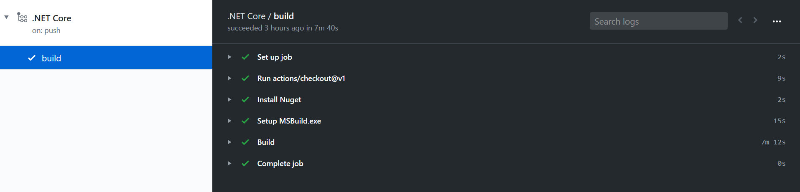

# 手把手教你如何构建 WPF 官方开源框架源代码

从去年微软就将 WPF 开源了，差不多现在所有 WPF 的源代码都开源了。在学习框架的时候，我会做一些改动，期望能构建一个自己的版本进行测试。但是作为一个特别大的框架，想要构建跑起来可不是直接在 VisualStudio 里面点击一下运行就完成了，需要做很多的准备才可以。本文将一步步教你如何构建 WPF 框架源代码

<!--more-->


<!-- CreateTime:4/23/2020 2:24:15 PM -->

<!-- 发布 -->

我不敢说每个版本的 WPF 框架的源代码我都能构建，在[官方仓库 https://github.com/dotnet/wpf](https://github.com/dotnet/wpf) 我构建成功的版本是这个 [commit](https://github.com/dotnet/wpf/commit/f226a72ed5302737b14984cffdd6208731244038) 小伙伴可以尝试使用本文的方法，先切的这个 commit 按照我的方法来进行构建，成功了之后再做更新版本的尝试

阅读本文能让你了解如何构建[WPF框架 https://github.com/dotnet/wpf](https://github.com/dotnet/wpf)源代码，但是不确保你一定能构建成功

构建 WPF 的步骤如下：

1. 下载构建需要的依赖库
2. 还原 NuGet 包
3. 按照顺序构建 C++ 和 C# 代码，创建 NuGet 包

这里面对于咱国内的小伙伴，最坑的问题就是下载构建需要的库，需要的库如下

- dotnet-sdk-5.0.100-preview.1.20155.7-win-x64.zip 安装
- dotnet-runtime-5.0.0-preview.4.20220.15-win-x86.zip 安装
- strawberry-perl-5.28.1.1-1-win64-x64.zip 放到 `.netcoreeng\native\temp` 文件夹 
- net-framework-48-ref-assemblies-0.0.0.1-win64-x64.zip 放到 `.netcoreeng\native\temp` 文件夹
- dotnet-api-docs_netcoreapp3.0-0.0.0.2-win64-x64.zip 放到 `.netcoreeng\native\temp` 文件夹
- msvcurt-c1xx-0.0.1.2-win64-x64.zip 放到 `.netcoreeng\native\temp` 文件夹
- net-framework-472-iltools-0.0.0.1-win64-x64.zip 放到 `.netcoreeng\native\temp` 文件夹
- dotnet-runtime-2.1.7-win-x86.zip 安装

上面说的 `.netcoreeng\native\temp` 文件夹就是在用户名下的如 `C:\Users\lindexi\.netcoreeng\native\temp\` 文件夹

这些文件都是十分大的，同时有一些文件会下载放在系统的临时文件夹，如果一开始下载失败了，第二次不会进行校验，只会出现 IO 解压缩错误，此时就需要小伙伴清空自己的系统临时文件夹，用户临时文件夹和 `C:\Users\lindexi\.netcoreeng\native\temp\` 文件夹

在进行构建的时候还需要让 VisualStudio 安装了差不多所有能装的负载，毕竟需要构建 C++ 这样的东西，这对 VisualStudio 版本也有要求。最低的 VisualStudio 要求是 16.4 版本

当前，我肯定不会一开始说这么劝退的方法，在本地构建的失败率太高了，即使是我全用梯子下载，也没有成功，因为有一点是在于构建的代码里面，微软的小伙伴认为网速都是特别快的，没有在一定的时间内下载完成就是失败。而我基本上每次都是下载到失败。同时失败之后下一次没有做校验，也就是除非我全部删除了重新下载，否则可能因为下载不完成构建一半翻车

一个简单的方法是利用 GitHub 的 Action 构建，感谢微软，微软收购了 GitHub 给了大量土豪的支持，所有小伙伴只要创建 GitHub 账号都能免费使用 GitHub 的 Action 构建代码。而构建的服务器可以选择 Windows 全环境服务器，在服务器里面安装了最新的 VisualStudio 和所有的负载，功能齐全，下载安装网速基本有 100M 一秒的速度。重要的是这么强大的服务器还是免费使用，不要钱，只要编写构建脚本就会自动执行

好，差不多广告费到手了，下面让我告诉大家如何使用 GitHub 的 Action 构建 WPF 的框架源代码

在开始之前先说为什么

原因一在于环境，因为 WPF 代码包含一部分 C++ 代码，这部分代码特别调环境。需要差不多将 VisualStudio 的全部功能安装才能。我就在这里翻车了，我就少安装了一个，然后就翻车了，但是很难猜到是少安装了，因为提示很诡异。虽然我就一句话，给 VisualStudio 按照全部功能，但是我预计你不会听我的

原因二在于网速，要下载的包还是大了一点，同时还原 NuGet 的服务器也没有国内源

刚好 GitHub 的 Action 都能满足条件，包含了全部环境，下载速度特别快

使用 GitHub 的 Action 的方法就是创建一个构建清单文件，放在 `.github\workflows\` 文件夹里面。清单文件是 yml 格式，如 dotnetcore.yml 文件

这个清单文件的格式不是咱的重点，理论上小伙伴看了代码大概就能理解了，不需要去学习

```yaml
name: .NET Core

on: [push]

jobs:
  build:

    runs-on: windows-latest

    steps:
    - uses: actions/checkout@v1
    - name: Install Nuget
      uses: nuget/setup-nuget@v1
      with:
        nuget-version: '5.x'
      
    - name: Build
      run: .\build.cmd -pack -ci -configuration Release -prepareMachine /p:Platform=x86
```

没错，将这个清单文件放在清单文件夹里面，如 [这个 commit 的做法](https://github.com/dotnet-campus/wpf/blob/13839999674f51238cc0d4edc140783c52583c16/.github/workflows/dotnetcore.yml ) 就可以让 WPF 构建起来

上面的清单文件也是最简单的让 WPF 构建的代码了，核心代码是 `.\build.cmd -pack -ci -configuration Release -prepareMachine /p:Platform=x86` 通过这句代码就可以调用微软小伙伴写好的脚本进行构建

<!--  -->


在日志里面看到输出构建了 nupkg 文件就是构建成功

```
2020-04-23T04:00:24.5493423Z   Successfully created package 'D:\a\wpf\wpf\artifacts\packages\Release\NonShipping\runtime.win-x86.Microsoft.DotNet.Wpf.GitHub.5.0.0-ci.nupkg'.
2020-04-23T04:00:40.3376680Z   Successfully created package 'D:\a\wpf\wpf\artifacts\packages\Release\NonShipping\Microsoft.DotNet.Arcade.Wpf.Sdk.5.0.0-ci.nupkg'.
2020-04-23T04:00:41.1278940Z   Successfully created package 'D:\a\wpf\wpf\artifacts\packages\Release\NonShipping\Microsoft.DotNet.Wpf.GitHub.5.0.0-ci.nupkg'.
2020-04-23T04:00:42.2993941Z   Successfully created package 'D:\a\wpf\wpf\artifacts\packages\Release\NonShipping\Microsoft.DotNet.Wpf.ProjectTemplates.5.0.0-ci.nupkg'.
2020-04-23T04:00:43.0266336Z   Successfully created package 'D:\a\wpf\wpf\artifacts\packages\Release\NonShipping\Microsoft.NET.Sdk.WindowsDesktop.5.0.0-ci.nupkg'.
2020-04-23T04:00:45.5485389Z 
2020-04-23T04:00:45.5486750Z Build succeeded.
2020-04-23T04:00:45.5488608Z     0 Warning(s)
2020-04-23T04:00:45.5489064Z     0 Error(s)
2020-04-23T04:00:45.5489325Z 
2020-04-23T04:00:45.5921119Z Time Elapsed 00:05:29.82
```

也就是最简单的构建 WPF 的方法就是先 Fork 官方仓库到自己的仓库，将 WPF 代码 Clone 到本地，切换 commit 到 [f226a72ed5302737b14984cffdd6208731244038](https://github.com/dotnet/wpf/commit/f226a72ed5302737b14984cffdd6208731244038) 版本，切换 commit 可以使用下面 Git 命令

```csharp
git checkout f226a72ed5302737b14984cffdd6208731244038
```

然后新建一个分支，使用 Git 命令如下

```csharp
git checkout -b 分支名
```

复制本文上面的清单文件的代码，在相对于 `.git` 文件夹的 `.github\workflows\` 文件夹创建 dotnetcore.yml 文件，将上面的清单代码放入到 dotnetcore.yml 文件

使用 Git 创建 commit 或通过 VisualStudio 的团队管理创建 commit 推送到自己的 Fork 的仓库里面，此时将会触发 GitHub 的 Action 的自动构建

在构建完成的 WPF 的输出是 NuGet 包，在 `artifacts\packages` 文件夹

在构建成功之后，还请小伙伴试试切换 WPF 的源代码到最新，尝试构建一下

本地构建的方法相对来说比较复杂，虽然从上面的清单文件可以看到，其实构建的代码只有调用脚本一句话。但是本地需要先让环境搭建，如让 VisualStudio 安装全部功能等

本地构建的方法如下

先打开 VisualStudio 让 VisualStudio 安装全部的功能，特别是 C++ 的全部勾选

保持本地是系统是 Windows 10 最新版本

下载 [Download the Windows Driver Kit (WDK)](https://docs.microsoft.com/en-us/windows-hardware/drivers/download-the-wdk ) 安装，我不确定这是不是必须的

搭建好梯子，设置全局代理

通过 PowerShell 执行 `.\build.cmd` 脚本，注意此时不要添加任何后缀，这样将可以在输出信息里面快速知道是不是下载失败了

如果下载失败了，将会提示如解压缩失败等，此时请清空自己的系统临时文件夹，用户临时文件夹，和 `.netcoreeng` 文件夹。这里的 `.netcoreeng` 放在用户文件夹，如 `C:\Users\lindexi\.netcoreeng\` 文件夹。清空 NuGet 缓存文件夹。调用 `git clean -xdf` 清空代码文件

可以通过梯子的输出找到当前需要下载的文件的链接，可以尝试做本地的代理，先用其他方式下载然后用 Fiddler 模拟路径提升下载速度

如果可以到输出下面代码，表示前面的下载工具应该完成

```
LINK : fatal error LNK1104: cannot open file 'MSVCURTD_netcore.LIB' [D:\a\wpf\wpf\src\Microsoft.DotNet.Wpf\src\DirectWriteForwarder\DirectWriteForwarder.vcxproj]
```

上面代码是因为没有指定 x86 的方式构建，在命令行运行 `.\build.cmd -pack -ci -configuration Release -prepareMachine /p:Platform=x86` 尝试构建

如果还是失败了，可以多次尝试上面的命令，先不要做任何的清理。或者先调用`git clean -xdf` 清理一下，然后继续调用上面命令

大概在尝试很多次，应该可以构建成功，之后就可以愉快打开 VisualStudio 了，在里面单独构建某个项目了。当然也不是所有的项目都能成功构建

在调用上面的脚本的命令里面，其实还有以下的调用方法，分别是进行 x86 和 x64 的构建，以及进行 Debug 和 Release 的构建

```
build.cmd -pack -ci -configuration $(Configuration) -prepareMachine /p:Platform=$(Platform)
```

请将上面代码的 `$(Configuration)` 替换为 Debug 或 Release 将 `$(Platform)` 替换为 x86 或 x64 进行构建

如果能生成官方的构建 ID 可以在命令行添加下面参数 `/p:OfficialBuildId=$(BuildId)` 这里的 `BuildId` 在官方仓库里面用的是 `$(BUILD.BUILDNUMBER)` 这是在 Azure Pipelines 的参数，大概的值的是 `20190909.1` 这样的值，可以自己随意给

上面参数的 `-ci` 是 [arcade](https://github.com/dotnet/arcade ) 提供的功能，用来启动 CI 构建

能构建官方开源代码就可以作出自己私有的版本，在使用上面命令构建完成之后，可以在 `artifacts\packages` 文件夹找到构建的 NuGet 包，这些文件可以私有发布，或者自己修改 Id 发布

现在微软的开源协议非常友好，允许小伙伴对源代码进行修改和发布

虽然可以进行自己的私有发布，当时我还是推荐将代码提到官方仓库，有官方的大佬帮忙看看代码是否合理。只要在官方的大佬认为代码不合理但是自己却觉得必须，或者官方发布太慢了，才使用自己的版本

原因是如果都用自己的版本，后续官方修了一些内容，将很难合并到自己的版本

本文提到的 GitHub 的 Action 请看 [dotnet 部署 github 的 Action 进行持续集成](https://blog.lindexi.com/post/dotnet-%E9%83%A8%E7%BD%B2-github-%E7%9A%84-Action-%E8%BF%9B%E8%A1%8C%E6%8C%81%E7%BB%AD%E9%9B%86%E6%88%90.html )


<a rel="license" href="http://creativecommons.org/licenses/by-nc-sa/4.0/"></a><br />本作品采用<a rel="license" href="http://creativecommons.org/licenses/by-nc-sa/4.0/">知识共享署名-非商业性使用-相同方式共享 4.0 国际许可协议</a>进行许可。欢迎转载、使用、重新发布，但务必保留文章署名[林德熙](http://blog.csdn.net/lindexi_gd)(包含链接:http://blog.csdn.net/lindexi_gd )，不得用于商业目的，基于本文修改后的作品务必以相同的许可发布。如有任何疑问，请与我[联系](mailto:lindexi_gd@163.com)。