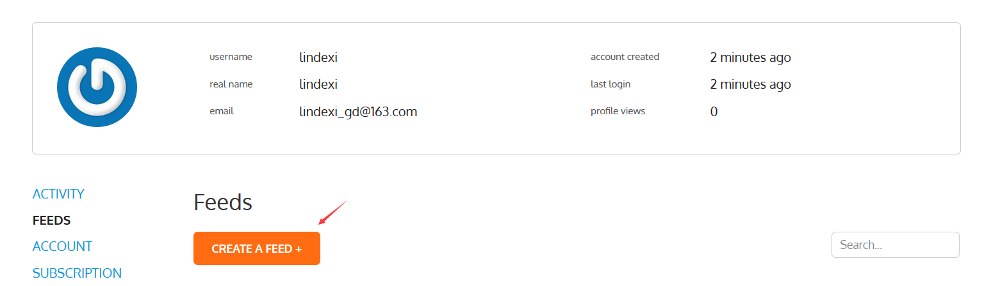
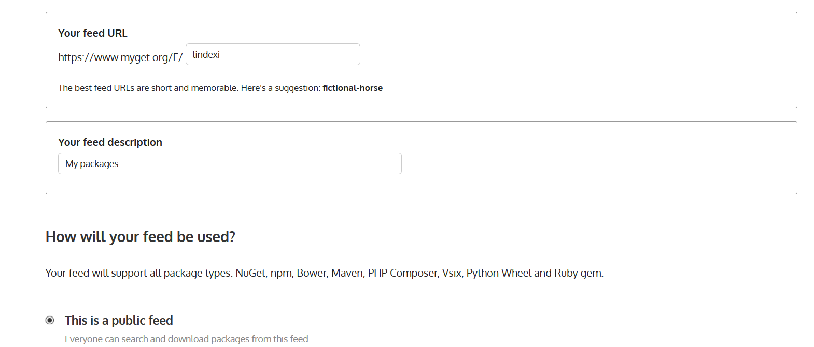
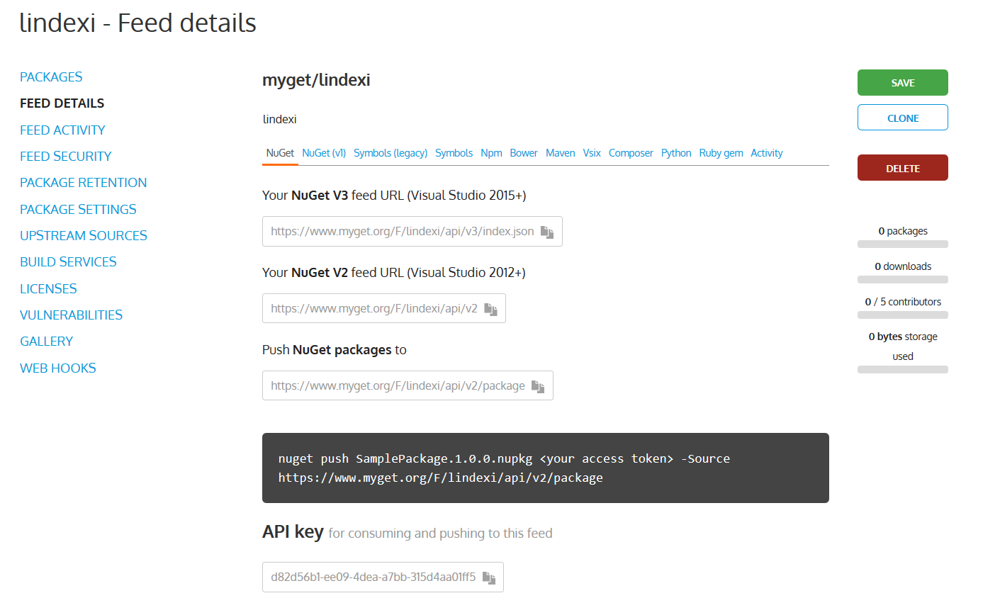
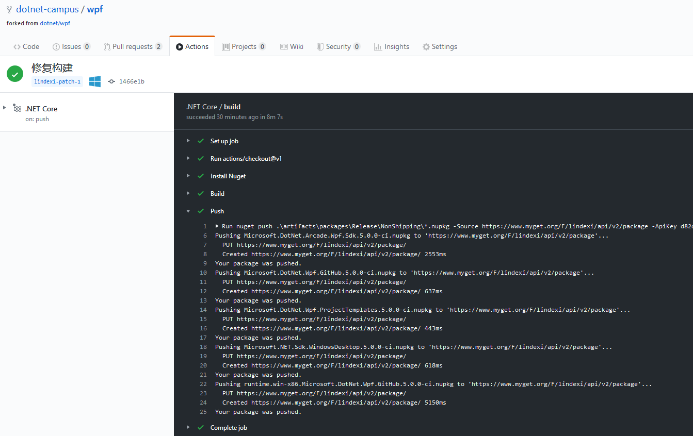
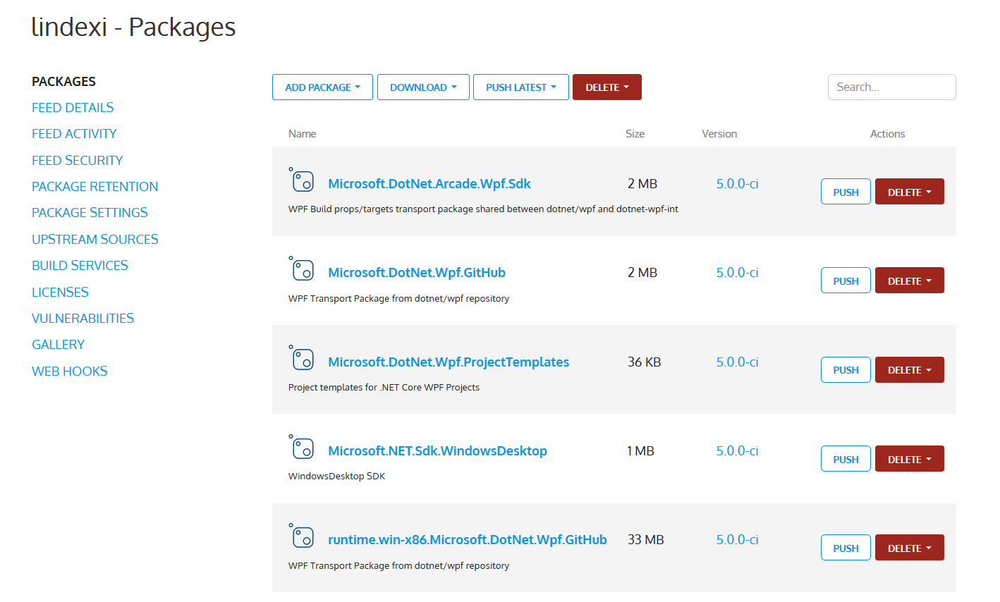
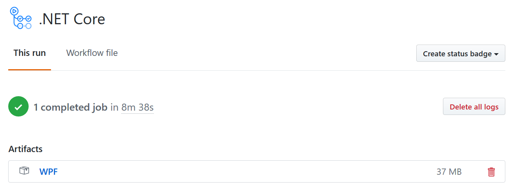
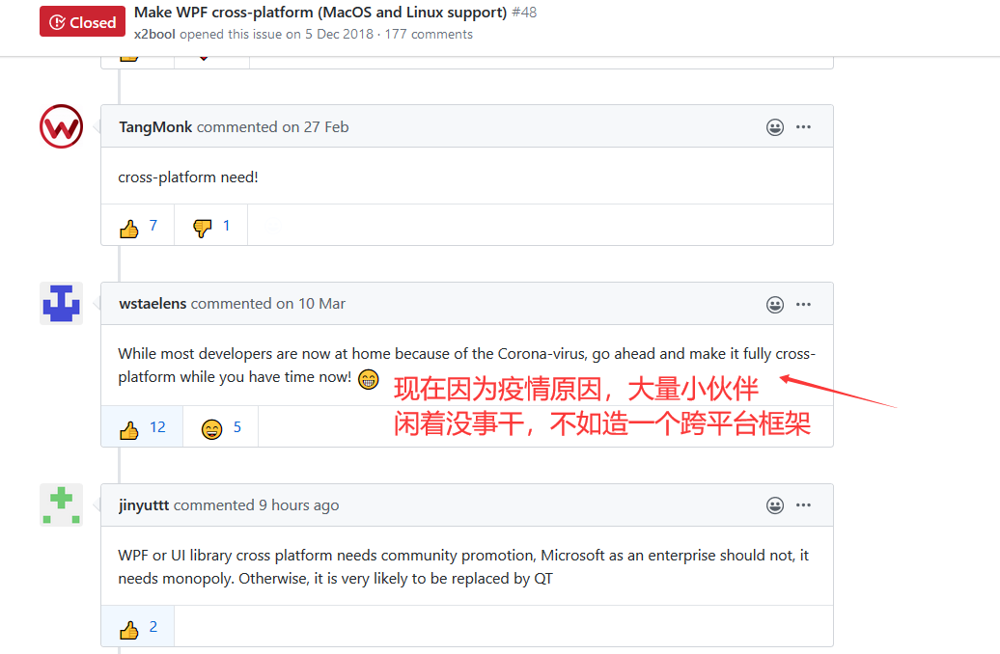
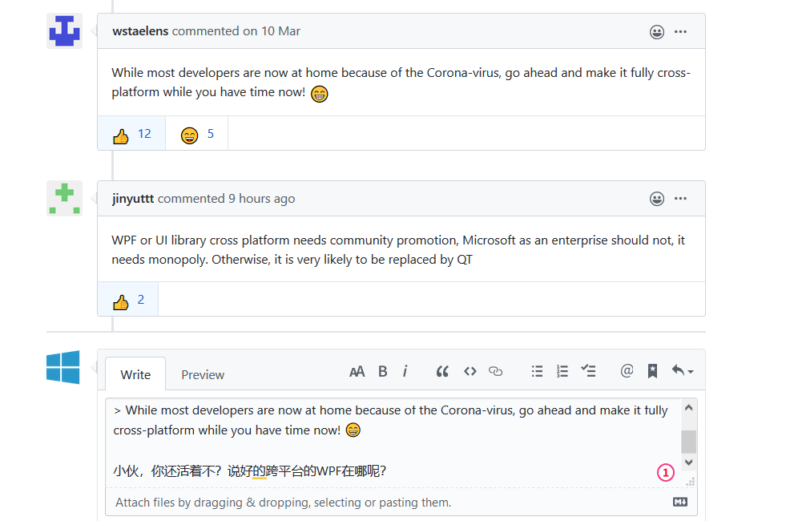

# 手把手教你构建 WPF 框架的私有版本

在上一篇博客告诉了大家如何让 GitHub 的 Action 协助咱构建 WPF 官方源代码，但是上一篇博客只是构建成功而已，构建的输出内容还是拿不到。本文将告诉大家如何让 WPF 框架的源代码构建之后输出到私有的 NuGet 源上，方便构建出私有分支版本

<!--more-->


<!-- CreateTime:4/25/2020 3:07:57 PM -->


在上一篇博客 [手把手教你如何构建 WPF 官方开源框架源代码](https://blog.lindexi.com/post/%E6%89%8B%E6%8A%8A%E6%89%8B%E6%95%99%E4%BD%A0%E5%A6%82%E4%BD%95%E6%9E%84%E5%BB%BA-WPF-%E5%AE%98%E6%96%B9%E5%BC%80%E6%BA%90%E6%A1%86%E6%9E%B6%E6%BA%90%E4%BB%A3%E7%A0%81.html ) 告诉大家为什么我推荐使用 GitHub 的 Action 进行构建，尽管进行本地构建也可以。但是本文则是再次建议使用 GitHub 的 Action 进行打包推送

为什么推荐使用 GitHub 的 Action 进行打包推送？原因是这部分是自动化的，对于发布的正式包，越少有人工的参与，那么在打包发布的坑将会越少。自动化不仅可以减少人工的成本，同时可以减少发布的坑。另外自动化的工具有很多，为什么我推荐使用 GitHub 的 Action 做？原因在于被微软收购的 GitHub 十分有钱，免费可以使用，性能强劲。另外这个 GitHub 的 Action 的构建服务器部署在国外，下载 WPF 构建需要的依赖库的速度非常快

假定咱给 WPF 框架写了一点诡异的代码，这部分代码官方是绝对不接收的，例如在 Application 基类的构造函数写出下面代码

```csharp
Console.WriteLine("林德熙是逗比");
```

这个版本的 WPF 框架只能做私有发布了，在 [手把手教你如何构建 WPF 官方开源框架源代码](https://blog.lindexi.com/post/%E6%89%8B%E6%8A%8A%E6%89%8B%E6%95%99%E4%BD%A0%E5%A6%82%E4%BD%95%E6%9E%84%E5%BB%BA-WPF-%E5%AE%98%E6%96%B9%E5%BC%80%E6%BA%90%E6%A1%86%E6%9E%B6%E6%BA%90%E4%BB%A3%E7%A0%81.html ) 告诉大家如何进行构建，那么现在就需要将构建完成的 NuGet 库发布到私有仓库里面

我推荐使用 myget 这个免费的私有的仓库，这个免费的仓库允许上传私有的 nuget 库，创建自己的私有源

打开 [https://www.myget.org](https://www.myget.org) 官网，点击 Sign Up 注册，填写自己的用户名邮箱密码等，点击创建账号，再去邮箱的垃圾堆找到确定邮件，点击确定

接下来点击创建一个私有源

<!--  -->


给自己的私有源一个链接

<!--  -->


可以设置为公开的或私有的

此时就可以拿到一个用于 NuGet 推送的链接和 ApiKey 了

<!--  -->


回到 WPF 仓库的 `.github\workflows\dotnetcore.yml` 文件，此时给他添加构建之后推送的代码

```
    - name: Push
      run: nuget push .\artifacts\packages\Release\NonShipping\*.nupkg -Source https://www.myget.org/F/lindexi/api/v2/package -ApiKey d82d56b1-ee09-4dca-a7bb-315d4aa01ff5 -SkipDuplicate -NoSymbols 
```

在 WPF 构建完成之后，将在 `artifacts\packages` 文件夹创建 NuGet 包，而上面代码就是将对应的 NuGet 包推送到 `https://www.myget.org/F/lindexi/api/v2/package` 仓库，可以注意到这个仓库的链接就是刚才在 myget 创建的私有链接

因为这是一个私有链接，需要使用到特殊的 ApiKey 在刚才的管理界面能找到对应的字符串，后面的 `-SkipDuplicate` 表示如果服务器上面已经存在相同的版本，那么跳过而不报错。这里的 `-NoSymbols` 参数表示的是没有包含带符号的 NuGet 包，如果没有加上这个参数，默认 NuGet 会尝试寻找 snupkg 文件，但是这里是没有创建的，将会提示找不到文件

此时的 dotnetcore.yml 文件的全部代码如下

```
name: .NET Core

on: [push]

jobs:
  build:

    runs-on: windows-latest

    steps:
    - uses: actions/checkout@v1
    - name: Install Nuget
      uses: nuget/setup-nuget@v1
      with:
        nuget-version: '5.x'
    - name: Build
      run: .\build.cmd -pack -ci -configuration Release -prepareMachine /p:Platform=x86
    - name: Push
      run: nuget push .\artifacts\packages\Release\NonShipping\*.nupkg -Source https://www.myget.org/F/lindexi/api/v2/package -ApiKey d82d56b1-ee09-4dca-a7bb-315d4aa01ff5 -SkipDuplicate -NoSymbols 
```

将代码推送到 GitHub 上，触发 Action 自动构建，默认构建完成将会推送。可以看我的这一次 [commit](https://github.com/dotnet-campus/wpf/pull/1/commits/1466e1bd2ee78a7d3e62e82512b720095f445a8c ) 和对应的 Action 的[构建](https://github.com/dotnet-campus/wpf/runs/617508691) 因为 Github 的构建会保存日志一段时间，会自动清理太古老的日志，所以我下面贴上构建成功的日志

<!--  -->


返回自己的私有 NuGet 仓库，就可以看到刚才上传的 NuGet 文件

<!--  -->


这就是通过 GitHub 的 Action 加上 myget 的构建私有版本的方法，当然如果只是想要让 NuGet 库可以下载，还可以用到 GitHub 的 Artifact 功能

什么是 Arifact 功能？ 大概就是存放输出文件的功能，这个功能可以将某个输出的文件夹压缩为 zip 包存储起来的功能，因为是将文件夹压缩为 zip 的，就不需要处理单独的某个包，也和具体的输出格式没有关系

使用方法是将上面的 NuGet 的 Push 的代码去掉，替换为 Artifact 的方法

```
    - name: Push
      uses: actions/upload-artifact@v1
      with:
        name: WPF
        path: ./artifacts/packages/Release/NonShipping
```

使用上面代码构建完成之后，将会创建 WPF.zip 包，这个文件包含了 `/artifacts/packages/Release/NonShipping` 文件夹的内容。现在 dotnetcore.yml 的代码请看下面

```
name: .NET Core

on: [push]

jobs:
  build:

    runs-on: windows-latest

    steps:
    - uses: actions/checkout@v1
    - name: Install Nuget
      uses: nuget/setup-nuget@v1
      with:
        nuget-version: '5.x'
    - name: Build
      run: .\build.cmd -pack -ci -configuration Release -prepareMachine /p:Platform=x86
    - name: Push
      uses: actions/upload-artifact@v1
      with:
        name: WPF
        path: ./artifacts/packages/Release/NonShipping
```

推送到服务器的构建效果请看下图

<!--  -->


此时通过梯子下载输出的 zip 包，然后本地解压缩，这样就可以拿到输出文件了

虽然我还没有想好给 WPF 的私有版本添加什么功能，但是想想能做一个私有的版本，也就是相当于真的可以使用了这个源代码，可以让源代码发挥除了了解框架的功能之外，还多了定制的功能

有个小伙伴说现在很多小伙伴都有空没事干，不如去造一个跨平台的 WPF 框架

<!--  -->


但是过了很久，其实他连项目都没开起来，于是我就想问他是不是还活着

<!--  -->


特别感谢微软提供的 GitHub 平台免费的构建服务器，这样可以让我很低成本的上手。能够自己对框架源代码定制化，才能认为这个框架是真正的可用的开源项目

本文代码放在 [github](https://github.com/dotnet-campus/wpf/pull/2) 欢迎小伙伴访问

更多博客

- [手把手教你如何构建 WPF 官方开源框架源代码](https://blog.lindexi.com/post/%E6%89%8B%E6%8A%8A%E6%89%8B%E6%95%99%E4%BD%A0%E5%A6%82%E4%BD%95%E6%9E%84%E5%BB%BA-WPF-%E5%AE%98%E6%96%B9%E5%BC%80%E6%BA%90%E6%A1%86%E6%9E%B6%E6%BA%90%E4%BB%A3%E7%A0%81.html )

- [dotnet 部署 github 的 Action 进行持续集成](https://blog.lindexi.com/post/dotnet-%E9%83%A8%E7%BD%B2-github-%E7%9A%84-Action-%E8%BF%9B%E8%A1%8C%E6%8C%81%E7%BB%AD%E9%9B%86%E6%88%90.html )


<a rel="license" href="http://creativecommons.org/licenses/by-nc-sa/4.0/"></a><br />本作品采用<a rel="license" href="http://creativecommons.org/licenses/by-nc-sa/4.0/">知识共享署名-非商业性使用-相同方式共享 4.0 国际许可协议</a>进行许可。欢迎转载、使用、重新发布，但务必保留文章署名[林德熙](http://blog.csdn.net/lindexi_gd)(包含链接:http://blog.csdn.net/lindexi_gd )，不得用于商业目的，基于本文修改后的作品务必以相同的许可发布。如有任何疑问，请与我[联系](mailto:lindexi_gd@163.com)。