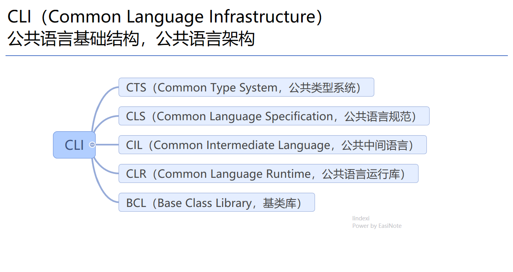
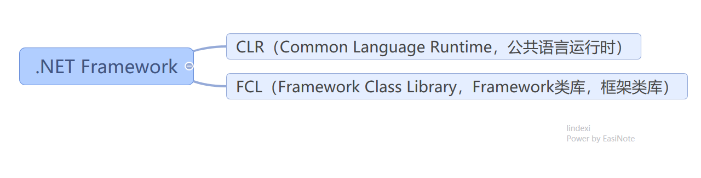
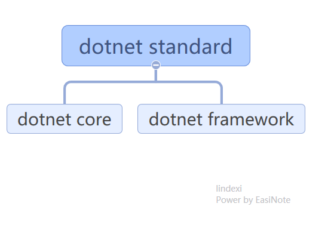
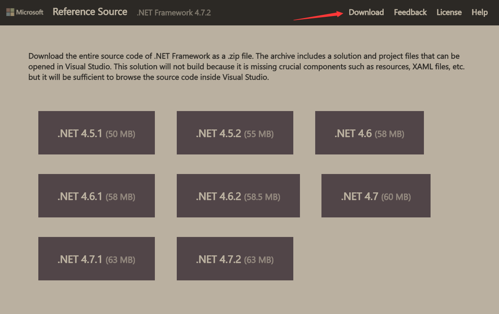
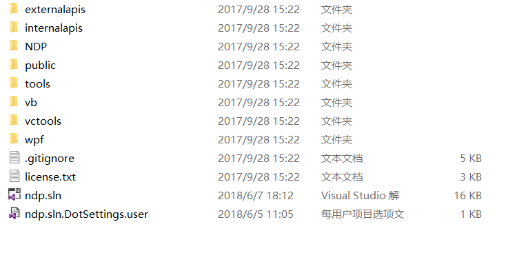
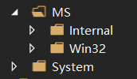

# 手把手教你读 dotnet 源代码

本文告诉大家如何阅读 dotnet 源代码。本金鱼技术有限，如果发现有什么地方没写到，欢迎告诉我

<!--more-->
<!-- CreateTime:2018/8/10 19:16:52 -->

<!-- csdn -->
<!-- 标签：C#,dotnet-framework,源代码分析，dotnetframework ，WPF -->

<!-- 草稿 -->

阅读源代码是比较难的，本文也不适合刚接触 dotnet 的大佬

## 为什么需要读源代码

如果已经是以为工作了好多年的大佬，忽然有新人询问，这个 xx 控件为什么会 xx 的行为。如我使用 `Dispatcher.Yiled` 之后为什么 Popup 忽然就消失了，为什么我在 `StylusUp` 抛一个异常，我的代码就触摸失效了？这时需要怎么回答呢

这就需要对 dotnet 的代码有一些了解了，很多的问题都可以从 dotnet 的代码找到原因

读源代码有下面这些好处

提高自己的代码质量，如果自己的代码都是在自己的组内分享，那么一个组的代码最高水平也就是组内代码质量最高的小伙伴的水平，团队的整体水平很难超过他的水平，换句话说自己的技术水平会被团队的最高技术水平限制。在读取开源的源代码的时候，可以看到更多的代码，从而提高自己的代码质量，让自己的技术水平被限制的天花板从原先自己的团队变更为开源世界的大团队，如果此时也能到达天花板，那基本就是当前世界的技术天花板

发现更多用法，有很多代码的写法是不会在文档告诉大家，只有在读 dotnet 源代码的时候才可以知道。我在阅读源代码的时候，就会发现原来这个接口是可以这样使用，如[WPF UncommonField 类型是什么](https://lindexi.gitee.io/post/WPF-UncommonField-%E7%B1%BB%E5%9E%8B%E6%98%AF%E4%BB%80%E4%B9%88.html ) 和 [BooleanBoxes](https://referencesource.microsoft.com/#WindowsBase/Base/MS/Internal/KnownBoxes.cs) 如果不看源代码很少知道可以这样使用

了解性能，在看 dotnet 的源代码，可以知道有哪些地方是 dotnet 没写好的，存在性能的问题，这样可以在使用的时候就需要尽量避免，如通过阅读 dotnet 的 WPF 的源代码可以了解到使用继承的附加属性拿的时候是需要从视觉树获取，所以尽量减少使用继承的附加属性。还有在 Load 时调用 `Focus` 函数会需要很多时间。通过阅读 WPF 的 XAML 源代码可以了解到 XAML 创建对象时，对象的访问权限对创建的影响，从而在代码里面让在 XAML 使用的对象是公开的，详细请看 [dotnet 读 WPF 源代码笔记 XAML 创建对象的方法](https://blog.lindexi.com/post/dotnet-%E8%AF%BB-WPF-%E6%BA%90%E4%BB%A3%E7%A0%81%E7%AC%94%E8%AE%B0-XAML-%E5%88%9B%E5%BB%BA%E5%AF%B9%E8%B1%A1%E7%9A%84%E6%96%B9%E6%B3%95.html )

设计模式，在 dotnet 特别是微软的源代码使用了很多设计模式，如 WPF 的 `DependencyObject` 类几乎用了所有的设计模式，通过阅读微软的源代码，会比自己去看书更好，这样可以知道设计模式在框架如何使用。不是一个类使用越多的设计模式就越好，微软在很多地方的代码都使用了恰好的设计，所以微软才可以使用了 dotnet framework 那么多年，但修改的类很少。当前设计的越好也就是修改越难，只能重新做 dotnet core 而不是修改源代码。通过阅读源代码可以去尝试从源代码里面去了解用了哪些设计模式，从而在自己的代码里面也尝试跟随框架源代码的用法，而了解为什么适合或为什么需要，提升自己的代码设计

设计框架，在微软的 WPF 界面框架是一个不错的框架，知乎轮子都说自己要写一个和 WPF 一样的界面框架，在读完了 WPF 的源代码，我就知道了如何做一个界面框架，我现在和好多大佬一起在写 Avalonia 这个开源项目，这是一个跨平台的界面框架。如果没有读源代码，是不知道如何写一个界面框架，和一个界面框架存在的坑。当前现在 WPF 也是开源的，我也在尝试去维护 WPF 框架，不过更多的贡献是修改文档和格式化代码

了解底层细节。如一个对象是如何创建，如内存具体是如何回收的。或者如 WPF 如何从 Windows 消息转路由事件，路由事件是如何做的。这些都是需要去阅读源代码才了解的。在了解更多的知识的时候，编写代码和调试的时候，会更有把握

## 代码图

微软定义了规范CLI（Common Language Infrastructure）公共语言基础结构，公共语言架构，对他的实现就是 dotnet framework 和 dotnet core 等，而 CLI 包含了很多规范，请看下图

<!--  -->

实现 CLI 的 dotnet framework 包含两个部分

<!--  -->

现在dotnet也是跨平台，存在 dotnet standard 包含微软等组织制定 API 标准，和 dotnet framework 的关系请看下图。在 .NET 5 之后，将会逐步废弃掉 dotent standard 和 dotnet framework 后续将维护统一的 dotnet 平台

<!--  -->

需要知道 dotnet framework 是不开源的，而 dotnet core 是开源的，但是可以通过反编译或从微软 https://referencesource.microsoft.com/ 拿到源代码。我更推荐大家阅读 dotnet 开源的代码，因为这部分更新，而且有足够注释

因为 https://referencesource.microsoft.com/ 网站的速度太慢，如果需要下载 dotnet framework 源代码，请点击 下载

<!--  -->

开放的 dotnet framework 源代码是无法下载就可以编译通过，如果需要编译通过需要做很多修改。

现在我通过反编译让部分的 WPF 代码可以编译通过，如果你需要可以联系我

把源代码解压，可以看到如下图的文件

<!--  -->

双击打开 ndp.sln 就可以看到 VisualStudio 很多工程，下面我来告诉大家工程的意思

## 类库

## WPF 类库

在很多 WPF 类库，都有相似的文件

<!--  -->

文件夹里包含 MS 文件夹和 System 文件夹，

这里的 MS 文件夹包含的很多都是和 Windows 系统相关的底层代码也就是COM的包装，而 System 包含的是对系统上一层的代码，也就是应用程序的代码。

 本作品采用<a rel="license" href="http://creativecommons.org/licenses/by-nc-sa/4.0/">知识共享署名-非商业性使用-相同方式共享 4.0 国际许可协议</a>进行许可。欢迎转载、使用、重新发布，但务必保留文章署名[林德熙](http://blog.csdn.net/lindexi_gd)(包含链接:http://blog.csdn.net/lindexi_gd )，不得用于商业目的，基于本文修改后的作品务必以相同的许可发布。如有任何疑问，请与我[联系](mailto:lindexi_gd@163.com)。
