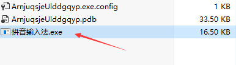
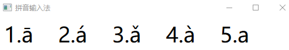

# 拼音输入法 快速输入带音调的字符

本文告诉大家如何使用本文提供的输入法快速输入带音调的字符

<!--more-->
<!-- CreateTime:2018/11/18 20:56:38 -->

<!-- csdn -->

在教学的应用上，很多时候都需要混合输入带音调的拼音。但是无论是哪个输入法都无法满足需求，于是我就开发了一个。

## 使用方法

点击[下载](http://image.acmx.xyz/app/pinyin.zip )拼音输入法

下载的是压缩文件，需要解压缩到任意的文件夹，建议不要直接解压到桌面

<!--  -->

打开拼音输入法，此时就可以进行快速的拼音输入

如输入 海 hǎi 可以这样输入 ha3i5 在每次按下元音的时候就可以选择数字对应。在使用的时候注意关闭原有的输入法，通过 shift 键关闭就可以

<!--  -->

在不使用拼音输入法的时候，只需要关闭拼音输入法就可以。如果想要卸载输入法，只需要删除文件就可以。

下载链接：http://image.acmx.xyz/app/pinyin.zip

如果无法下载请联系我

如果觉得不好用，有任何建议都可以发邮件给我

参考

[快速在课堂活动输入拼音带音调字符 - 分享汇 - 希沃论坛](http://bbs.seewoedu.cn/forum.php?mod=viewthread&tid=10625&page=1&ordertype=1#pid142429 )

[WPF 拼音输入法](https://lindexi.gitee.io/post/WPF-%E6%8B%BC%E9%9F%B3%E8%BE%93%E5%85%A5%E6%B3%95.html )

 本作品采用<a rel="license" href="http://creativecommons.org/licenses/by-nc-sa/4.0/">知识共享署名-非商业性使用-相同方式共享 4.0 国际许可协议</a>进行许可。欢迎转载、使用、重新发布，但务必保留文章署名[林德熙](http://blog.csdn.net/lindexi_gd)(包含链接:http://blog.csdn.net/lindexi_gd )，不得用于商业目的，基于本文修改后的作品务必以相同的许可发布。如有任何疑问，请与我[联系](mailto:lindexi_gd@163.com)。
