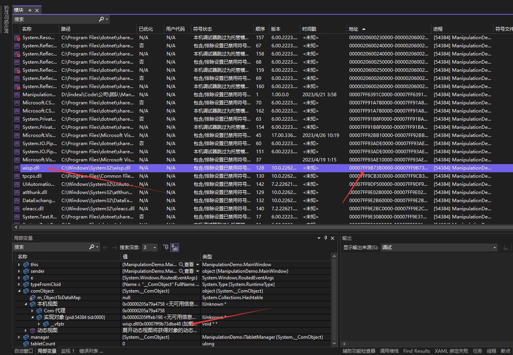
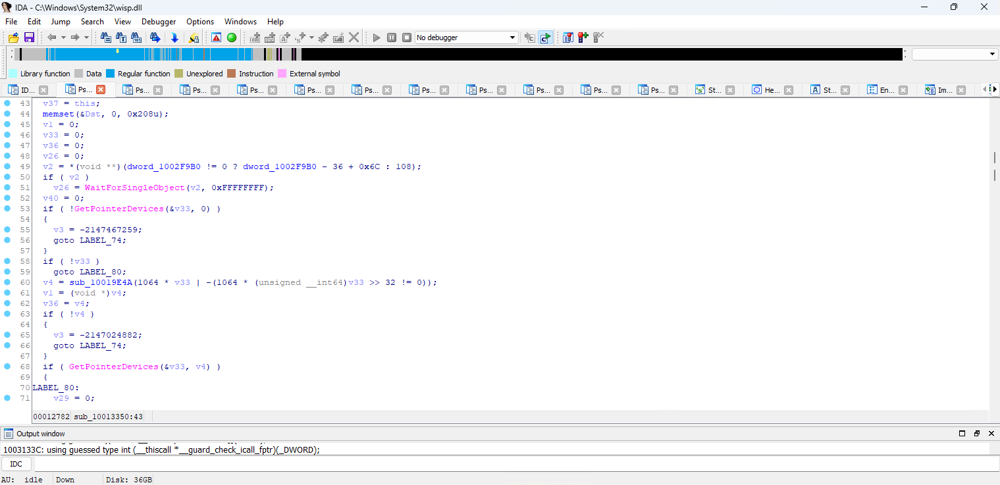

# 探索 WPF 的 ITabletManager.GetTabletCount 在 Win11 系统的底层实现

本文将和大家介绍专为 WPF 触摸模块提供的 ITabletManager 的 GetTabletCount 方法在 Windows 11 系统的底层实现

<!--more-->


<!-- 发布 -->
<!-- 博客 -->

本文属于 WPF 触摸相关系列博客，偏系统底层介绍，更多触摸博客请看 [WPF 触摸相关](https://blog.lindexi.com/post/WPF-%E8%A7%A6%E6%91%B8%E7%9B%B8%E5%85%B3.html )

大家都知道在 Windows 7 系统，有专门的笔和触摸服务提供触摸消息的支持。而 WPF 是从 Vista 年代就开始的框架，自然需要支持到 XP 系统。在 XP 系统里面，还没有完善的 WM_Touch 消息，同时又需要兼顾性能，最好走的是 RealTimeStylus 这一套。在 Windows 下有一套专门给 WPF 触摸模块使用 COM 接口，这一套接口提供了和 RealTimeStylus 几乎一样的实现功能，详细请看 [https://learn.microsoft.com/en-us/windows/win32/tablet/com-apis-used-by-windows-presentation-foundation](https://learn.microsoft.com/en-us/windows/win32/tablet/com-apis-used-by-windows-presentation-foundation)

但是从 Win10 开始，系统里面就没有了专门的笔和触摸服务，而是将触摸消息集成到系统里面

本文就来和大家聊聊在 Windows 11 下的 WPF 的触摸底层，也就是 [ITabletManager](https://learn.microsoft.com/en-us/windows/win32/tablet/itabletmanager) 接口是定义在哪里，以及里面的 GetTabletCount 方法是如何实现

由于各个系统都可以对此进行更改，本文着重在于编写调试用的代码，在 VisualStudio 和 IDA 的辅助下了解在 Windows 11 22H2 22621 上的实现

为了了解 ITabletManager 的具体实现 DLL 在哪，可以定义出 COM 接口，通过拿到 COM 接口的虚函数表地址从而了解到对应的 DLL 文件

先编写定义 [ITabletManager](https://learn.microsoft.com/en-us/windows/win32/tablet/itabletmanager) 接口的代码，代码如下

```csharp
using System;
using System.Runtime.CompilerServices;
using System.Runtime.InteropServices;
using HRESULT = System.Int32;

[ComImport, Guid("764DE8AA-1867-47C1-8F6A-122445ABD89A"), InterfaceType(ComInterfaceType.InterfaceIsIUnknown)]
public interface ITabletManager
{
    int GetDefaultTablet(out ITablet ppTablet);
    int GetTabletCount(out ulong pcTablets);
    int GetTablet(ulong iTablet, out ITablet ppTablet);
}
```

以上的 ITablet 接口不是本文的重点，咱只需要定义空接口即可，不需要定义里面的方法

```csharp
[ComImport, Guid("1CB2EFC3-ABC7-4172-8FCB-3BC9CB93E29F"), InterfaceType(ComInterfaceType.InterfaceIsIUnknown)]
public interface ITablet //: IUnknown
{
}
```

接着在代码里面，通过如文档所述方法，先创建 `CLSID_TabletManagerS` 对象，再将其转换为 ITabletManager 接口

> Call CoCreateInstance with a class ID of CLSID_TabletManagerS, and then call QueryInterface to get a pointer to the ITabletManager Interface. The CLSID_TabletManagerS GUID is defined as follows: #define CLSID_TabletManagerS uuid(A5B020FD-E04B-4e67-B65A-E7DEED25B2CF)

以上文档对应的 C# 代码如下

```csharp
            var typeFromClsid = Type.GetTypeFromCLSID(new Guid("A5B020FD-E04B-4e67-B65A-E7DEED25B2CF"));
            object comObject = Activator.CreateInstance(typeFromClsid);

            var manager = comObject as ITabletManager;
            manager!.GetTabletCount(out var tabletCount);
```

开启本机调试，运行代码，在以上的代码的最后一句话下断点，进入断点之后即可展开 `comObject` 的本机视图，找到 COM 对象的 `__vfptr` 地址。再根据地址从 VisualStudio 的调试模块里面找到落在其中的地址范围内的 DLL 文件。如下图

<!--  -->


在写到这里我才看到 VisualStudio 里已经写了 wisp.dll 文件了，不需要自己去算地址，也是方便哈

了解到了现在的 ITabletManager 是定义在 C:\Windows\System32\wisp.dll 文件，即可将此文件丢到 IDA 里面反编译一下，如下图

<!--  -->


可以看到在第 53 行里使用的是 GetPointerDevices 方法。我感觉这就是核心实现了，这个 GetPointerDevices 是在 Win10 下的 WM_Pointer 触摸系列下的获取触摸设备数量的方法

也就是说 ITabletManager 的 GetTabletCount 的核心实现又到 POINTER 机制里面了。这就超过了本文的范围了哈，不过能够知道 ITabletManager 的 GetTabletCount 底层也是到 POINTER 机制也就足够我玩的。因为这侧面反映了 Win11 不是保留旧代码，而是 API 重定向和加上兼容的代码而已。换句话说，如果有一个 bug 是 Pointer 层存在的，那么 WPF 的 COM 触摸层也会存在。但反过来不成立，如果有某个是 bug 是在 WPF 的 COM 触摸层存在的，可能是因为 Win11 的 API 调用或兼容代码挖的坑，不一定是 Pointer 的问题

关于 GetPointerDevices 的描述，请参阅 [https://learn.microsoft.com/en-us/windows/win32/api/winuser/nf-winuser-getpointerdevices](https://learn.microsoft.com/en-us/windows/win32/api/winuser/nf-winuser-getpointerdevices)

简单的 GetPointerDevices 用法可以使用 PInvoke 调用，如下面例子

先安装 Microsoft.Windows.CsWin32 库，如 [dotnet 使用 CsWin32 库简化 Win32 函数调用逻辑](https://blog.lindexi.com/post/dotnet-%E4%BD%BF%E7%94%A8-CsWin32-%E5%BA%93%E7%AE%80%E5%8C%96-Win32-%E5%87%BD%E6%95%B0%E8%B0%83%E7%94%A8%E9%80%BB%E8%BE%91.html ) 博客提供的方法

接下来编写代码从 GetPointerDevices 里获取触摸信息

```csharp
                StringBuilder stringBuilder = ...

                // 获取 Pointer 设备数量
                uint deviceCount = 0;
                PInvoke.GetPointerDevices(ref deviceCount,
                    (Windows.Win32.UI.Controls.POINTER_DEVICE_INFO*)IntPtr.Zero);
                Windows.Win32.UI.Controls.POINTER_DEVICE_INFO[] pointerDeviceInfo =
                    new Windows.Win32.UI.Controls.POINTER_DEVICE_INFO[deviceCount];
                fixed (Windows.Win32.UI.Controls.POINTER_DEVICE_INFO* pDeviceInfo = &pointerDeviceInfo[0])
                {
                    // 这里需要拿两次，第一次获取数量，第二次获取信息
                    PInvoke.GetPointerDevices(ref deviceCount, pDeviceInfo);
                    stringBuilder.AppendLine($"PointerDeviceCount:{deviceCount} 设备列表：");
                    foreach (var info in pointerDeviceInfo)
                    {
                        stringBuilder.AppendLine($" - {info.productString}");
                    }
                }
```

需要调用 GetPointerDevices 两次，第一个获取数量，第二次获取信息。这个 GetPointerDevices 在第一个参数传入是 0 的时候，是不会填充第二个参数数组信息

以上就是专为 WPF 触摸模块提供的 ITabletManager 的 GetTabletCount 方法在 Windows 11 系统的底层实现


<a rel="license" href="http://creativecommons.org/licenses/by-nc-sa/4.0/"></a><br />本作品采用<a rel="license" href="http://creativecommons.org/licenses/by-nc-sa/4.0/">知识共享署名-非商业性使用-相同方式共享 4.0 国际许可协议</a>进行许可。欢迎转载、使用、重新发布，但务必保留文章署名[林德熙](http://blog.csdn.net/lindexi_gd)(包含链接:http://blog.csdn.net/lindexi_gd )，不得用于商业目的，基于本文修改后的作品务必以相同的许可发布。如有任何疑问，请与我[联系](mailto:lindexi_gd@163.com)。