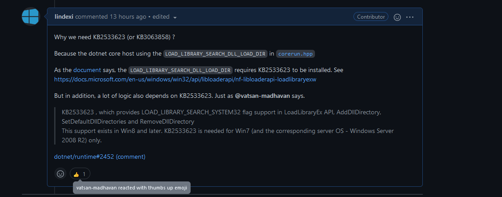

# 探索 dotnet core 为何在 Windows7 系统需要补丁的原因

在一些 Windows 7 系统上，根据 dotnet 官方文档，需要安装上 KB2533623 补丁，才能运行 dotnet core 或 .NET 5 等应用。尽管非所有的设备都需要安装此，但这也让应用的分发不便，安装包上都需要带上补丁给用户安装。此补丁同时也要求安装完成之后重启系统，这对用户端来说，也是较不方便。本文来聊聊为什么 dotnet core 一系的框架依赖于此补丁

<!--more-->


<!-- 发布 -->
<!-- 博客 -->

特别感谢 [lsj](https://blog.sdlsj.net) 给我讲解 Win32 调用部分的知识和帮我调查具体的原因，我只是记录的工具人

## 补丁

开始之前，先来理一下所需补丁的情况，不想看补丁细节还请跳到下文主题这章。 准确来说，在当前 2021.12.25 官方推荐 Win7 系统打上的补丁是 KB3063858 补丁

> KB3063858: MS15-063：Windows 内核中的漏洞可能允许特权提升：2015 年 6 月 9 日
> 此安全更新可解决 Windows 中的一个漏洞。如果用户访问包含特殊设计的文件的网络共享（或指向网络共享的网站）时，此漏洞可能允许特权提升。但是在所有情况下，攻击者都无法强制用户访问此类网络共享或网站。

也有伙伴推荐给我的是安装 KB4457144 补丁。但是 KB4457144 补丁太大了，包含太多内容，带上这个补丁没什么优势

> KB4457144: 2018 年 9 月 11 日 - KB4457144（月度汇总）

在 GitHub 上的 [Security update KB2533623 no longer available · Issue #20459 · dotnet/docs](https://github.com/dotnet/docs/issues/20459 ) 讨论上，有大佬表示 KB3063858 或 KB4457144 包含了 KB2533623 补丁内容：

> The thread claims that KB2533623 is superseded by KB3063858 or KB4457144. https://github.com/dotnet/docs/issues/20459#issuecomment-689513876

值得一说的是对需要安装 KB3063858 补丁的系统来说，大多数都需要额外加上证书，参阅 [https://www.microsoft.com/pkiops/Docs/Repository.htm](https://www.microsoft.com/pkiops/Docs/Repository.htm) 因此我认为对于客户端分发来说，打上 KB2533623 补丁似乎更好。但是 KB2533623 当前被微软下架了，请看 [Security update KB2533623 no longer available · Issue #20459 · dotnet/docs](https://github.com/dotnet/docs/issues/20459 ) 

这是 KB2533623 的下载地址: [http://www.microsoft.com/download/details.aspx?familyid=c79c41b0-fbfb-4d61-b5d8-cadbe184b9fc](http://www.microsoft.com/download/details.aspx?familyid=c79c41b0-fbfb-4d61-b5d8-cadbe184b9fc)

另外，在刚推送 dotnet core 3.0 的预览版本时，有伙伴在 WPF 官方仓库反馈说需要加上 [KB2999226](https://support.microsoft.com/kb/2999226) 补丁。此 KB2999226 补丁是 `Windows 中的 Universal C Runtime 更新` 的内容，参阅 [https://github.com/dotnet/wpf/issues/2009#issuecomment-543872453](https://github.com/dotnet/wpf/issues/2009#issuecomment-543872453)

也许可以使用 [runtime.win7-x64.Microsoft.NETCore.Windows.ApiSets NuGet 库](https://www.nuget.org/packages/runtime.win7-x64.Microsoft.NETCore.Windows.ApiSets/1.0.1) 代替 KB2999226 补丁内容，只需要将 `api-xxxxx.dll` 这些文件拷贝到输出路径即可。或者是解包 VC++ 2015 的分发包里的文件，将 `api-xxxxx.dll` 和 `ucrtbase.dll` 拷贝到输出路径即可

因此，对于客户端分发来说，似乎采用 KB2533623 最小补丁，然后在输出路径上拷贝好 [`api-xxxxx.dll`](https://www.nuget.org/packages/runtime.win7-x64.Microsoft.NETCore.Windows.ApiSets) 这些文件到输出路径是最佳方法

下载地址：

- [KB2533623 x86](http://image.acmx.xyz/Windows6.1-KB2533623-x86.msu)
  + MD5： EDF1D538C85F24EC0EF0991E6B27F0D7
  + SHA1： 25BECC0815F3E47B0BA2AE84480E75438C119859
- [KB2533623 x64](http://image.acmx.xyz/Windows6.1-KB2533623-x64.msu)
  + MD5： 0A894C59C245DAD32E6E48ECBDBC8921
  + SHA1： 8A59EA3C7378895791E6CDCA38CC2AD9E83BEBFF
- [KB3063858 32-bit](https://www.microsoft.com/en-us/download/details.aspx?id=47409)
- [KB3063858 64-bit](https://www.microsoft.com/en-us/download/details.aspx?id=47442)

## 主题

清理好了各个补丁的关系之后，咱回到主题。为什么在 dotnet core 一系都有此要求？而且还不是对所有 Win7 系统都有此要求，这是为什么？回答这两个问题，可以从 dotnet core 的 dotnet host core run 开始聊起

在 Windows 下，咱双击运行的 dotnet core 的可执行 exe 文件，其实是一个 AppHost 文件。咱编写的 Main 函数，在非单文件模式下，是放在同名的 dll 里面。详细关于 AppHost 请参阅 [dotnet core 应用是如何跑起来的 通过AppHost理解运行过程](https://blog.lindexi.com/post/dotnet-core-%E5%BA%94%E7%94%A8%E6%98%AF%E5%A6%82%E4%BD%95%E8%B7%91%E8%B5%B7%E6%9D%A5%E7%9A%84-%E9%80%9A%E8%BF%87AppHost%E7%90%86%E8%A7%A3%E8%BF%90%E8%A1%8C%E8%BF%87%E7%A8%8B.html )

在 dotnet host core run 里，对应代码是 `src\coreclr\hosts\corerun\corerun.hpp` 文件，在这里需要拉起 `hostpolicy.dll` 组件。加载此组件的代码如下，不过代码内容不重要哈

```c
    inline bool try_load_hostpolicy(pal::string_t mock_hostpolicy_value)
    {
        const char_t* hostpolicyName = W("hostpolicy.dll");
        pal::mod_t hMod = (pal::mod_t)::GetModuleHandleW(hostpolicyName);
        if (hMod != nullptr)
            return true;

        // Check if a hostpolicy exists and if it does, load it.
        if (pal::does_file_exist(mock_hostpolicy_value))
            hMod = (pal::mod_t)::LoadLibraryExW(mock_hostpolicy_value.c_str(), nullptr, LOAD_LIBRARY_SEARCH_DLL_LOAD_DIR | LOAD_LIBRARY_SEARCH_DEFAULT_DIRS);

        if (hMod == nullptr)
            pal::fprintf(stderr, W("Failed to load mock hostpolicy at path '%s'. Error: 0x%08x\n"), mock_hostpolicy_value.c_str(), ::GetLastError());

        return hMod != nullptr;
    }
```

以上最关键的只有这一行代码 `LoadLibraryExW(mock_hostpolicy_value.c_str(), nullptr, LOAD_LIBRARY_SEARCH_DLL_LOAD_DIR | LOAD_LIBRARY_SEARCH_DEFAULT_DIRS)`

以上代码通过 [LoadLibraryExW](https://docs.microsoft.com/en-us/windows/win32/api/libloaderapi/nf-libloaderapi-loadlibraryexw?WT.mc_id=WD-MVP-5003260 ) 函数进行加载库。调用时传入了 `LOAD_LIBRARY_SEARCH_DLL_LOAD_DIR` 参数。根据官方文档的描述，调用此函数，如果加入了 `LOAD_LIBRARY_SEARCH_DLL_LOAD_DIR` 参数，将要求 KB2533623 补丁

> If this value is used, the directory that contains the DLL is temporarily added to the beginning of the list of directories that are searched for the DLL's dependencies. Directories in the standard search path are not searched.
> The lpFileName parameter must specify a fully qualified path. This value cannot be combined with LOAD_WITH_ALTERED_SEARCH_PATH.
> For example, if Lib2.dll is a dependency of C:\Dir1\Lib1.dll, loading Lib1.dll with this value causes the system to search for Lib2.dll only in C:\Dir1. To search for Lib2.dll in C:\Dir1 and all of the directories in the DLL search path, combine this value with LOAD_LIBRARY_DEFAULT_DIRS.
> 
> Windows 7, Windows Server 2008 R2, Windows Vista and Windows Server 2008:  This value requires KB2533623 to be installed.
> Windows Server 2003 and Windows XP:  This value is not supported

除以上逻辑之外，在 dotnet 仓库里还可以找到其他的各个部分的 LoadLibraryExW 函数上，也都带上了 `LOAD_LIBRARY_SEARCH_DLL_LOAD_DIR` 参数，列表如下：

- `src\coreclr\dlls\dbgshim\dbgshim.cpp`: CreateDebuggingInterfaceFromVersion2 函数
- `src\coreclr\hosts\corerun\corerun.hpp`: try_load_hostpolicy 函数
- `src\coreclr\hosts\coreshim\CoreShim.cpp`: TryLoadHostPolicy 函数
- `src\coreclr\vm\nativelibrary.cpp`: DetermineLibNameVariations 函数
- `src\native\corehost\hostmisc\pal.windows.cpp`: load_library 函数

看起来文件不多，就看哪个伙伴想不开就去改改挖坑吧

此 [LoadLibraryExW](https://docs.microsoft.com/en-us/windows/win32/api/libloaderapi/nf-libloaderapi-loadlibraryexw?WT.mc_id=WD-MVP-5003260 ) 函数是放在 Kernel32.dll 的，相同的需求，在 dotnet core 里也间接依赖于 [AddDllDirectory](https://docs.microsoft.com/en-us/windows/win32/api/libloaderapi/nf-libloaderapi-adddlldirectory?WT.mc_id=WD-MVP-5003260) 和 [SetDefaultDllDirectories](http://msdn.microsoft.com/zh-cn/library/hh310515(vs.85).aspx) 和 [RemoveDllDirectory](https://docs.microsoft.com/zh-cn/windows/win32/api/libloaderapi/nf-libloaderapi-removedlldirectory?WT.mc_id=WD-MVP-5003260) 等方法。如官方文档描述，刚好这些方法也都相同依赖 KB2533623 补丁

> Windows 7, Windows Server 2008 R2, Windows Vista and Windows Server 2008:  To use this function in an application, call GetProcAddress to retrieve the function's address from Kernel32.dll. KB2533623 must be installed on the target platform.

通过如上描述，可以了解到，在 dotnet core 需要补丁的原因是调用了 Kernel32.dll 的新（大约10年前加的）函数，对于一些 Win7 旧设备上，没有更新 Kernel32.dll 加上函数

因此，判断 dotnet core 所依赖环境可以有两个方法，第一个方法是判断 KB2533623 补丁是否有安装，另一个方法是判断 Kernel32.dll 里是否存在 [AddDllDirectory](https://docs.microsoft.com/en-us/windows/win32/api/libloaderapi/nf-libloaderapi-adddlldirectory?WT.mc_id=WD-MVP-5003260) 函数。第一个方法判断是不靠谱的，因为不一定需要 KB2533623 补丁，如上文描述，换成其他几个补丁也可以。判断补丁安装可以使用下面命令行代码，更多请参阅 [dotnet 通过 WMI 获取系统补丁](https://blog.lindexi.com/post/dotnet-%E9%80%9A%E8%BF%87-WMI-%E8%8E%B7%E5%8F%96%E7%B3%BB%E7%BB%9F%E8%A1%A5%E4%B8%81.html ) 和 [PowerShell 通过 WMI 获取补丁](https://blog.lindexi.com/post/PowerShell-%E9%80%9A%E8%BF%87-WMI-%E8%8E%B7%E5%8F%96%E8%A1%A5%E4%B8%81.html )

```
BAT:

wmic qfe GET hotfixid | findstr /C:"KB2533623"
```

另外，判断是否存在 KB2533623 补丁，不存在则安装的 bat 脚本代码如下

```
echo off
cd /d %~dp0
wmic qfe GET hotfixid | findstr /C:"KB2533623"
if %errorlevel% equ 0 (Echo Patch KB2533623 installed) else (
wusa Windows6.1-KB2533623-x64.msu /quiet /norestart
wusa Windows6.1-KB2533623-x86.msu /quiet /norestart
exit /b 1
)
exit /b 0
```

第二个方法我比较推荐，判断代码如下：

```csharp
using PInvoke;
using System;

namespace AddDllDirectoryDetectCs
{
    class Program
    {
        static void Main(string[] args)
        {
            using (var hModule = Kernel32.LoadLibrary("Kernel32.dll"))
            {
                if (!hModule.IsInvalid)
                {
                    IntPtr hFarProc = Kernel32.GetProcAddress(hModule, "AddDllDirectory");
                    if (hFarProc != IntPtr.Zero)
                    {
                        Console.WriteLine("Either running on Win8+, or KB2533623 is installed");
                    }
                    else
                    {
                        Console.Write("Likely running on Win7 or older OS, and KB2533623 is not installed");
                    }
                }
            }

            // 以下是判断 Universal C Runtime 的逻辑，可以忽略
            using (var hModule = Kernel32.LoadLibraryEx("UCRTBASE.dll", IntPtr.Zero, Kernel32.LoadLibraryExFlags.LOAD_LIBRARY_SEARCH_SYSTEM32))
            {
                if (!hModule.IsInvalid)
                {
                    Console.WriteLine("UCRT is available - Either running on Win10+ or KB2999226 is installed");
                }
                else
                {
                    Console.WriteLine("UCRT is not available - Likely running on OS older than Win10 and KB2999226 is not installed");
                }
            }
        }
    }
}
```

以上代码由 WPF 框架官方开发 [Vatsan Madhavan](https://github.com/vatsan-madhavan ) 大佬提供，请看 [vatsan-madhavan/checknetcoreprereqs: Helper utility to check .NET Core Prerequisites on Windows systems](https://github.com/vatsan-madhavan/checknetcoreprereqs )

<!--  -->


收到 [Vatsan Madhavan](https://github.com/vatsan-madhavan ) 大佬赞

## 参考

[LoadLibraryExW function (libloaderapi.h) - Win32 apps Microsoft Docs](https://docs.microsoft.com/en-us/windows/win32/api/libloaderapi/nf-libloaderapi-loadlibraryexw?WT.mc_id=WD-MVP-5003260 )

[LoadLibraryExA function (libloaderapi.h) - Win32 apps Microsoft Docs](https://docs.microsoft.com/en-us/windows/win32/api/libloaderapi/nf-libloaderapi-loadlibraryexa?WT.mc_id=WD-MVP-5003260 )

[LoadLibraryW function (libloaderapi.h) - Win32 apps Microsoft Docs](https://docs.microsoft.com/en-us/windows/win32/api/libloaderapi/nf-libloaderapi-loadlibraryw?WT.mc_id=WD-MVP-5003260 )

[windows - SetDllDirectory does not cascade, so dependency DLLs cannot be loaded - Stack Overflow](https://stackoverflow.com/questions/44588618/setdlldirectory-does-not-cascade-so-dependency-dlls-cannot-be-loaded?WT.mc_id=WD-MVP-5003260 )

[SetDllDirectoryA function (winbase.h) - Win32 apps Microsoft Docs](https://docs.microsoft.com/en-us/windows/win32/api/winbase/nf-winbase-setdlldirectorya?WT.mc_id=WD-MVP-5003260 )

[AddDllDirectory function (libloaderapi.h) - Win32 apps Microsoft Docs](https://docs.microsoft.com/en-us/windows/win32/api/libloaderapi/nf-libloaderapi-adddlldirectory?WT.mc_id=WD-MVP-5003260 )

[Windows installer should warn about missing required updated · Issue #2452 · dotnet/runtime](https://github.com/dotnet/runtime/issues/2452 )

[RemoveDllDirectory function (libloaderapi.h) - Win32 apps](https://docs.microsoft.com/zh-cn/windows/win32/api/libloaderapi/nf-libloaderapi-removedlldirectory?WT.mc_id=WD-MVP-5003260 )

[Unable to load DLL 'wpfgfx_cor3.dll' or one of its dependencies · Issue #2009 · dotnet/wpf](https://github.com/dotnet/wpf/issues/2009 )

[SqlClient: Unable to load DLL 'sni.dll' · Issue #16905 · dotnet/runtime](https://github.com/dotnet/runtime/issues/16905 )

[`Failed to bind to coreclr` dotnet run failure on Windows 7 and Windows 2008 R2 · Issue #5590 · dotnet/sdk](https://github.com/dotnet/sdk/issues/5590 )

[API Set Usage Question · Issue #5075 · dotnet/runtime](https://github.com/dotnet/runtime/issues/5075 )

[Cannot load CoreCLR.dll · Issue #5076 · dotnet/runtime](https://github.com/dotnet/runtime/issues/5076 )

[vatsan-madhavan/checknetcoreprereqs: Helper utility to check .NET Core Prerequisites on Windows systems](https://github.com/vatsan-madhavan/checknetcoreprereqs )

[使用 C# 判断指定的 Windows 更新是否已安装-码农很忙](https://www.coderbusy.com/archives/1983.html )

[Windows 7 安装 msu 系统更新时的常见报错及解决办法-码农很忙](https://www.coderbusy.com/archives/2012.html )

[Windows 7 安装 .NET 5 / .NET Core 3.1 环境的方法和依赖文件-码农很忙](https://www.coderbusy.com/archives/798.html )

[Windows 7 SP 1 部署 .NET 6 Desktop Runtime 桌面运行时会遇到的问题-码农很忙](https://www.coderbusy.com/archives/1995.html )


<a rel="license" href="http://creativecommons.org/licenses/by-nc-sa/4.0/"></a><br />本作品采用<a rel="license" href="http://creativecommons.org/licenses/by-nc-sa/4.0/">知识共享署名-非商业性使用-相同方式共享 4.0 国际许可协议</a>进行许可。欢迎转载、使用、重新发布，但务必保留文章署名[林德熙](http://blog.csdn.net/lindexi_gd)(包含链接:http://blog.csdn.net/lindexi_gd )，不得用于商业目的，基于本文修改后的作品务必以相同的许可发布。如有任何疑问，请与我[联系](mailto:lindexi_gd@163.com)。