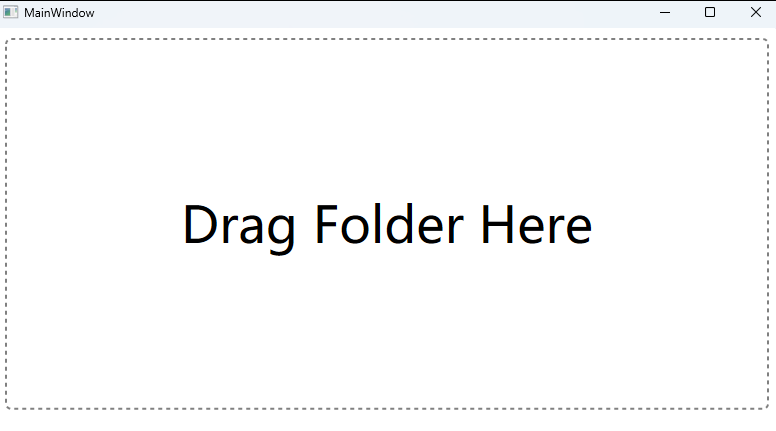

# 推荐一个使用 HardLink 硬链接减少重复文件占用磁盘空间的工具

在 NTFS 文件系统里面，咱可以使用 HardLink 硬链接的方式，将多个重复的文件链接到磁盘的同一份记录里面，从而减少在磁盘里面对重复文件存储多份记录，减少磁盘空间的占用。本文将和大家推荐我所做的基于 HardLink 硬链接减少重复文件占用磁盘空间的工具

<!--more-->
<!-- CreateTime:2023/12/9 10:59:42 -->

<!-- 发布 -->
<!-- 博客 -->

此工具名为 UsingHardLinkToZipNtfsDiskSize 在 GitHub 上完全开源，请看 [https://github.com/dotnet-campus/dotnetcampus.DotNETBuildSDK](https://github.com/dotnet-campus/dotnetcampus.DotNETBuildSDK)

使用方法

1. 启动 UsingHardLinkToZipNtfsDiskSize 工具
2. 将需要进行瘦身的文件夹拖入到工具的 "Drag Folder Here" 里面即可

<!--  -->


拖进去之后，工具将会分析拖入的文件夹里面包含的重复文件，记录文件哈希值，调用 [CreateHardLink](https://learn.microsoft.com/zh-cn/windows/win32/api/winbase/nf-winbase-createhardlinkw) 这个 Win32 函数创建硬链接减少重复文件。如此实现减少重复文件占用磁盘空间

用前须知：由于采用的是硬链接的方式，意味着重复的文件都会指向磁盘里面的相同一份空间，如对其中的一个文件进行修改，将会让修改同时对其他的重复文件生效。因此只建议用在只读存档文件里面，比如一些再也不改的图片、再也不改的视频、再也不改的程序文件等。不适合用于文档、游戏存档等文件

这个 UsingHardLinkToZipNtfsDiskSize 工具的开发背景是我此前开源了 CopyAfterCompileTool 工具，这个 CopyAfterCompileTool 工具的作用就是将代码仓库里面的每个 commit 提交都进行构建，将构建生成的内容存储起来。如此方便快速定位问题，比如想要知道某个 commit 提交实现的效果或造成的问题，就可以快速获取这次 commit 提交构建输出的内容，减少重复的构建过程，提高开发定位问题的效率。通过 CopyAfterCompileTool 工具，我所在的团队快速二分了许多问题。详细请看 [用于辅助做二分调试的构建每个 commit 的工具](https://blog.lindexi.com/post/%E7%94%A8%E4%BA%8E%E8%BE%85%E5%8A%A9%E5%81%9A%E4%BA%8C%E5%88%86%E8%B0%83%E8%AF%95%E7%9A%84%E6%9E%84%E5%BB%BA%E6%AF%8F%E4%B8%AA-commit-%E7%9A%84%E5%B7%A5%E5%85%B7.html )

然而经过了几年的构建，我发现存储这些 commit 提交的构建输出内容的磁盘的空间已经不足了。于是我就在想着能够有什么方法优化一下磁盘空间的占用，开始是开了磁盘的压缩功能，开了之后发现能够压缩一半的空间，毕竟对于大部分构建输出的 DLL 和 Exe 来说，压缩一半的空间是十分简单的。就这样又跑了很久，磁盘空间又不足了。这次我发现了相邻的构建之间的文件的差异其实是很小的，很多的时候开发者的变更只是修改其中的某几个 DLL 而已，更多的文件都是相同的

这就意味着存储这些 commit 提交的构建输出内容的文件夹里面，存在十分多的重复文件。为了减少重复文件浪费的磁盘空间，同时为了能够尽量减少上层应用对减少重复文件的感知，我就选用了 [CreateHardLink](https://learn.microsoft.com/zh-cn/windows/win32/api/winbase/nf-winbase-createhardlinkw) 方法创建硬链接的方式减少重复文件。由于 HardLink 硬链接是非常底层的，不说应用程序，即使许多系统组件，都不会感知到差异。这是因为从某个角度上说，在 Explorer 资源管理器里面所看到的所有文件其实都是硬链接的，只不过绝大部分文件只硬链接一份，而经过了 UsingHardLinkToZipNtfsDiskSize 工具将会硬链接多份

使用 HardLink 硬链接减少重复的文件，依然可以让几乎所有上层的应用程序无感知变化，让许多系统组件都不会感知到差异。于是无论是文件共享还是 SMB 系列，还是磁盘挂载，还是 http 文件分享工具，还是构建输出的应用程序本身，都能很好的工作

以上就是 UsingHardLinkToZipNtfsDiskSize 工具的制作背景。当然，还有一个理由就是作为开发者，无论用到什么功能，我都喜欢自己做一次，不管是不是有别人做的更好的工具。做的过程也是学习的过程，接下来我将会告诉大家制作这个工具我所遇到的技术问题

以下是 UsingHardLinkToZipNtfsDiskSize 工具的实现细节，我只列出其中踩坑的技术点

我先通过 DirectoryInfo 的 EnumerateFiles 方法枚举出整个文件夹，如下面代码

```csharp
        foreach (var file in workFolder.EnumerateFiles("*", enumerationOptions: new EnumerationOptions()
        {
            RecurseSubdirectories = true,
            MaxRecursionDepth = 100,
        }))
        {
            // ...
        }
```

之所以采用 EnumerateFiles 方法而不是 GetFiles 方法是因为如果传入的文件夹包含了超级多数量的文件，比如我的需求是将 commit 构建输出的存储文件夹进行优化，里面有大概 10w 个 commit 构建输出的内容，每个 commit 输出文件大概是 200 多个文件，也就是超过千万个文件，此时 EnumerateFiles 的优势就体现出来了。调用 GetFiles 方法将会先执行一次完全的遍历，获取到所有的文件，换句话说就是在我的当前需求里面就是需要一口气遍历超过千万个文件，构建了一个超过千万个字符串的超大数组。而 EnumerateFiles 则是用到再遍历，不需要一口气就遍历完所有的文件，在我当前的情况下特别合适

遍历到文件之后，我通过 SHA1 的 HashDataAsync 计算文件的哈希。对于文件的哈希计算来说，常见的方法有 MD5 和 SHA1 两个方法。为什么选用 SHA1 而不是 MD5 呢？这里也许某些伙伴有一个误解，那就是 MD5 由于安全性问题被越来越多不推荐使用了，然而这完全不是这里不使用的原因。对于作为本地的某段信息的摘要比较，使用 MD5 是完全没有问题的。比如我只是为了方便比较本地的文件，那么此时使用 MD5 是不需要也不应该考虑安全性问题的。这里使用 SHA1 而不是 MD5 的原因只是因为 SHA1 更快而已。为什么 SHA1 更快呢？似乎我读书那会自己推导性能是 MD5 更快才对，哈哈，如果你也有整个印象那就证明咱是差不多个年代的开发者。从算法推导上 MD5 确实比 SHA1 快，但架不住 SHA1 可以作弊呀，在 CPU 层对 SHA1 有特殊指令进行硬件加速，现在的绝大部分电脑的 CPU 带上了对此指令的支持，在 dotnet 里面一旦 CPU 有硬件优化加速将会自动使用硬件加速，详细请看 [Intel SHA extensions - Wikipedia](https://en.wikipedia.org/wiki/Intel_SHA_extensions )

使用 .NET 7 引入的 HashDataAsync 方法可以获取更优的性能，这个方法可以生成 20 个 byte 的 SHA1 哈希内容，可以复用传入的结果数组，减少 byte 数组对象的创建，减少对 GC 的压力

通过计算哈希，将哈希存放在本地的 Sqlite 数据库里面，即可快速查询了解到是否存在重复的文件以及重复的文件有哪些

存放 Sqlite 数据库我采用的是 EF 来辅助存放。我开始的时候采用的是将一个 EF 的 Context 从头到尾的使用，也就是将一个 EF 的 Context 应用在所有的文件哈希变更和查询里面，大概的代码写法如下

```csharp
        await using var fileStorageContext = new FileStorageContext(sqliteFile.FullName);

        foreach (var file in workFolder.EnumerateFiles("*", enumerationOptions: new EnumerationOptions()
        {
            RecurseSubdirectories = true,
            MaxRecursionDepth = 100,
        }))
        {
        	// ...

            // 添加文件记录
            fileStorageContext.FileRecordModel.Add(new FileRecordModel()
            {
                FilePath = file.FullName,
                FileLength = fileLength,
                FileSha1Hash = sha1,
            });

        	// 查询是否存在重复的文件
        	var fileStorageModel = await fileStorageContext.FileStorageModel.FindAsync(sha1);
        }
```

在跑了大概 10w 个文件，即可发现 EF 性能在不断下降。这是因为在 EF 里面做了实体追踪功能，导致产生了大量追踪对象，被追踪功能拖慢了性能。从内存上看都是一堆 `Snapshot<String>` 和 `InternalEntityEntry` 对象

解决方法是要么不复用 FileStorageContext 对象，要么不要追踪，详细请看 [更改检测和通知 - EF Core Microsoft Learn](https://learn.microsoft.com/zh-cn/ef/core/change-tracking/change-detection )

我这里为了简单起见，就不复用 FileStorageContext 对象，更改之后如下代码

```csharp

        foreach (var file in workFolder.EnumerateFiles("*", enumerationOptions: new EnumerationOptions()
        {
            RecurseSubdirectories = true,
            MaxRecursionDepth = 100,
        }))
        {
            await using var fileStorageContext = new FileStorageContext(sqliteFile.FullName);
        	// ...

            // 添加文件记录
            fileStorageContext.FileRecordModel.Add(new FileRecordModel()
            {
                FilePath = file.FullName,
                FileLength = fileLength,
                FileSha1Hash = sha1,
            });

        	// 查询是否存在重复的文件
        	var fileStorageModel = await fileStorageContext.FileStorageModel.FindAsync(sha1);
        }
```

也就是在每次文件的循环里面不断创建和释放 FileStorageContext 内容，如此即可减少追踪的性能影响。同时每次文件循环里面的性能点也都在文件的读取和计算 SHA1 里面，对数据库的查询和添加的性能损耗可以忽略

以上的 FileStorageContext 类型的具体定义过于业务，如感兴趣的伙伴还请阅读开源的代码

使用 [CreateHardLink](https://learn.microsoft.com/zh-cn/windows/win32/api/winbase/nf-winbase-createhardlinkw) 方法创建硬链接时有一个限制是我之前都不知道的，那就是有最大链接数量限制，最多只能支持 1023 个链接。对于我的需求来说，很简单就超过了限制，存在重复的文件太多了

我开始不知道这个问题，于是没有判断 [CreateHardLink](https://learn.microsoft.com/zh-cn/windows/win32/api/winbase/nf-winbase-createhardlinkw) 方法返回值，创建失败了还将原文件删除，只好写一个修复程序将删除掉的文件还原回来

> 使用此函数可以创建的硬链接的最大数目为每个文件 1023。 如果为文件创建的链接超过 1023 个，则会导致错误

我的策略逻辑是调用 [CreateHardLink](https://learn.microsoft.com/zh-cn/windows/win32/api/winbase/nf-winbase-createhardlinkw) 方法之后，不仅判断返回值，还通过 File.Exists 方法判断文件是否还存在

经过大量的测试发现只要 [CreateHardLink](https://learn.microsoft.com/zh-cn/windows/win32/api/winbase/nf-winbase-createhardlinkw) 方法返回成功，全部的 File.Exists 方法判断文件是否还存在都通过，证明了此方法的返回值十分可行

额外的，为了让我的界面能够显示一行日志，我还修改了日志组件。我编写了一个 ChannelLoggerProvider 的继承 ILoggerProvider 接口的类型，在 ChannelLoggerProvider 里面的核心实现是进行日志的分发

大家都知道，一般情况下都不应该在记录日志的地方等待日志的消费，除非是特别重要的日志。我在 ChannelLoggerProvider 里面使用了 System.Threading.Channels.Channel 编写了生产者消费者模式，支持注入多个消费者。也就是让同一条消息被多个消费者同时消费，于是就同时将日志记录到文件里面也将日志显示在 WPF 应用程序的界面上

```csharp
public class ChannelLoggerProvider : ILoggerProvider
{
    public ChannelLoggerProvider(params IStringLoggerWriter[] stringLoggerWriterList)
    {
        _stringLoggerWriterList = stringLoggerWriterList;
        var channel = Channel.CreateUnbounded<string>(new UnboundedChannelOptions()
        {
            SingleReader = true
        });
        _channel = channel;

        Task.Run(WriteLogAsync);
    }

    private readonly IStringLoggerWriter[] _stringLoggerWriterList;

    private async Task? WriteLogAsync()
    {
        while (!_channel.Reader.Completion.IsCompleted)
        {
            try
            {
                var message = await _channel.Reader.ReadAsync();
                foreach (var stringLoggerWriter in _stringLoggerWriterList)
                {
                    await stringLoggerWriter.WriteAsync(message);
                }
            }
            catch (ChannelClosedException)
            {
                // 结束
            }
        }

        foreach (var stringLoggerWriter in _stringLoggerWriterList)
        {
            await stringLoggerWriter.DisposeAsync();
        }
    }

    private readonly Channel<string> _channel;
    public void Dispose()
    {
        ChannelWriter<string> channelWriter = _channel.Writer;
        channelWriter.TryComplete();
    }

    public ILogger CreateLogger(string categoryName)
    {
        return new ChannelLogger(_channel.Writer);
    }

    class ChannelLogger : ILogger, IDisposable
    {
        public ChannelLogger(ChannelWriter<string> writer)
        {
            _writer = writer;
        }

        private readonly ChannelWriter<string> _writer;

        public void Log<TState>(LogLevel logLevel, EventId eventId, TState state, Exception? exception, Func<TState, Exception?, string> formatter)
        {
            var message = $"{DateTime.Now:yyyy.MM.dd HH:mm:ss,fff} [{logLevel}][{eventId}] {formatter(state, exception)}";
            _ = _writer.WriteAsync(message);
        }

        public bool IsEnabled(LogLevel logLevel)
        {
            return true;
        }

        public IDisposable? BeginScope<TState>(TState state) where TState : notnull
        {
            return this;
        }

        public void Dispose()
        {
        }
    }
}
```

日志的使用方法如下

```csharp
        using var channelLoggerProvider = new ChannelLoggerProvider(...);

        using var loggerFactory = LoggerFactory.Create(builder =>
        {
            // ReSharper disable once AccessToDisposedClosure
            builder.AddProvider(channelLoggerProvider);
        });

        var logger = loggerFactory.CreateLogger(xxx);
```

由于我的界面上只需要显示一行的内容，而显示界面的速度有时候会远远小于日志生产的速度。而根据这里的需求，只需要显示最新的一行即可，这就意味着可以随意丢掉中间的过程日志内容。根据此需求即可实现为写一个布尔字段，当有值进入时，设置只允许通过一次，且由于这里的记录的信息不重要也不需要多线程安全问题，简单的实现如下

```csharp
    private readonly TextBlock _logTextBlock;

    private string _lastMessage = string.Empty;
    private bool _isInvalidate = false;

    public ValueTask WriteAsync(string message)
    {
        _lastMessage = message;

        if (!_isInvalidate)
        {
            _isInvalidate = true;

            _logTextBlock.Dispatcher.InvokeAsync(() =>
            {
                _logTextBlock.Text = _lastMessage;
                _isInvalidate = false;
            });
        }

        return ValueTask.CompletedTask;
    }
```

也就是进入到 WriteAsync 方法里面时无论如何都更新 `_lastMessage` 的值，接着判断 `_isInvalidate` 只允许进入一次调度主线程，防止主线程过于忙碌

在主线程完成赋值之后，再设置 `_isInvalidate` 允许下一次的调度进来

以上的实现方法的优点在于十分简单，缺点在于可能存在最后一次的消息没有被正确消费。也就是说可能最后一条日志没有能够在界面上显示出来