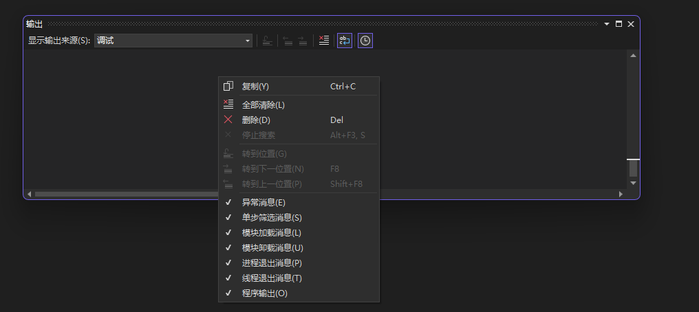

# 测试 dotnet 9 的 AssemblyLoadContext 动态加载和卸载程序集能力

本文记录我测试 dotnet 9 的 AssemblyLoadContext 动态加载和卸载程序集能力。实测发现可以动态进行加载，且在卸载之后对程序集 DLL 文件能够做到无引用，卸载之后可以正常删除程序集 DLL 文件

<!--more-->


<!-- 发布 -->
<!-- 博客 -->

为了方便测试，我新建了两个项目，分别是 JucufolalKuwenallfiko 和 KarnadikemnemkaCallcilowhijinem 项目。其中 KarnadikemnemkaCallcilowhijinem 项目当成被动态加载的程序集内容

先在 KarnadikemnemkaCallcilowhijinem 编写一些测试用的代码，方便被动态加载时可以执行一些内容，编写的测试代码如下

```csharp
using System;
using System.Collections.Generic;
using System.Linq;
using System.Text;
using System.Threading.Tasks;

namespace KarnadikemnemkaCallcilowhijinem;

public class Foo
{
    public void Do()
    {
        Console.WriteLine("Foo");
    }
}
```

为了方便两个项目之间进行动态 DLL 引用时，寻找到对应的文件。我通过设置 ArtifactsPath 的方式，更改其输出路径，将其进行统一。具体做法是在两个项目的上层文件夹放入 Directory.Build.props 文件，加入以下配置代码。如果大家不清楚这些项目文件组织方式，还请到本文末尾获取本文所有代码，了解项目组织方式

```xml
<Project>
  <PropertyGroup>
    <ArtifactsPath>$(MSBuildThisFileDirectory)Artifacts</ArtifactsPath>
  </PropertyGroup>
</Project>
```

进入到 JucufolalKuwenallfiko 项目的 Program.cs 文件里，先找到 KarnadikemnemkaCallcilowhijinem.dll 文件，寻找的代码如下

```csharp
#if DEBUG
var configuration = "Debug";
#else
var configuration = "Release";
#endif

var dllFile = Path.Join(AppContext.BaseDirectory,
    @$"..\..\KarnadikemnemkaCallcilowhijinem\{configuration}\KarnadikemnemkaCallcilowhijinem.dll");
dllFile = Path.GetFullPath(dllFile);

Console.WriteLine($"测试加载 {dllFile}");

if (!File.Exists(dllFile))
{
}
```

通过 `File.Exists(dllFile)` 方法确保能够找到正确的路径

由于可能存在各种引用问题导致的不释放，为了让测试代码更加专注，我新建了名为 LoadAndUnloadAssembly 的本地方法，防止方法上下文之间的捕获导致 Debug 下效果不符合预期的行为

在 .NET Core 下，动态加载程序集应该使用 AssemblyLoadContext 类型，创建此类型的对象的代码如下

```csharp
WeakReference LoadAndUnloadAssembly()
{
    var assemblyLoadContext = new AssemblyLoadContext("Test", isCollectible: true);
    ... // 忽略其他代码
}
```

执行动态加载程序集，代码如下

```csharp
    Assembly assembly = assemblyLoadContext.LoadFromAssemblyPath(dllFile);
```

预期此时能够加载成功。加载成功之后，尝试反射获取 Foo 类型，将其跑起来，代码如下

```csharp
    var fooType = assembly.GetType("KarnadikemnemkaCallcilowhijinem.Foo")!;
    var foo = Activator.CreateInstance(fooType);
    var methodInfo = fooType.GetMethod("Do")!;
    methodInfo.Invoke(foo, null);
```

预期跑起来的时候，能够看到控制台存在对应的输出内容，证明反射正确调用了 Do 方法

此时方式直接立刻删除 dll 文件，预期是删除失败。但由于 Release 下的释放问题，有一定可能性能够删除成功

```csharp
    try
    {
        File.Delete(dllFile);
        Console.WriteLine($"立刻删除程序集文件成功");
    }
    catch (UnauthorizedAccessException e)
    {

    }
```

接下来是本文的核心部分，通过 AssemblyLoadContext 的 Unload 进行动态卸载程序集，代码如下

```csharp
    assemblyLoadContext.Unload();
```

这里可能有一些伙伴会错误地立刻在 AssemblyLoadContext 的 Unload 之后，去查看 DLL 文件的占用情况，如立刻去删除 DLL 文件。此时大部分情况下应该也是失败的。其原因是现在依然在内存里面还存活着此程序集里面的类型对应的对象，此时程序集还被这些对象引用占用着

正确的处理方法是等待到 `assemblyLoadContext` 也被回收的时候，再尝试删除 DLL 文件，预期此时就没有占用了

那么接下来的问题是如何判断 `assemblyLoadContext` 对象被回收了？方法很简单，细心的伙伴也许发现了 LoadAndUnloadAssembly 方法是带 WeakReference 返回值的。没错，通过 WeakReference 包装 `assemblyLoadContext` 对象制作弱引用，通过判断弱引用是否存活即可了解到对象是否被回收

```csharp
WeakReference LoadAndUnloadAssembly()
{
    var assemblyLoadContext = new AssemblyLoadContext("Test", isCollectible: true);
    Assembly assembly = assemblyLoadContext.LoadFromAssemblyPath(dllFile);
    var fooType = assembly.GetType("KarnadikemnemkaCallcilowhijinem.Foo")!;
    var foo = Activator.CreateInstance(fooType);
    var methodInfo = fooType.GetMethod("Do")!;
    methodInfo.Invoke(foo, null);
    try
    {
        File.Delete(dllFile);
        Console.WriteLine($"立刻删除程序集文件成功");
    }
    catch (UnauthorizedAccessException e)
    {

    }
    assemblyLoadContext.Unload();
    return new WeakReference(assemblyLoadContext);
}
```

调用 LoadAndUnloadAssembly 方法进行动态加载和卸载程序集之后，再通过判断返回的 WeakReference 里面的对象是否存活了解 AssemblyLoadContext 对象是否被回收

为了方便测试，我这里编写了通过有限循环加上强制 GC 的方式等待释放，代码如下

```csharp
var t = LoadAndUnloadAssembly();

for (int i = 0; t.IsAlive; i++)
{
    GC.Collect();
    GC.WaitForFullGCComplete();
    GC.Collect();

    Thread.Sleep(1000);

    if (i > 100)
    {
        Console.WriteLine($"等不到释放");
        return;
    }
}
```

在正常的业务代码里面不应该这么编写的

预期在循环的过程中，可以在调试下的 VisualStudio 输出窗口里面看到程序集卸载的输出信息。如果没能看到输出的信息，则可能是输出窗口里面没有勾选消息的输出。右击输出窗口，全部消息都勾选，如下图所示

<!--  -->


完成循环之后，再等待一下，即可删除文件了，代码如下

```csharp
Thread.Sleep(1000);

File.Delete(dllFile);

Console.WriteLine($"成功删除文件 {dllFile}");
```

预期无论是在 Debug 或 Release 下，都能成功加载和卸载程序集，且在卸载程序集之后释放对 DLL 文件的占用，可以成功删除 DLL 程序集文件

全部的 Program.cs 代码如下

```csharp
using System.Reflection;
using System.Runtime.Loader;

#if DEBUG
var configuration = "Debug";
#else
var configuration = "Release";
#endif

var dllFile = Path.Join(AppContext.BaseDirectory,
    @$"..\..\KarnadikemnemkaCallcilowhijinem\{configuration}\KarnadikemnemkaCallcilowhijinem.dll");
dllFile = Path.GetFullPath(dllFile);

Console.WriteLine($"测试加载 {dllFile}");

var t = LoadAndUnloadAssembly();

for (int i = 0; t.IsAlive; i++)
{
    GC.Collect();
    GC.WaitForFullGCComplete();
    GC.Collect();

    Thread.Sleep(1000);

    if (i > 100)
    {
        Console.WriteLine($"等不到释放");
        return;
    }
}

Thread.Sleep(1000);

File.Delete(dllFile);

Console.WriteLine($"成功删除文件 {dllFile}");

WeakReference LoadAndUnloadAssembly()
{
    var assemblyLoadContext = new AssemblyLoadContext("Test", isCollectible: true);
    Assembly assembly = assemblyLoadContext.LoadFromAssemblyPath(dllFile);
    var fooType = assembly.GetType("KarnadikemnemkaCallcilowhijinem.Foo")!;
    var foo = Activator.CreateInstance(fooType);
    var methodInfo = fooType.GetMethod("Do")!;
    methodInfo.Invoke(foo, null);
    try
    {
        File.Delete(dllFile);
        Console.WriteLine($"立刻删除程序集文件成功");
    }
    catch (UnauthorizedAccessException e)
    {
    }
    assemblyLoadContext.Unload();
    return new WeakReference(assemblyLoadContext);
}
```

本文代码放在 [github](https://github.com/lindexi/lindexi_gd/tree/7e6f154573e031ec5d042bf3270b1e57fc3ab8a2/Workbench/GewobigeheCehijirawha) 和 [gitee](https://gitee.com/lindexi/lindexi_gd/blob/7e6f154573e031ec5d042bf3270b1e57fc3ab8a2/Workbench/GewobigeheCehijirawha) 上，可以使用如下命令行拉取代码。我整个代码仓库比较庞大，使用以下命令行可以进行部分拉取，拉取速度比较快

先创建一个空文件夹，接着使用命令行 cd 命令进入此空文件夹，在命令行里面输入以下代码，即可获取到本文的代码

```
git init
git remote add origin https://gitee.com/lindexi/lindexi_gd.git
git pull origin 7e6f154573e031ec5d042bf3270b1e57fc3ab8a2
```

以上使用的是国内的 gitee 的源，如果 gitee 不能访问，请替换为 github 的源。请在命令行继续输入以下代码，将 gitee 源换成 github 源进行拉取代码。如果依然拉取不到代码，可以发邮件向我要代码

```
git remote remove origin
git remote add origin https://github.com/lindexi/lindexi_gd.git
git pull origin 7e6f154573e031ec5d042bf3270b1e57fc3ab8a2
```

获取代码之后，进入 Workbench/GewobigeheCehijirawha 文件夹，即可获取到源代码

更多技术博客，请参阅 [博客导航](https://blog.lindexi.com/post/%E5%8D%9A%E5%AE%A2%E5%AF%BC%E8%88%AA.html )


<a rel="license" href="http://creativecommons.org/licenses/by-nc-sa/4.0/"></a><br />本作品采用<a rel="license" href="http://creativecommons.org/licenses/by-nc-sa/4.0/">知识共享署名-非商业性使用-相同方式共享 4.0 国际许可协议</a>进行许可。欢迎转载、使用、重新发布，但务必保留文章署名[林德熙](http://blog.csdn.net/lindexi_gd)(包含链接:http://blog.csdn.net/lindexi_gd )，不得用于商业目的，基于本文修改后的作品务必以相同的许可发布。如有任何疑问，请与我[联系](mailto:lindexi_gd@163.com)。