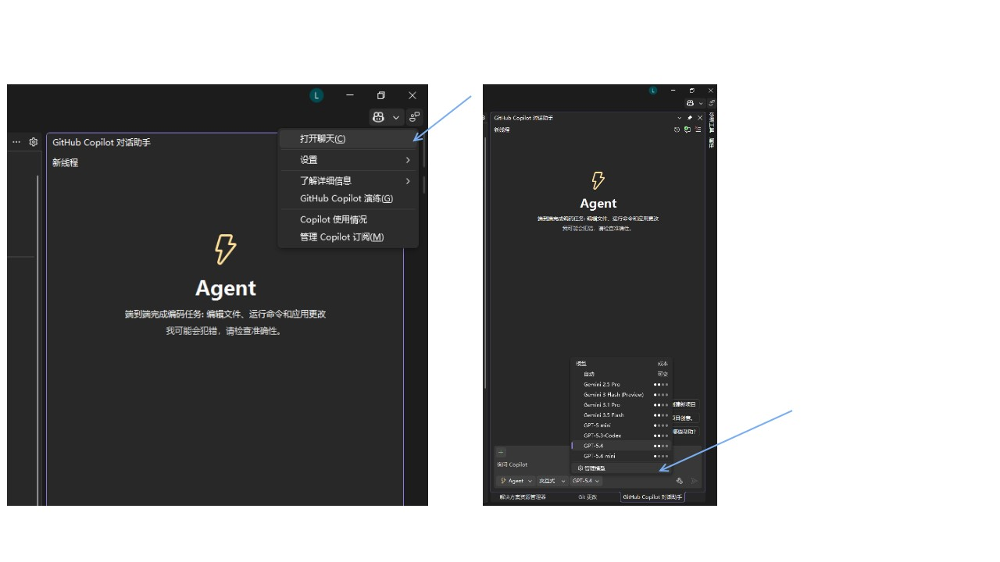
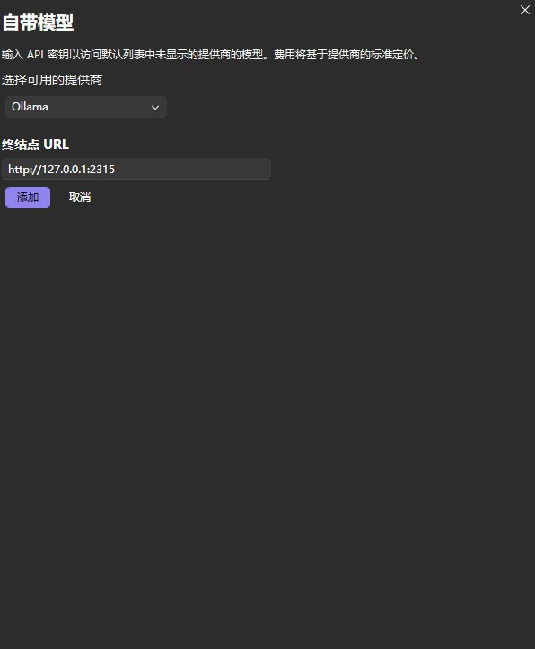
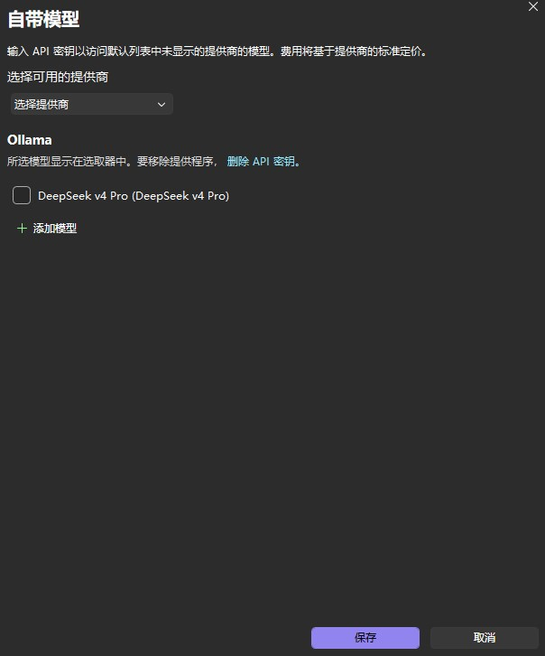
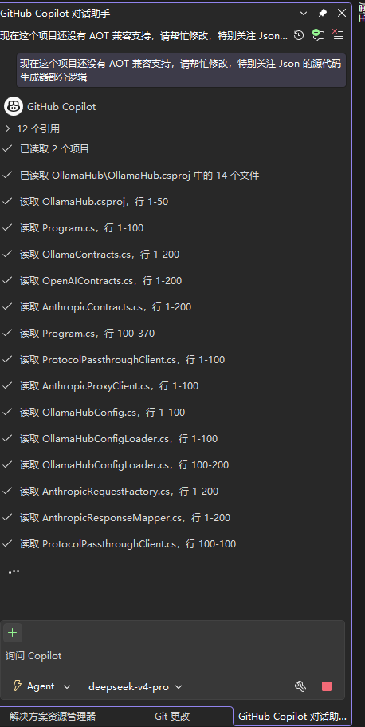
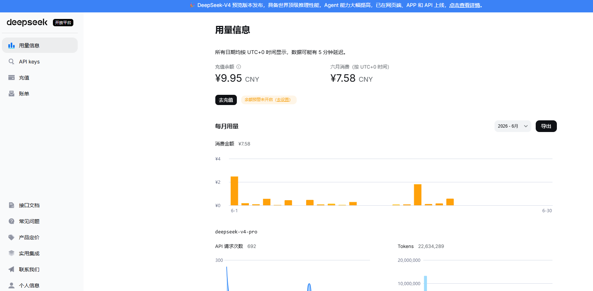
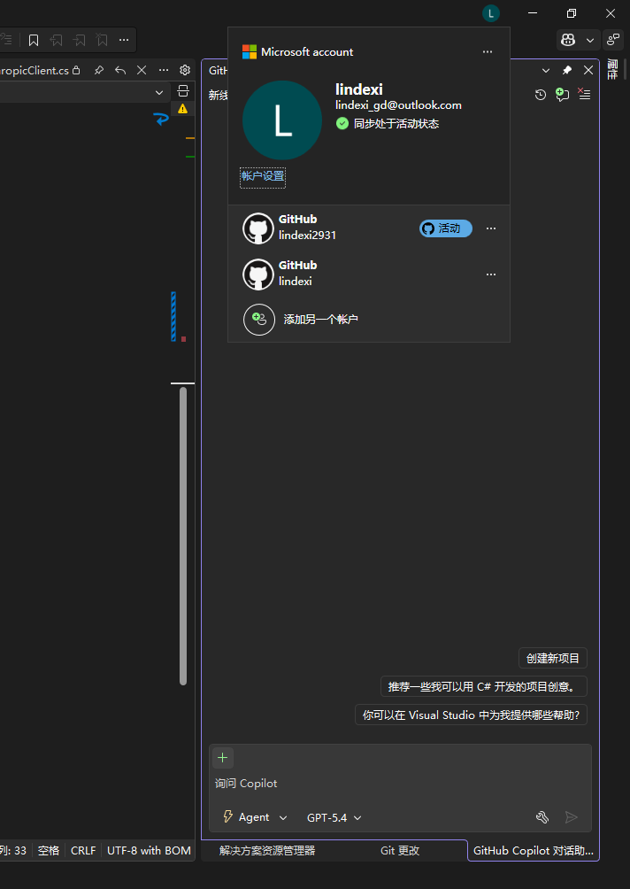

# 用 OllamaHub  让 Visual Studio Copilot 可以对接任意模型

随着 GitHub Copilot 订阅策略发现变化，再叠加上国产 DeepSeek 大降价与 GLM 5.2 发力。默认 GitHub Copilot 提供的模型已经不香了，也不够用了。本文将和大家介绍如何使用 OllamaHub 对接国内的 DeepSeek 模型。相信看完本文之后，大家也自然地学会对接其他厂商，如 GLM 、阿里千问、豆包等等

<!--more-->
<!-- CreateTime:2026/06/22 09:35:26 -->

<!-- 发布 -->
<!-- 博客 -->

OllamaHub 的开源项目地址： <https://github.com/mingkuang-Chuyu/OllamaHub>

这种与账号安全相关的事情，十分推荐大家自己编项目自己跑起来，不要去用别人编好的。反正整个 dotnet 系的编译都非常简单

整个 OllamaHub 非常纯净，虽然名字叫 OllamaHub 但完全无需 Ollama 的任何依赖。仅仅只是模拟 Ollama 协议用于左边连 Visual Studio Copilot，右边连其他厂商而已。整个 OllamaHub 项目全 C# 代码，结构简单，基本拉下来有心去看，不到一会代码就全扫完了。这也就是我敢和大家推荐的原因

先用 GitHub 拉取项目，如果发现难以访问。那就请试试用 Gitee 将其拉下来： <https://gitee.com/projects/import/url>

拉下来项目之后，先 cd 进入 OllamaHub 文件夹后，可以一键用 dotnet run 跑起来项目

开始以上步骤前的准备工作是将 Visual Studio 更新到最新（自然也就包含 dotnet 10 的负载了）

此时的 dotnet run 是不会有什么结果的，因为其配置文件还没设置。定位到构建的输出路径，正常也就在 OllamaHub 的 `bin\Debug\net10.0` 文件夹下，在此文件夹里面新建一个名为 `settings.json` 的项目，填入如下内容：

```json
{
  "logging": 
  {
    "level": "info"
  },
  "host": "127.0.0.1",
  "port": 2315,
  "url": null,
  "baseUrl": null,
  "providers": 
   [
    {
      "id": "DeepSeek",
      "baseUrl": "https://api.deepseek.com",
      "apiKey": "sk-换成你的 DeepSeek 的 Key",
      "protectedApiKey": null,
      "apiMode": "openai",
      "headers": {}
    }
  ],
  "models": [
    {
      "id": "deepseek-v4-pro",
      "displayName": "DeepSeek v4 Pro",
      "configId": null,
      "family": null,
      "owned_by": null,
      "provider": "DeepSeek",
      "provide": null,
      "baseUrl": null,
      "apiKey": null,
      "protectedApiKey": null,
      "apiMode": "openai",
      "context_length": 1000000,
      "max_tokens": 1000000,
      "vision": false,
      "temperature": null,
      "top_p": null,
      "headers": 
      {
        "Content-Type": "application/json"
      },
      "extra": {}
    }
  ]
}
```

通过如上配置可以看到，可以支持任意的兼容 OpenAI 的 API 接口的厂商提供的模型。以上我写的是 DeepSeek 的模型，以上配置相信大家看一眼就明白其设置了。关键部分在于写明 `providers` 提供商，这里可以写模型厂商，比如豆包的、阿里的、甚至是 360 系的等等。在 models 里面写明有哪些模型，模型由哪个厂商提供，关键属性为 id 和 `displayName` 以及 `provider` 这三个，分别是模型的 Id 号（豆包的模型的 Id 与模型名是不同的），和展示给开发者自己看的模型名，以及由哪个提供商提供的（有可能 deepseek 是阿里提供的，取决于你买了谁的服务）

请将上面的 DeepSeek 的 API Key 换成你自己的。我想给 DeepSeek 打个免费的广告： DeepSeek 实在太便宜了，而且模型也聪明。没有为编程专门训练的 DeepSeek v4 Pro 模型，实际用起来也十分好用。大概日常用的话，一天 1 块钱到 5 块钱之间

获取 DeepSeek 的 API Key 方法：

1. 进入 `https://platform.deepseek.com/api_keys`，需要自行注册和登录账号
2. 点充值，充 10 块钱就够了，因为 10 块钱就够用很久了
3. 点 API Keys 选项卡，点击创建 API Key 即可

再次重新运行 OllamaHub.exe 文件，即可看到现在监听到了本地的 2315 端口，且日志里面说明了已经加载了至少一个模型：

```
Loaded 1 model(s) from Xxx\OllamaHub\bin\Debug\net10.0\settings.json
```

完成以上步骤之后，即可在 Visual Studio 里面进行对接

在 Visual Studio Copilot 界面里面，在选择模型的最下方，点击管理模型

<!--  -->


选择 Ollama 然后填入 `http://127.0.0.1:2315` 即可

<!--  -->


以上的  2315 端口号就是在上面 `settings.json` 里配置的

配置完成之后点击添加，随后开始转圈，预期转圈完成之后即可显示出来刚才配置在  `settings.json` 里面的模型

<!--  -->


将其勾选后点保存即可

回到 Visual Studio Copilot 界面上，此时可选模型就包含了刚才咱添加的模型了

<!--  -->


我从 6 月 1 号到现在（6月21号），每天正常在用，拿 DeepSeek v4 Flash 当成补全模型，拿 DeepSeek v4 Pro 当成主力辅助模型。大概 20 天用了 7 块钱，就是感觉还很便宜的

<!--  -->


我现在有几个项目都是用 DeepSeek 辅助编写的，博客也是，感觉用起来不错

### 常见问题

#### 找不到“管理模型”选项？

原因1 是登录的是公司组织下的账号，这是受限的，切换为自己的账号，应该就可以了。切换方式就是切换活动账号，在 "..." 里面就能找到

<!--  -->


原因2是版本太旧了，试试升级一下吧

#### DeepSeek 报告 415 错误

原因是没有添加好 header 导致 DeepSeek 报告 Response: Expected request with Content-Type: application/json

解决方法是添加在配置里面 header 内容：

```json
      "headers": 
      {
        "Content-Type": "application/json"
      },
```