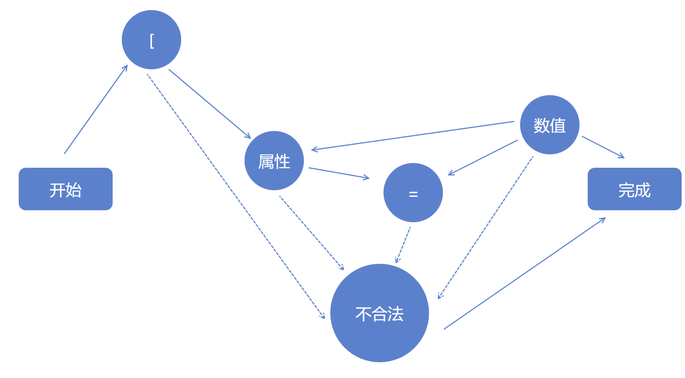

# 用状态机的思想解析字符串

在编程思想比较高级的有递归和状态机等使用比较少的代码就可以做出复杂的逻辑，状态机的思想是在一个状态到另一个状态，每个状态知道自己能处理的内容，同时知道可以调用哪些状态

如需要解析 [x=1,y=2,w=3,h=5] 的字符串作为一个矩形，使用状态机的方法解析，在知道使用状态机的开发者看到代码就会觉得很容易理解，对于不了解状态机的开发者就会觉得逻辑很绕

<!--more-->
<!-- CreateTime:2019/9/2 12:57:38 -->

<!-- csdn -->

从上面的字符串看，这个字符串包含五个解析状态

第一个状态是读取 `[` 字符，这个状态只要处理第一个字符是不是 `[` 如果是就到下状态，如果不是就到不合法状态。

第二个状态是解析属性，也就是 `x` `y` `w` `h` 的某个字符，知道写的是哪个属性。

第三个状态是解析等于号，在这个状态里面只处理读取到的字符是否是等于号。

第四个状态是解析数值，在这个状态需要一直读取字符，直到读取到的不是属于数值的字符。

第五个状态是不合法状态，在上面任意一个状态只要判断不符合规范就到这个。

<!--  -->


要写状态机就需要写出 Node 基类，上面五个不同的处理都需要继承 Node 类

还需要一个类用于传递数据和一个类用于管理跳转

我这里就将后面传递数据的和管理跳转的合为一个类 Manage 类

先写出 Node 的定义，在 C# 定义为一个接口

```csharp
    internal interface IRead
    {
        void Read(Manage manage);
    }
```

从上面的分析，对于不合法的定义可以放在 Manage 类，我定义了里面包含了一个 bool 属性和一个字符串属性，用于判断当前是否解析的字符串是不符合规范，同时告诉开发者是输入的哪里不符合规范

```csharp
    internal class Manage
    {
        public bool IsError { get; set; }

        public string ErrString { get; set; }
    }
```

同时定义其他的处理 

 - SquareBracketsRead 处理字符串的第一个字符 `[` 字符
 - PropertyRead 处理字符串读取到的属性
 - EqualRead 处理字符串的等于字符
 - DoubleRead 处理字符串里面的数值

将上面的处理在 Manage 里面定义

```csharp
    internal class Manage
    {
        public bool IsError { get; set; }

        public string ErrString { get; set; }

        public void ReadSquareBrackets()
        {
            _squareBracketsRead.Read(this);
        }

        public void ReadProperty()
        {
            _propertyRead.Read(this);
        }

        public void ReadDouble()
        {
            _doubleRead.Read(this);
        }

        public void ReadEqual()
        {
            _equalRead.Read(this);
        }

        private readonly IRead _doubleRead = new DoubleRead();
        private readonly IRead _equalRead = new EqualRead();
        private readonly IRead _propertyRead = new PropertyRead();
        private readonly IRead _squareBracketsRead = new SquareBracketsRead();
    }
```

现在开始实现解析第一个字符 `[` 的方法，代码非常简单，从上面的图知道，只要读取到第一个字符是 `[` 那么就继续解析属性，如果读取到不是，那么就告诉用户当前输入不规范

```csharp
    internal class SquareBracketsRead : IRead
    {
        /// <inheritdoc />
        public void Read(Manage manage)
        {
            if (manage.ReadChar() == '[')
            {
                manage.ReadProperty();
            }
            else
            {
                manage.Error("不是使用[开始");
            }
        }
    }
```

从代码可以知道，在 Manage 类需要提供读取一个字符的方法，从一个字符串不断读取字符可以使用 StringReader 的方法

```csharp
    internal class Manage
    {
        public Manage(StringReader read)
        {
            _read = read;
        }

        public char ReadChar()
        {
            return (char) _read.Read();
        }
    }
```

上面的代码跳转到解析属性，解析属性需要读取一个字符，判断这个字符是不是 `x` `y` `w` `h` 的某个字符，如果是就判断是不是已经解析过这个字符了，如果之前没有解析过，那么就开始读取等于号

```csharp
    internal class PropertyRead : IRead
    {
        /// <inheritdoc />
        public void Read(Manage manage)
        {
            var str = manage.ReadChar();
            string property;
            switch (str)
            {
                case 'w':
                case 'W':
                    property = "w";
                    break;
                case 'h':
                case 'H':
                    property = "h";
                    break;
                case 'x':
                case 'X':
                    property = "x";
                    break;
                case 'y':
                case 'Y':
                    property = "y";
                    break;
                default:
                    manage.Error("发现无法识别字符" + str);
                    return;
            }

            if (manage.ExitsProperty.Contains(property))
            {
                manage.Error("存在重复的属性" + property);
                return;
            }

            manage.SetCurrentProperty(property);

            manage.ReadEqual();
        }
    }
```

也就是在 Manage 里面需要有这样的支持，设置当前的正在解析的属性，也就是传递数据的类本来应该做的，传递数据的类需要做到下面方法和属性

```csharp
        public string CurrentProperty { private set; get; }

        public HashSet<string> ExitsProperty { get; } = new HashSet<string>();

        public void SetCurrentProperty(string str)
        {
            ExitsProperty.Add(str);
            CurrentProperty = str;
        }        
```

这样就可以在属性设置修改当前的读取的属性，在之后读取数值知道设置到哪个属性

在读取等于字符的方法代码十分简单，只是判断读取到的字符是不是等于号

```csharp
    internal class EqualRead : IRead
    {
        /// <inheritdoc />
        public void Read(Manage manage)
        {
            if (manage.ReadChar() == '=')
            {
                manage.ReadDouble();
            }
            else
            {
                manage.Error($"格式不对，在{manage.CurrentProperty}后面不是等于");
            }
        }
    }
```

读取数字的方法是比较复杂的，需要判断字符是不是 0-9 的字符，还需要判断当前的字符是不是小数点。或者判断字符是不是逗号或 `]` 字符

在判断到字符是 0-9 和小数点的时候，就加入到数字字符串中，在读取完成的时候进行解析

```csharp
            var str = new StringBuilder();
            while (true)
            {
                var c = manage.ReadChar();
                if (c <= '9' && c >= '0')
                {
                    str.Append(c);
                }
                else if (c == '.')
                {
                    str.Append(c);
                }
                // 其他代码
            }
```

在读取到逗号和 `]` 表示读取数字完成，如果是读取到逗号还需要调用读取属性方法，这样表示读取下一个属性，读取到 `]` 表示完成

```csharp
                else if (c == ',')
                {
                    if (ParseDouble(manage, str))
                    {
                        manage.ReadProperty();
                        return;
                    }
                }
                else if (c == ']')
                {
                    ParseDouble(manage, str);

                    return;
                }
```

这里的 ParseDouble 就是尝试解析数值，因为刚才没有判断读取了多少个小数点，如果小数点读取超过一个，那么 ParseDouble 函数将会返回 false 这时需要提示用户输入不规范

所以数字读取的代码请看代码

```csharp
    internal class DoubleRead : IRead
    {
        /// <inheritdoc />
        public void Read(Manage manage)
        {
            var str = new StringBuilder();
            while (true)
            {
                var c = manage.ReadChar();
                if (c <= '9' && c >= '0')
                {
                    str.Append(c);
                }
                else if (c == '.')
                {
                    str.Append(c);
                }
                else if (c == ',')
                {
                    if (ParseDouble(manage, str))
                    {
                        manage.ReadProperty();
                        return;
                    }
                }
                else if (c == ']')
                {
                    ParseDouble(manage, str);

                    return;
                }
            }
        }

        private bool ParseDouble(Manage manage, StringBuilder str)
        {
            if (double.TryParse(str.ToString(), out var n))
            {
                manage.SetCurrentProperty(n);
                return true;
            }

            manage.Error("无法将" + str + "转换");
            return false;
        }
    }

```

这里的代码要求传递数据的代码里面存在 SetCurrentProperty 设置当前的属性的数值请看代码

```csharp
        public void SetCurrentProperty(double value)
        {
            switch (CurrentProperty)
            {
                case "w":
                    _rect.Width = value;
                    break;
                case "h":
                    _rect.Height = value;
                    break;
                case "x":
                    _rect.X = value;
                    break;
                case "y":
                    _rect.Y = value;
                    break;
            }
        }

        private Rect _rect;
```

这就是通过状态机的思想去解析一个字符串，虽然看起来这个解析的代码很多，同时有些绕，但是在理解之后会发现很容易写出这样的代码，同时也很简单

那么上面的代码还有哪些问题？存在的问题就是调用堆栈很多，需要不断从方法调用另一个方法。解决这样的问题在于管理类的做法还可以修改，也就是每个 Node 的方法都是有返回值的，在 Manage 根据返回值跳转到不同的方法，这样就可以减少堆栈提高一点性能

其实写编译器主要用的也是这个方法，只是大家从上面代码也可以知道，解析如何简单的字符串到需要这么多的代码，如果没有人写出来直接给代码也是比较难知道在写的方法，解析一个很长的代码需要的代码大家想想就知道

有小伙伴吐槽说上面的解析使用一个正则也能解决，是的，但是本文主要是介绍状态机的思想

通过 `\[x=[\d\.]+,y=[\d\.]+,w=[\d\.]+,h=[\d\.]+\]` 正则可以解析上面的字符串

想了解更多编译请看[手把手教你写 Roslyn 修改编译](https://blog.lindexi.com/post/roslyn )

课件 [状态机](https://r302.cc/VMLqvk?platform=enpc&channel=copylink)

下面是解析的所有代码

```csharp
    internal class SquareBracketsRead : IRead
    {
        /// <inheritdoc />
        public void Read(Manage manage)
        {
            if (manage.ReadChar() == '[')
            {
                manage.ReadProperty();
            }
            else
            {
                manage.Error("不是使用[开始");
            }
        }
    }

    internal class PropertyRead : IRead
    {
        /// <inheritdoc />
        public void Read(Manage manage)
        {
            var str = manage.ReadChar();
            string property;
            switch (str)
            {
                case 'w':
                case 'W':
                    property = "w";
                    break;
                case 'h':
                case 'H':
                    property = "h";
                    break;
                case 'x':
                case 'X':
                    property = "x";
                    break;
                case 'y':
                case 'Y':
                    property = "y";
                    break;
                default:
                    manage.Error("发现无法识别字符" + str);
                    return;
            }

            if (manage.ExitsProperty.Contains(property))
            {
                manage.Error("存在重复的属性" + property);
                return;
            }

            manage.SetCurrentProperty(property);

            manage.ReadEqual();
        }
    }

    internal class EqualRead : IRead
    {
        /// <inheritdoc />
        public void Read(Manage manage)
        {
            if (manage.ReadChar() == '=')
            {
                manage.ReadDouble();
            }
            else
            {
                manage.Error($"格式不对，在{manage.CurrentProperty}后面不是等于");
            }
        }
    }

    internal class DoubleRead : IRead
    {
        /// <inheritdoc />
        public void Read(Manage manage)
        {
            var str = new StringBuilder();
            while (true)
            {
                var c = manage.ReadChar();
                if (c <= '9' && c >= '0')
                {
                    str.Append(c);
                }
                else if (c == '.')
                {
                    str.Append(c);
                }
                else if (c == ',')
                {
                    if (ParseDouble(manage, str))
                    {
                        manage.ReadProperty();
                        return;
                    }
                }
                else if (c == ']')
                {
                    ParseDouble(manage, str);

                    return;
                }
            }
        }

        private bool ParseDouble(Manage manage, StringBuilder str)
        {
            if (double.TryParse(str.ToString(), out var n))
            {
                manage.SetCurrentProperty(n);
                return true;
            }

            manage.Error("无法将" + str + "转换");
            return false;
        }
    }

    internal class Manage
    {
        public Manage(StringReader read)
        {
            _read = read;
        }

        public string CurrentProperty { private set; get; }

        public HashSet<string> ExitsProperty { get; } = new HashSet<string>();

        public bool IsError { get; set; }

        public string ErrString { get; set; }

        public void SetCurrentProperty(string str)
        {
            ExitsProperty.Add(str);
            CurrentProperty = str;
        }

        public void ReadDouble()
        {
            _doubleRead.Read(this);
        }

        public void SetCurrentProperty(double value)
        {
            switch (CurrentProperty)
            {
                case "w":
                    _rect.Width = value;
                    break;
                case "h":
                    _rect.Height = value;
                    break;
                case "x":
                    _rect.X = value;
                    break;
                case "y":
                    _rect.Y = value;
                    break;
            }
        }

        public void ReadEqual()
        {
            _equalRead.Read(this);
        }

        public void ReadSquareBrackets()
        {
            _squareBracketsRead.Read(this);
        }

        public void ReadProperty()
        {
            _propertyRead.Read(this);
        }

        public void Error(string str)
        {
            IsError = true;
            ErrString = str;
        }

        public void Read()
        {
            ReadSquareBrackets();
        }

        public char ReadChar()
        {
            return (char) _read.Read();
        }

        private readonly IRead _doubleRead = new DoubleRead();
        private readonly IRead _equalRead = new EqualRead();
        private readonly IRead _propertyRead = new PropertyRead();
        private readonly IRead _squareBracketsRead = new SquareBracketsRead();

        private readonly StringReader _read;

        private Rect _rect;
    }

    internal interface IRead
    {
        void Read(Manage manage);
    }

    internal struct Rect
    {
        public double X { set; get; }

        public double Y { set; get; }

        public double Width { set; get; }
        public double Height { set; get; }
    }
```

本文代码放在 [github](https://github.com/lindexi/lindexi_gd/tree/5cccc8d157ab9e8f35b7399ecb4dce6c85e8e641/ZelsolarlicoLinarmalne) 欢迎小伙伴访问

<a rel="license" href="http://creativecommons.org/licenses/by-nc-sa/4.0/"></a><br />本作品采用<a rel="license" href="http://creativecommons.org/licenses/by-nc-sa/4.0/">知识共享署名-非商业性使用-相同方式共享 4.0 国际许可协议</a>进行许可。欢迎转载、使用、重新发布，但务必保留文章署名[林德熙](http://blog.csdn.net/lindexi_gd)(包含链接:http://blog.csdn.net/lindexi_gd )，不得用于商业目的，基于本文修改后的作品务必以相同的许可发布。如有任何疑问，请与我[联系](mailto:lindexi_gd@163.com)。
