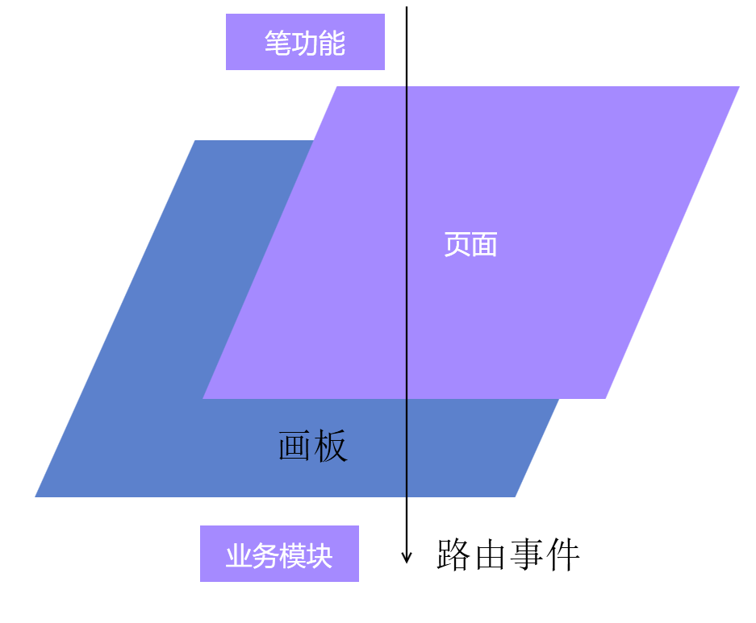

# 白板类应用的业务事件分发模式

在画板上延伸业务的事件，可以通过画板本身，利用路由事件分发，此时能解决依赖事件业务对具体业务对象的依赖

<!--more-->
<!-- CreateTime:6/23/2020 8:39:32 AM -->

<!-- 发布 -->

## 背景

先来聊聊白板应用的背景

基础的白板可以认为是有一个画板 Board 而在画板上面有很多纸张页面，咱称这些纸张页面为 Slide 页面

默认在画板上添加的元素，如笔迹或文本等，都是画在纸张上面的。而通过切换纸张 Slide 可以做到切换页面

多的我也不讲了，因为了解这个行业的小伙伴自然了解哈

那这里要聊的事件分发是什么呢？就是附加在画板上的各个交互，例如我有一个笔的功能，这个笔的功能是一个个独立的类，这个类知道画板以及页面的存在。这个类需要对外抛出事件，例如抛出开始写字以及完成写字的事件

那么我在其他的业务可以如何监听到这些事件呢？或者业务功能通过什么方式拿到事件

咱先聊聊会遇到的问题

## 为什么

还是使用笔这个功能作为例子

假设咱有一个业务需要监听笔开始写的功能以及写字完成，那么这个业务以及笔功能可以如何设计

最简单的方法就是在笔功能里面添加 CLR 事件，而业务就监听具体的对象拿到事件

这么做有什么问题呢？会遇到的问题是业务需要知道具体笔功能的对象

而根据白板的业务，用户当前选择的交互模式会变更，如用户现在想要进行选择了。此时就会切换走了笔功能。当用户切换回笔功能的时候，就不一定是刚才的对象了。此时业务模块就需要处理模式切换的时候的事件注册的坑

而笔这个功能，假定白板里面有很多不同的笔，这些不同的笔功能甚至连相同的基类都很难做到。此时也许就需要业务方做一个适配器对各个不同的笔监听对应的事件

这看起来的代码复杂度很高，实际上这部分的代码复杂度也很高，因为我就写过这样的逻辑，后续很难维护

## 如何做

有什么方法可以解决上面所说的问题

解决方法是让事件作为独立的路由事件模块，而具体功能模块触发路由事件，让业务模块监听路由事件。此时业务模块只需要知道从画板以及画板上层的容器可以拿到事件，而不需要关注这个事件是由那个功能触发的。但是如果真需要了解是那个功能模块触发的，可以通过参数拿到是哪个模块

使用笔作为例子

简单的方法是让业务模块不要去知道笔功能的存在，或者不要知道具体的笔功能对象的存在。这样就能解决很多的问题了

假定业务模块不需要知道笔功能的存在，或不需要知道具体对象，那么用户切换交互模式的时候，也就不需要处理事件注册功能。当逻辑上笔功能的对象变化的时候，也不需要去关注对象变化的事件变化。当逻辑上需要多个不同的笔类的时候，也不需要去跟随新的笔类型的创建而添加适配器的逻辑

那如何才能做到让业务模块不要去知道具体的笔功能的存在？简单的方法是将事件从笔功能去掉，将事件放在独立的模块

假设创建一个模块叫笔事件模块

```csharp
public static class InkEvents
{

}
```

在笔事件模块里面定义了路由事件，表示笔的开始写和写完成的事件

```csharp
public static class InkEvents
{
        public static readonly RoutedEvent InkStartedEvent = EventManager.RegisterRoutedEvent("InkStarted",
            RoutingStrategy.Bubble, typeof(EventHandler<InkStartedRoutedEventArgs>), typeof(Board));
}


    public class InkStartedRoutedEventArgs : RoutedEventArgs
    {
        public InkStartedRoutedEventArgs(RoutedEvent routedEvent) : base(routedEvent)
        {
        }
    }
```

这里的细节是定义自己的 InkStartedRoutedEventArgs 这样可以在后续业务修改的时候方便添加属性，业务修改时添加属性不会影响现有的业务。而在事件定义的时候，注意路由事件最后一个参数写了是 `typeof(Board)` 使用的是画板的

这样的写法就类似给画板添加了一个事件，而不需要改动画板的功能

利用事件能作出的效果是在页面 Slide 里面触发路由事件，路由事件会在视觉树上面一层层分发，在画板或画板的容器可以让业务去拿到这个路由事件

<!--  -->


那笔功能可以如何触发这个路由事件？假设笔功能拿到了页面 Slide 可以使用下面代码触发

```csharp
Slide.RaiseEvent(new InkStartedRoutedEventArgs(InkEvents.InkStartedEvent));
```

此时业务模块不需要在页面切换的时候修改事件监听，也不需要关注是哪个对象或类型触发了笔事件。因此业务模块就可以做到很小的依赖，同时也方便做一些有趣的功能，例如有一些不是笔的模块也能通过触发这些事件模拟笔的效果

更多白板应用设计请看

[白板类应用的模式交互设计方案](https://blog.lindexi.com/post/%E7%99%BD%E6%9D%BF%E7%B1%BB%E5%BA%94%E7%94%A8%E7%9A%84%E6%A8%A1%E5%BC%8F%E4%BA%A4%E4%BA%92%E8%AE%BE%E8%AE%A1%E6%96%B9%E6%A1%88.html )

<a rel="license" href="http://creativecommons.org/licenses/by-nc-sa/4.0/"></a><br />本作品采用<a rel="license" href="http://creativecommons.org/licenses/by-nc-sa/4.0/">知识共享署名-非商业性使用-相同方式共享 4.0 国际许可协议</a>进行许可。欢迎转载、使用、重新发布，但务必保留文章署名[林德熙](http://blog.csdn.net/lindexi_gd)(包含链接:http://blog.csdn.net/lindexi_gd )，不得用于商业目的，基于本文修改后的作品务必以相同的许可发布。如有任何疑问，请与我[联系](mailto:lindexi_gd@163.com)。
