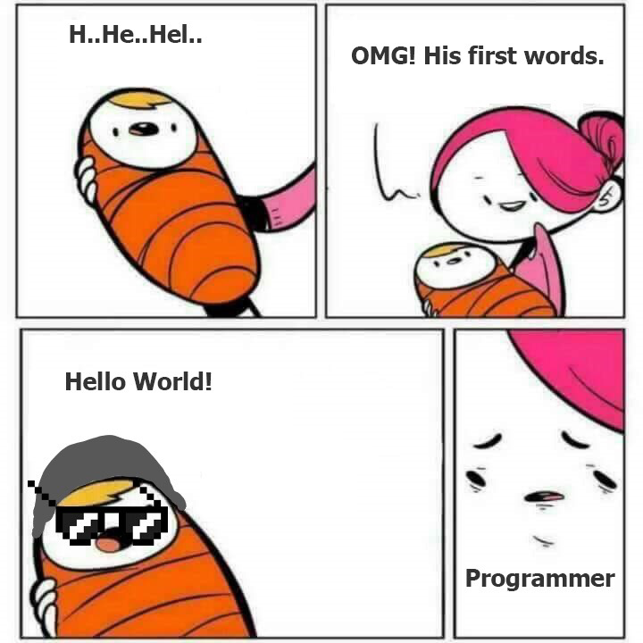

# 程序员笑话

本文收集我在各个网站看到的程序员笑话。

<!--more-->
<!-- CreateTime:2019/9/2 12:57:38 -->

<!-- csdn -->

## 烧烤

两个程序员去烧烤

A: 我不记得带烧烤架了

B：我有办法

## 一半实话

产品经理：有黑客入侵了系统，盗取了用户信息。现在需要你发一个版本说明这个问题，并且说这个事情再也不会发生。

程序员：发布的声明是真的么？// 这件事情再也不会发生是真的？

产品经理：至少一半是真的

程序员：那些是真的？

产品经理：有黑客入侵了系统，盗取了用户信息

## 程序员重生

<!--  -->

C:H..He..Hel

A:我的天，这是他的第一句话

C: Hello World // 程序员练手的第一句话

A: 一脸嫌弃，这是一个程序员

 本作品采用<a rel="license" href="http://creativecommons.org/licenses/by-nc-sa/4.0/">知识共享署名-非商业性使用-相同方式共享 4.0 国际许可协议</a>进行许可。欢迎转载、使用、重新发布，但务必保留文章署名[林德熙](http://blog.csdn.net/lindexi_gd)(包含链接:http://blog.csdn.net/lindexi_gd )，不得用于商业目的，基于本文修改后的作品务必以相同的许可发布。如有任何疑问，请与我[联系](mailto:lindexi_gd@163.com)。
