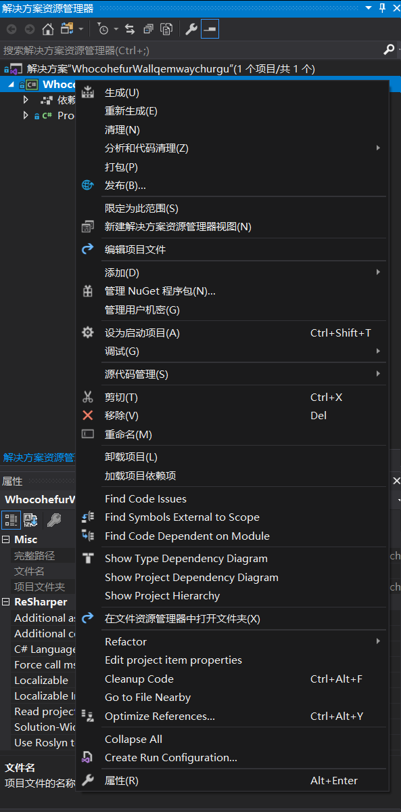
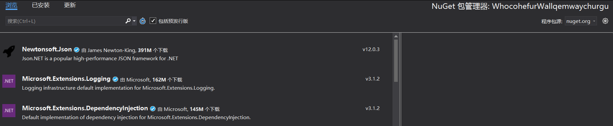
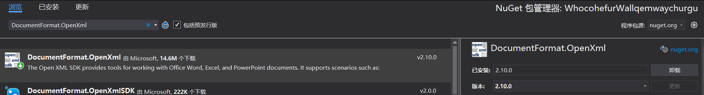

# 程序猿修养 使用 NuGet 发射卫星只需要三步

软件行业和其他行业不相同，在很多行业想要复用前人的知识，需要重新再制造一遍。而软件行业，特别是 dotnet 系的技术，想要用前人的经验只需要使用前人写的库。随着越来越多的基础设施和底层库的积累，现在开发一个软件的速度会越来越快。在使用 dotnet 技术栈时，可以通过 NuGet 方便使用前人的库或发布自己的库和工具。有很多功能，其实只需要知道用哪个库和如何用，底层细节可以在完全不知道不了解的情况下也能用起来

<!--more-->
<!-- CreateTime:2020/2/23 19:18:30 -->

<!-- 发布 -->

回到[上篇博客](https://blog.lindexi.com/post/%E7%A8%8B%E5%BA%8F%E7%8C%BF%E4%BF%AE%E5%85%BB-%E4%BB%8E%E5%AE%89%E8%A3%85-dotnet-%E5%BC%80%E5%A7%8B.html)最后的问题，我想要写一个软件，用来发射卫星，请问需要几步？

<!-- [程序猿修养 从安装 dotnet 开始](https://blog.lindexi.com/post/%E7%A8%8B%E5%BA%8F%E7%8C%BF%E4%BF%AE%E5%85%BB-%E4%BB%8E%E5%AE%89%E8%A3%85-dotnet-%E5%BC%80%E5%A7%8B.html) -->

假设现在已经有大佬将创建卫星和发射卫星等的实现都封装在一个库中，那么此时要发射卫星就非常简单了

```csharp
第一步：通过 NuGet 安装发射卫星的库
第二步：调用库里面发射卫星函数
第三步：使用 dotnet run 构建运行程序
```

没错，只需要三步

用 NuGet 就是怎么神奇的东西，根据 GitHub 的统计，每天都会被小伙伴上传几百万行代码（数据不准确）而我每天最多只能看一万行代码，这就意味着有大量的知识或专业的知识其实我很难快速掌握。但是我又想做这方面的开放，难道我需要和之前上学一样，从原理从最底层开始学习，我才可以进行开发？其实不然，如最简单的矩阵转换，我只需要知道调用哪个函数就会发生什么，而不是去了解什么是矩阵，矩阵的转换的最优算法是什么，如何写，有哪些边界。其实我大部分时间写出来的逻辑都没有从 NuGet 上使用其他小伙伴做的库的方法来的稳当

按照中国的教科书，在学习一个东西之前都需要吹半天，而现在吹的部分也差不多了，下面就是实战啦

当然，我不会告诉大家如何发射卫星，这个技术太可怕了。请让咱来个简单一点的东西，在开始之前需要了解什么是 NuGet 工具。其实 NuGet 就是一个用来存放库的东西，这里的 库 指的是小伙伴编写上传的封装好的东西。可以引用库来做很多有趣的事情。而 NuGet 分为两部分，一部分在云上面，就是上面所说的用来存放库的功能。另一部分放在本地用来安装和管理项目里面用到的库

如果小伙伴遇到一个功能不知道如何实现，在网上是期望找到源代码复制粘贴好呢？还是找到一个现成的库安装好呢？其实我比较推荐后面一个方法

在安装完成了 dotnet 工具之后，可以方便使用 NuGet 在本地的一个项目里面安装神奇的库，我想要读取一个PPT文件里面的所有页面的所有文本将这些文本输出，此时我可以如何做？想要做PPT解析可不是一个简单的事情，但是有了 NuGet 工具，好像就简单了好多了

我通过神奇的bing找到了微软开源的官方 Office 解析库 OpenXml 库，这是一个跨平台的库，可以在任何的 dotnet core 和 dotnet framework 项目上使用，首先就是按照惯例先安装 NuGet 库。如何安装呢？

假设通过下面代码创建了一个控制台项目

```csharp
dotnet new console -o WhocohefurWallqemwaychurgu
```

在进入到 WhocohefurWallqemwaychurgu 文件夹之后，可以使用下面代码用 dotnet 工具安装 [Openxml](https://www.nuget.org/packages/DocumentFormat.OpenXml) 库

```csharp
dotnet add package DocumentFormat.OpenXml
```

此时就完成了库的安装了，接下来就是使用这个库啦，假设在 `E:\lindexi\测试.pptx` 的文件就是本文想要测试输出的文件，可以在 Program 使用下面代码，就是这么方便就完成了一个 PPT 的解析了

```csharp
            using (var presentationDocument = DocumentFormat.OpenXml.Packaging.PresentationDocument.Open(@"E:\lindexi\测试.pptx", false))
            {
                var presentationPart = presentationDocument.PresentationPart;
                var presentation = presentationPart.Presentation;

                // 先获取页面
                var slideIdList = presentation.SlideIdList;

                foreach (var slideId in slideIdList.ChildElements.OfType<SlideId>())
                {
                    // 获取页面内容
                    var slidePart = (SlidePart) presentationPart.GetPartById(slideId.RelationshipId);

                    foreach (var paragraph in
                        slidePart.Slide
                            .Descendants<DocumentFormat.OpenXml.Drawing.Paragraph>())
                    {
                        // 获取段落
                        // 在 PPT 文本是放在形状里面
                        foreach (var text in
                            paragraph.Descendants<DocumentFormat.OpenXml.Drawing.Text>())
                        {
                            // 获取段落文本，这样不会添加文本格式
                            Debug.WriteLine(text.Text);
                        }
                    }
                }
            }
```

这个项目所有代码放在 [github](https://github.com/lindexi/lindexi_gd/tree/3bb1678686dbd12c4b2d911d3d3bd42ec30d8987/WhocohefurWallqemwaychurgu) 欢迎小伙伴访问

通过上面例子小伙伴可以看到用 NuGet 的话，将问题从如何理解一个新的知识和如何应用和编写代码转换为如何寻找一个库，以及如何使用这个库。按照学习模型的分法，寻找一个库和学习如何使用这个库都是属于舒适区范围。而学习一个新知识，如学习 PPT 的格式等，这些就是属于学习模型里面的恐慌区了，学起来的难度和需要投入的时间都是很大的

刚才都是通过命令行的形式安装库的，我是不是还可以使用太阳系里面最强的 IDE 来进行管理 NuGet 库呢？没错请打开 VisualStudio 创建一个控制台项目，我这里还是依然使用刚才的命令行创建的项目为例子。可以双击 xx.csproj 打开项目，此时的 VisualStudio 在你关闭它时会提示保存 sln 文件，而不需要先新建 sln 文件

右击项目点击管理 NuGet 程序包

<!--  -->


点击之后可以看到此页面

<!--  -->


这里提供了安装 NuGet 库的功能以及卸载库的功能，只需要在搜寻里面输入对应的库的名字，支持模糊搜寻的功能，找到对应的库，点击安装就可以了

<!--  -->


多使用 NuGet 库，可以减少自己写的代码的时间，如果看到一个库里面的下载量很多，那么证明这个库还是有比较多小伙伴用的。换句话就是有很多小伙伴帮你踩坑了，基本上可以放心使用

我是一个助人为乐的逗比，我想要将自己写的代码打包为库让更多的小伙伴能用上我的逗比代码，我可以怎么做？

很简单，在 VisualStudio 右击打包就可以啦


请看 [VisualStudio 使用新项目格式快速打出 Nuget 包](https://blog.lindexi.com/post/VisualStudio-%E4%BD%BF%E7%94%A8%E6%96%B0%E9%A1%B9%E7%9B%AE%E6%A0%BC%E5%BC%8F%E5%BF%AB%E9%80%9F%E6%89%93%E5%87%BA-Nuget-%E5%8C%85.html) 基本上5分钟内就可以完成打包啦

不想打开 VisualStudio 的话，可以用上文介绍的 `dotnet pack` 一句话进行打包，当然这个命令就只能打包，而对包里面的作者什么的设置就需要手动编辑 csproj 文件啦，没有在 VisualStudio 里面那么方便啦

很不辛苦，很简单打出一个包出来了，请问如何发布呢？访问 [https://www.nuget.org/](https://www.nuget.org/) 官网，点击上传就可以啦。想要进行自动化的发布，在 Github 上往主分支合并时就自动发布，请看 [Github 给仓库上传 NuGet 库](https://blog.lindexi.com/post/Github-%E7%BB%99%E4%BB%93%E5%BA%93%E4%B8%8A%E4%BC%A0-NuGet-%E5%BA%93.html)

更多阅读：

- [C# dotnet 使用 OpenXml 解析 PPT 文件](https://blog.lindexi.com/post/C-dotnet-%E4%BD%BF%E7%94%A8-OpenXml-%E8%A7%A3%E6%9E%90-PPT-%E6%96%87%E4%BB%B6.html)
- [VisualStudio 使用新项目格式快速打出 Nuget 包](https://blog.lindexi.com/post/VisualStudio-%E4%BD%BF%E7%94%A8%E6%96%B0%E9%A1%B9%E7%9B%AE%E6%A0%BC%E5%BC%8F%E5%BF%AB%E9%80%9F%E6%89%93%E5%87%BA-Nuget-%E5%8C%85.html)
- [Github 给仓库上传 NuGet 库](https://blog.lindexi.com/post/Github-%E7%BB%99%E4%BB%93%E5%BA%93%E4%B8%8A%E4%BC%A0-NuGet-%E5%BA%93.html)

上一篇博客：[程序猿修养 从安装 dotnet 开始](https://blog.lindexi.com/post/%E7%A8%8B%E5%BA%8F%E7%8C%BF%E4%BF%AE%E5%85%BB-%E4%BB%8E%E5%AE%89%E8%A3%85-dotnet-%E5%BC%80%E5%A7%8B.html)

<a rel="license" href="http://creativecommons.org/licenses/by-nc-sa/4.0/"></a><br />本作品采用<a rel="license" href="http://creativecommons.org/licenses/by-nc-sa/4.0/">知识共享署名-非商业性使用-相同方式共享 4.0 国际许可协议</a>进行许可。欢迎转载、使用、重新发布，但务必保留文章署名[林德熙](http://blog.csdn.net/lindexi_gd)(包含链接:http://blog.csdn.net/lindexi_gd )，不得用于商业目的，基于本文修改后的作品务必以相同的许可发布。如有任何疑问，请与我[联系](mailto:lindexi_gd@163.com)。 
