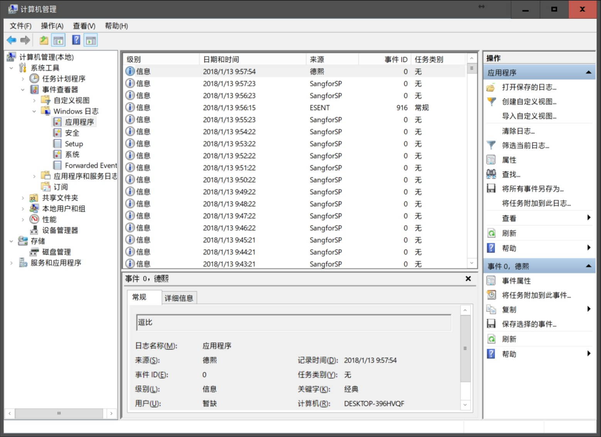

# 程序猿修养 日志应该如何写

在和小伙伴讨论日志的时候，小伙伴说的是文件的读写，而实际上的日志在广义上包含了任何的输出方式，无论是控制台还是文件。而日志记录在哪不重要，重要的是什么日志应该记录，应该怎么记录和记录什么内容

<!--more-->
<!-- CreateTime:2019/11/29 8:49:58 -->

<!-- csdn -->
<div id="toc"></div>

在记日志里面，需要严格将调试下的日志和发布版的日志的记录方法和内容分开。调试下的日志指的是在调试工具，例如在 VisualStudio 调试的时候记录的日志，或者在自己开发设备上调试的时候记录的日志。而发布版指的是将软件通过 Release 编译发布给用户端使用，此时用户环境缺少开发工具

## 日志的意义

对外发布的软件是很难找到实时了解软件内部是如何工作的，也很难每次都可以使用调试工具附加到软件上。而记日志将可以让开发者可以从日志里面了解软件内部是如何工作的，特别是异常等。在用户反馈问题的时候，如果这个问题是很难再次复现的，那么除非能在调试的时候复现问题，不然在没有日志的帮助下，是很难定位是哪里的问题

通过软件运行日志，可以了解到软件在用户端是如何运行的，可以用来回顾用户端出现问题的时候执行的逻辑，也可以用来分析用户的行为用于给产品提供决策

## 日志是什么

在和小伙伴讨论日志的时候，小伙伴说的是文件的读写，其实我和他聊的不是在一个频道。广义的日志包括了程序的任何输出方式

- 软件界面的特殊提示，例如弹出窗口
- 通过调试工具控制台输出内容
- 通过文件记录日志
- 通过系统日志记录
- 通过上报数据到服务器

每个方式都有自己的优点和适合用的地方，下面让我一一告诉大家

## 调试下的日志

日志可以被认为是软件运行过程中的调试工具，一个稳定的软件一定是需要带上运行时调试的功能

在某个测试小伙伴告诉你软件不工作了，请问为什么软件不工作了？在没有了解更多的信息的前提下，也就是只有上面的一句话，理论上除非你对这个软件十分熟悉，同时也确定是你自己的某段代码写出来的，例如下面这个例子，否则几乎无法定位是哪一段代码问题

```csharp
某一天林德熙逗比开发者在调试软件的启动过程
这个逗比开发者在软件启动过程中扔了一个异常
某个吕水逗比代码审查将代码合并到了主分支
某个洪校长发布了这个版本
某个测试小伙伴告诉某产品说软件不工作了，就是打不开
此时某头像开发者直接就去打德熙逗比开发者，因为他十分明确这一定是一个逗比问题，只有逗比开发者能写出来
```

那么头像开发者是怎么知道这是一个逗比问题？而不是一个系统环境问题？在测试的设备上，是安装不了如此重的 VisualStudio 的，于是 [WPF 如何在应用程序调试启动](https://blog.lindexi.com/post/WPF-%E5%A6%82%E4%BD%95%E5%9C%A8%E5%BA%94%E7%94%A8%E7%A8%8B%E5%BA%8F%E8%B0%83%E8%AF%95%E5%90%AF%E5%8A%A8.html ) 的方法也用不了。同时因为软件一启动就 gg 了，所以附加调试也用不了。就连 [神器如 dnSpy](https://blog.walterlv.com/post/edit-and-recompile-assembly-using-dnspy.html ) 也被测试小姐姐说不要弄坏她的电脑不能用

此时可以怎么知道软件是运行做了什么

这时就应该用上日志的功能，再次强调，一个稳定的软件一定是需要带上运行时调试的功能，最简单的运行时调试功能就是记日志

最简单的记日志的方法相信小伙伴在都用过，就是通过提示窗口，例如在写前端页面的时候一开始用的最多的就是弹出窗口在里面写调试信息内容。当然这个方法的调试效率有点低，也不适合于在用户端使用。下面让我告诉大家一些好用的方法

## 记日志的等级

在开发的时候需要区分日志是在调试使用的还是在用户端使用的，这两个记录的方法和做法都有很大的不同。有一点必须明确的是无论什么方法记日志都是会影响性能的，其次不是所有人，特别是用户都关心输出的信息，所以在调试的过程记录的日志需要做以下区分

- 是否只有我关注
- 是否只有我在本次调试的时候才关注
- 是否只要调试此模块的开发者都应该关注

上面两个问题决定了什么内容应该记在日志，什么内容不应该记录日志或者不应该将此日志内容提交到代码仓库

从上面问题小伙伴就知道如何考虑记日志了，对于只有我关注的内容，也就是在我当前开发的过程我需要知道这些信息，但其他人不需要，同时这部分信息如果不断输出将会干扰其他开发者的调试。而对于只有我本次调试才关注的内容，也就是用在调试某个 bug 的时候，我需要进行日志输出，而在我解决了这个 bug 那么这些输出内容也就不需要

在我之前开发的时候就发现了团队项目让 VisualStudio 输出窗口无法使用，原因就是各个小伙伴都在往输出窗口输出只有他自己关注的内容和只有单次调试才有意义的内容。记日志不是越多越好，太多的日志信息将会让开发者关注不到关键的信息

在我开发笔迹模块的时候，就和雷哥合作，雷哥在他的项目里面通过他自己搭建的日志框架，可以做到在输出的时候指定开发者名字，只有在对应的设备上通过读取系统用户名匹配才会开启对应的日志输出。同时他的日志框架还支持模块日志开关，支持开启某个模块的日志输出，此时就可以做到雷哥写给自己看的日志，只有雷哥自己看到，而其他开发者看不到。而对整个模块的关键输出，也就是任何接手这个模块的开发者都会关注的内容，通过加上模块标签，可以在调试的时候在日志框架里面开启对应的模块标签进行调试，日常这些模块调试都不会输出，这样不仅可以在软件运行过程减少记日志耗费的时候，同时可以减少其他开发者看到不相关模块的调试日志

我现在没有找到任何一个适合和大家推荐的开源的日志追踪框架，上面说到的雷哥的日志框架也是他自己搭建的，而我现在团队里面的追踪框架我还在进行搭建

在记日志的时候，很重要的一点就是这个日志应不应该记，在问之前需要先问这个信息属于上面问题中的那方面信息。如果只是自己调试某个 bug 需要记录的日志，那么随意记录，包括记录的内容和记录的方法。例如我在调试网络访问的时候，我只需要知道服务器有没有返回数据而我不关注服务器返回的是什么，此时我记录的日志可以是 `aaaaa` 也就是一串只有我自己在此时才能知道含义的输出

这部分仅在某次调试才需要用到的日志没有任何要求，只要自己能懂就可以。但此部分提交应该在代码审查上拦下，不应该提交到代码仓库

另一部分是只有自己才需要知道的调试内容，这部分建议用工具或日志框架管理，例如在 VisualStudio 里面有过滤输出窗口的插件，通过每次在输出的时候带上自己的名字，然后过滤输出窗口的方法，可以让输出的内容只有自己看到

对于只有自己才需要了解的调试内容，需要在记日志的时候带上更多有用的信息，本金鱼君在写只有自己需要知道的调试内容的时候，会多写一部分注释，不然第二天调试就忘了内容

而对于模块调试内容，建议的一般方法是在有调试框架的时候，通过标签的方式输出，而对没有调试框架的时候，通过使用条件编译符的方式让只有调试这个模块的开发者才能看到

以上记日志的都是调试信息，对于调试信息应该只有在 DEBUG 下才能执行代码，不应该在发布版本包含调试信息代码的执行逻辑

如何让代码在发布版本不运行，只有在调试下运行，请看 [条件编译博客](https://blog.lindexi.com/post/C-%E6%9D%A1%E4%BB%B6%E7%BC%96%E8%AF%91.html )

## 发布版的日志

在发布版的代码里面，通过输出窗口进行记日志是很少用的方法，因为大多数发布版都会在用户端运行，在用户端运行的时候最主要的是没有开发环境。此时可选日志方案基本只有文件日志和追踪输出日志以及上报用户数据的方法

通过将日志记在文件适合于在用户端发现问题之后，通过日志看到用户的设备上软件是如何运行的。例如有用户告诉我程序某个功能无法使用，我可以通过日志发现是我请求了服务器，然后服务器没返回，只是就可以快速定位是服务器或网络相关的问题而不是定位是功能本身界面的问题

但是文件日志应该查看不容易，同时也不支持实时调试，所以通过追踪记录日志就在这里用到。在调试需要实时看到输出信息的，例如有用户告诉我他的某个功能不能用了，我远程他的设备，此时我需要实时看到软件运行的输出，那么推荐使用以下方法。在程序关键点通过 `Trace` 静态类作为追踪输出，然后在用户端使用 `DebugView` 工具就可以拿到程序里面的追踪输出

另外不是所有的用户都会在软件出现问题的时候反馈到工程师，同时也不是所有用户反馈的问题都是需要解决的。需要通过用户数量等判断优先级，此时就需要用到上报数据的方式。在微软发布每个版本的系统的时候，在每次上新功能之前，都需要添加很多埋点，这里的埋点的意思是将数据上传到自己的服务器。上传的数据包括一些异常和用户行为，以及开发认为一些不会进入的逻辑或运行性能。这样就可以在后台分析数据知道了功能的稳定性，同时还可以知道用户是如何使用软件

一个成熟的软件一定需要有成熟的日志管理方法，对于日志包含了所有程序对开发端输出的内容而与具体形式无关。在日志管理里面主要的是团队约定和管理方面，本身没有多少技术含量，即使是选用某个日志框架。也许现在我无法给大家推荐一个日志框架也和这个原因有关，每个团队每个软件都有自身的需求，很多需求都是相反的，这也就让一个统一的日志框架做不起来的原因，即使是再好的日志框架，也无法在一群逗逼的团队里面使用

说到这里和大家讲个笑话，我在开发一个有趣的 UWP 软件的时候，我用了 NLog 这个日志框架，有一天我看到了自己的调试设备的存储不够了，于是我就想到了一个好用的功能，我需要在软件里面添加清理空间的功能。软件的清理空间的功能是这样做的，通过 NLog 不断输出 林德熙是逗比 让磁盘的空间不足，于是就会执行自动的清理。同时我的日志本身也会自己清理，这样就完成了清理空间的功能

## 记日志方式

说到记日志，其实日志只是输出的内容，至于记的方法可以有多样，用的最多也是记最快的是通过输出窗口记录，建议的方法是通过 `Debug` 静态类进行记录而不是通过 `Console` 静态类进行记录。原因有二，第一是 `Debug` 静态类只有在调试下才能被执行，在发布版将不会执行调试输出的代码，这样可以提升性能。第二是 `Debug` 只有调试下输出而 `Console` 将会在发布版输出，同时任何其他进程可以通过调起软件的方法拿到软件进程的控制台输出，这样不仅会影响自己软件在发布版的运行性能，同时也会让其他开发者可以知道软件内容运行逻辑，详细请看[C# 如何写 DEBUG 输出](https://blog.lindexi.com/post/C-%E5%A6%82%E4%BD%95%E5%86%99-DEBUG-%E8%BE%93%E5%87%BA.html )

### 文件记录

另外的记日志的方法是通过文件记录和通过追踪记录，一般文件记录在于大量调试信息的记录以及在有一群逗逼小伙伴干扰了输出窗口的前提下，不得不自己新建一个文件用于记录日志。当然在进行多进程调试的时候也会用到文件日志的方法

通过文件记录的方法在服务器端推荐使用 Log4Net 框架，这个框架不仅支持文件记录还可以记录到数据库和做分布式记录等

在客户端的文件记录推荐使用 NLog 框架，这个框架不仅可以在 WPF 和 WinForms 使用，还支持在 UWP 使用

### 追踪记录

还有一个日志记录方法是通过追踪记录，在 .NET 提供的 `Trace` 静态类就是追踪日志的功能，需要说明的是追踪这个功能默认在发布版和调试版都是执行代码的，同时任何调试工具都可以获取追踪输出，所以请不要在追踪输出会影响性能的内容，也不要输出关键内容

如何记录追踪请看代码

```csharp
using System.Diagnostics;

    Trace.WriteLine("欢迎访问我博客 https://blog.lindexi.com 里面有大量 UWP WPF 博客");
```

详细请看

[dotnet core 输出调试信息到 DebugView 软件](https://blog.lindexi.com/post/dotnet-core-%E8%BE%93%E5%87%BA%E8%B0%83%E8%AF%95%E4%BF%A1%E6%81%AF%E5%88%B0-DebugView-%E8%BD%AF%E4%BB%B6.html ) 

[WPF 调试 获得追踪输出](https://blog.lindexi.com/post/WPF-%E8%B0%83%E8%AF%95-%E8%8E%B7%E5%BE%97%E8%BF%BD%E8%B8%AA%E8%BE%93%E5%87%BA.html )

### 写系统日志

对于绿色单文件软件，只有一个 exe 文件，一般小伙伴都会将这个文件放在 U 盘或桌面，同时也没有很高的权限，此时写文件不太清真，因为写入了文件日志，小伙伴也不知道写在哪里。此时一个建议的保存地方是系统日志

<!--  -->


如何写系统日志请看 [C＃ 写系统日志](https://blog.lindexi.com/post/C-%E5%86%99%E7%B3%BB%E7%BB%9F%E6%97%A5%E5%BF%97.html )

### 上传服务器

这部分需要服务器的支持，详细请看 [关于日志的那些事儿 - 衣舞晨风 - CSDN博客](https://blog.csdn.net/jiankunking/article/details/81806573 )

## 日志的内容

日志的内容应该如何写？在上文已经告诉大家在一开始调试下一次性的调试内容可以随意写，只需要保证自己一时的使用，但是稍微遵循一下套路可以让日志更好用

### 关键的日志要有明显的不同

通过控制台输出的时候，例如在执行到一段关键的逻辑，需要快速看到这段代码。而在很有模块都在控制台输出的时候，如何快速找到关键的输出

此时可以让输出的内容有明显的不同，例如下面的输出，请看业务输出3 输出多少次

```csharp
业务输出1
业务输出1
业务输出1
业务输出1
业务输出2
业务输出1
业务输出3
业务输出1
业务输出1
业务输出3
业务输出1
```

其实很难很快找到输出，特别是在刷屏的时候，如果使用下面的做法，那么就很快找到

```csharp
业务输出1
业务输出1
业务输出1
业务输出1
业务输出2
业务输出1
========== 业务输出3 ==========
业务输出1
业务输出1
========== 业务输出3 ==========
业务输出1
```

几乎瞬间你就找到了关键的输出

套路就是使用长长的符号或分割线作为标识

只有存在长长的符号，那么在刷屏的时候，可以快速看到逻辑开始和结束，同时也可以快速发现存在有逻辑结束之前没有开始

```csharp
++++++++++++++ 逻辑开始 ++++++++++++
业务输出1
业务输出1
业务输出1
===============逻辑结束=============
++++++++++++++ 逻辑开始 ++++++++++++
业务输出1
业务输出1
业务输出1
===============逻辑结束=============
业务输出1
业务输出1
业务输出1
===============逻辑结束=============
```

另一个套路是添加序号，在需要执行很长的一段步骤的时候，添加序号可以明确知道执行到哪。如下面代码可以看到存在一个连续的步骤没有被执行

```csharp
1. 业务输出
2. 业务输出
3. 业务输出
4. 业务输出
5. 业务输出
7. 业务输出
```

### 标签

我建议的输出是带上模块的标签，这样可以用于写脚本或程序解析和分析日志信息，同时也可以用于过滤日志内容。特别在一开始团队没有管理好日志的时候，想要在现有团队的日志里面添加自己的内容，同时想要自己添加的内容能方便找到，此时应该使用标签的方式

如下面的日志输出内容，在我自己的模块添加模块标签，此时虽然日志很乱，但是我依然可以通过过滤标签的方式找到我自己的输出内容

```csharp
林德熙是逗比
[模块] 业务输出
林德熙是逗比
林德熙是逗比
林德熙是逗比
[模块] 业务输出
林德熙是逗比
```

只需要通过 `\[模块\]\s(.+)` 正则就可以匹配出所有我自己模块的输出内容

在做解析和分析的时候，也可以方便通过特定标签找到对应的信息

### 结构化日志

在记录到文件和上传到服务器等的日志建议是结构化记录，这样方便分析

如果一个日志文件里面包含了多个不同的结构和格式，那么解析起来的难度肯定比一个结构化的日志文件难的多，如下面两个不同的日志格式，请问解析哪个比较简单

```csharp
// 日志1

// 格式 yyyy-mm-dd hh:mm:ss [模块1] 内容
20190723 08:21:31 [模块] 业务输出

// 日志2
// 没有格式
2019年7月21日 8:23:23 林德熙是逗比
20190725 林德熙不是逗比
0725 林德熙是逗比
内容还需要换行
8：25 这一行有10000个字符
```

我有一个小伙伴说他在实习的时候的任务就是解析日志文件，请问哪个日志文件解析可以在一瞬间完成

使用结构化的日志可以方便后续的分析，特别是用户很多日志很多，也期望使用大数据的方式分析的时候，在一开始写日志就需要约定好格式，按照格式写日志

### 关键点

日志的内容，无论是在发布版还是调试版，在期望是用来定位的时候有以下套路包含关键点

#### 时间点

建议在日志里面添加时间点

时间点可以用来定位是不是最近发生的，以及多线程之间的执行顺序。用一个反面例子告诉大家为什么需要添加时间点

我有一个按钮，点击的时候会做一个动画，我会在按钮按下的事件记录日志，但是我没有给记录的日志添加时间，在某一次测试小伙伴告诉我，点击按钮的时候没有做动画。而此时我看到的日志是这样的

```csharp
按钮点击
按钮点击
按钮点击
按钮点击
按钮点击
```

请问我的界面没有做动画是按钮事件没有触发，还是动画模块没有做动画？其实我是不能确定的，如果小伙伴认为在日志里面有看到按钮点击这个记录就认为按钮事件触发，这是不对的。可能是测试小伙伴在之前一天点击按钮记录的日志。用户和测试小伙伴的话都是不可信的，只有日志和视频才是可信的

如果此时我添加了一些时间点，那么我就可以知道是不是在测试小伙伴按下的时候触发了事件，而动画模块没有做动画，还是按钮事件没有触发

```csharp
2019年7月25日 8:28:35 按钮点击
2019年7月25日 8:28:37 按钮点击
2019年7月25日 8:28:40 按钮点击
2019年7月25日 8:28:42 按钮点击
2019年7月25日 8:28:50 按钮点击
```

当前时间是 2019年7月26日 也就是其实今天是没有任何按钮事件触发的，这时的日志才有用

#### 线程号

在程序有多线程和多进程的时候，建议在关键的代码添加对应的线程号和进程号，例如下面一个反面例子

```csharp
业务开始
业务开始
// 忽略一些日志
业务结束
```

此时可能认为是业务方法多次进入业务开始，一个方法存在重入，在还没有执行完成的时候重复进入了方法，如下面逻辑

```csharp
public void Foo()
{
	Log("业务开始");
	// 一些逻辑
	// 但不确定是否存在这样的路径 F1->F2->Foo
	F1();
	Log("业务结束");
}
```

此时在 Foo 里面调用 F1 方法，但不能确定是否在 F1 里面会调回 Foo 方法，如果在从 F1 整个调用链都打上日志，那么就和切面编程给每个进入方法打日志差不多，日志将会很长

如果此时添加进了线程号，那么很快就可以知道是方法重入还是多线程调用

```csharp
[99] 业务开始
[2]  业务开始
// 忽略一些日志
[99] 业务结束
```

上面的数字表示的是线程号，通过线程号就可以从上面日志看到是多线程问题

#### 次数

还是重复的调某个方法的问题，通过添加次数可以区分当前是第几次的逻辑，例如还是下面的代码，将会在 Foo 调用 F1 的时候重复进入 Foo 方法，那么此时在看日志的时候应该添加当前是第几次调用，从而可以知道在第几次调用的时候的逻辑

```csharp
public void Foo()
{
	Log("业务开始");
	// 一些逻辑
	// F1->F2->Foo
	// F1->Foo
	F1();
	Log("业务结束");
}
```

添加了次数的记录如下

```csharp
次数 0 业务开始
次数 0 调用 F1 方法
次数 1 业务开始
次数 1 调用 F1 方法
次数 2 业务开始
次数 2 调用 F1 方法
次数 2 调用 F2 方法
次数 2 业务结束
次数 1 调用 F2 方法
次数 1 在 F2 方法里面出现异常
// 忽略一些日志
次数 0 业务结束
```

此时对比上面日志和自己默默删除前面的调用次数之后的日志看这两个日志哪个找到调用链简单

通过添加次数可以快速找到出现问题的调用次数和逻辑

#### 分支

在记录日志的时候需要考虑好分支，也就是在看到日志内容的时候，可以明确方法的逻辑。当然这个要求在调试下是不使用的，因为调试下是对大量不明确的代码进行记录，同时如果写入内容不能明确，最多也就是进行修改代码再次调试

在日志里面考虑好分支主要是用在发布版的日志，也就是在看到日志的时候，最好不要存在多个含义的路径，例如下面代码

```csharp
public void Foo()
{
	if(判断逻辑)
	{
		Log("业务");
	}
	else
	{

	}
}
```

此时如果发现日志里面不存在业务的记录，那么请问是 Foo 方法没调用还是判断逻辑没成立，其实通过此时的日志是不能确定的

### 日志不是写只给自己看

在写日志内容的时候，需要明确这个日志是写给谁看，这一点将会关系到日志的内容。如果这个日志是写给我自己看到的，那么我可以在日志里面使用大量的代号，如下面日志

```csharp
aaaaaaaaaaaa
xxxxxx
=========
```

相信看到上面日志的小伙伴是很难知道我表达的是什么，即使他告诉我程序无法使用了，他自己看到了日志也不知道为什么程序无法使用

在写日志的时候，建议按照日志是写给谁看的，决定写的内容

 - 写给相关开发者

   相关开发者也就是他也参与了模块的开发，那么日志内容可以包含一些细节部分，最简单的就是通过 AOP 切面编程，将每个调用方法输出

   但是通过 AOP 切面编程输出的日志就和调用堆栈差不多，经常在出现问题的时候无法从日志里面看出问题，或者日志的内容过多，大家都不愿看日志。还会让开发者认为有 AOP 自动记日志了，自己就不用想如何记日志，这会让日志的质量很低

 - 写给调试相关方

   应该包含执行细节和关键路径，在日志里面的分类应该是 Debug 级

   相关的调试方是将会调试你写的模块或库的开发者，对于调试方应该认为模块或库是白盒也就是他应该知道模块或库的状态，同时调试相关方也只有在调试下才需要使用到日志

 - 给未稳定程序或辅助程序写日志而使用方是相关开发者

   对相关开发者是不关注他使用的未稳定程序或辅助程序到底在做什么，只关注完成了什么，和为什么出错了。此时应该执行细节输出，方便相关开发者在程序不稳定的时候调试。或者方便在相关开发者使用过程发现问题的时候，将你拖过来，可以通过日志内容快速知道是什么问题以平息相关开发者怒气。或者方便相关开发规避未稳定程序的坑，按照执行逻辑写出预定输入

 - 提供给上层开发者调用底层库的日志

   应该输出关键路径和错误信息，在使用库的时候上层开发者是不关注除了错误之外的其他信息

   但也需要提供关键路径输出的手段，方便上层开发者调试。在写这部分日志信息的时候需要假定自己使用这个底层库的开发者，如何通过输出的日志信息调试。也就是调试信息默认处于关闭，应该提供开关让相关开发开启底层库调试输出

   作为底层库的输出需要非常仔细，很多时候的建议只是输出错误信息，其他的都不要输出，因为一旦输出开发者不关心的内容，那么开发者将会认为底层库弄乱了输出窗口或日志文件。同时底层库除非提供安全开关否则不应该将敏感信息输出。例如我有一个网络模块的库，如我在输出日志里面包含了秘钥那么所有引用我这个库的开发者将可以拿到秘钥做有趣的访问

 - 应用程序的模块

   应该输出可供调试的日志内容，以及非预期的运行过程和运行关键路径记录。和与其他模块之间的通信记录

   通过换个想法，在我的程序出现异常的时候我如何根据日志信息定位是哪个模块的问题，就可以知道应该输出的可供调试的内容是什么。这部分可以依照经验所做，很少可以做到一次性做对，一般都是在出现问题之后发现之前记录的内容不够分析，然后才不断优化

   很多小伙伴都习惯将预期的内容作为日志内容，其实日志应该更多包含非预期的运行，也就是在 if 后面的没有写的 else 才是日志的关键内容，一般非预期的行为将会出现没有覆盖的测试，此时的日志将可以协助了解非预期的行为是如何做的

   与其他模块之间的通信记录主要用来甩锅，特别是在多进程和软硬件开发的时候，请将和对方通信的路径输出，方便知道是哪一方的问题。这里的多进程开发包含了在同设备的多个进程以及通过网络访问后台这些都需要添加足够的日志记录，方便知道是自己的模块发送的不对还是对方返回的不对

   在程序中运行关键路径记录可以用于了解程序运行到哪个步骤，例如启动过程的日志，如果软件运行就直接退出，那么请问是运行到哪就退出？此时通过关键运行步骤就可以知道运行了多少步，从而知道运行到下一步是哪一步的时候退出。在我调用 C++ 库的时候也是这样做的，在 Windows 里面如果 C++ 库访问了没有权限的内容，那么系统将会干掉这个进程，于是我在调用的时候都会先记录日志说开始调用，如果我发现程序退出了，而没有在日志找到调用完成那么就可以知道我调用的 C++ 库让我的程序直接退出

 - 应用程序的输出

   默认按照等级分类输出，不要输出程序细节，需要提供可供调试日志

   建议只输出错误和非预期行为和关键行为

   建议提供调试开关，用于在用户端调试程序。例如 Office 就提供了在命令行启动可以开启调试输出，开启的时候将会输出很多调试日志

   应用程序是作为发布到用户端的程序，建议添加的日志不要太多，一个反面例子就是 TIM 写入太多的日志

   很多程序都没有提供调试开关，这样会让程序需要在日志里面要么包含一些调试信息，要么无法在用户端调试，需要通过工具才能调试，效率比较低

 - 给 FAE 售后服务人员看的日志内容

   输出出错原因而不应该包含程序运行细节

   因为售后服务不关注也不会理解程序运行细节，反而这些细节内容可能被竞争对手利用。例如 HH 公司知道我的软件需要依赖硬件部分发送正确鼠标消息，于是就通过模拟诡异的鼠标消息让我的软件无法使用

  - 上报服务器用于分析的内容

   应该输出结构化可分析内容，减少后台清洗数据的难度，同时需要上报的是尽量是元数据，也就是多个数据之间没有关系，减少上报的数据

   上报服务器的内容需要明确后台期望分析什么然后再决定如何上传，上传的数据建议不要太多

   如果不明确后台期望分析什么的时候，需要将尽可能多的元数据上报。这里需要强调一点的是，上报的数据不是越多越好，需要根据用户量和后台技术实力上报合适的数据


### 应该在哪写日志

从上文可以了解到日志的内容应该写什么，但有一些套路和推荐可以告诉大家应该在哪里写日志

#### 多平台调用

在上文也有提到，在多端联调的时候，日志是关键，不仅用于解决问题更多的用于甩锅

如在调用后台的时候，无论是在调试的过程还是在发布版本都应该有一定的日志记录，这样方便知道是客户端的问题还是服务器端的问题还是网络的问题

在进行多平台调用的时候，不仅是访问后台的部分应该记录日志，对于大部分硬件的通信也应该记录日志。例如我有一个功能是从摄像头获取图片，此时我应该在寻找摄像头，从摄像头获取图片以及获取到或没有获取到等的分支都添加上日志。这样在用户端或在调试的时候发现客户端没有预期获取到图片时，可以了解到是连接摄像头失败还是连接成功但没有获取到图片等

又例如我调用 git 命令行执行一段命令，我应该将命令行调用的参数和 git 进程执行的输出都记录，这样在调用 git 命令没有执行的时候，可以知道是否传入的命令行参数不对还是 git 没有安装

基本上可以认为和其他平台，也就是和非自己代码执行逻辑的部分，和非当前设备执行的部分，在调用前后需要记录相关的内容，包括调用状态和参数

#### 全局未捕获异常

在 dotnet 里面提供了多个全局异常捕获方式，如果有一个异常在代码抛出，同时没有任何地方接住这个异常，那么这个异常将会成为全局未捕获异常

一般只有开发过程中未考虑到的异常才会作为全局未捕获异常，同时也一般只有在团队里面有[好的规范](https://blog.walterlv.com/post/dotnet-exception.html )处理异常的时候，全局未捕获异常才有用

推荐将全局未捕获异常记录，同时记录的方式建议同时记录在本地文件和上报到服务器，因为有很多代码路径只有大量的用户使用的时候，才能在用户端触发，而在开发端是很难测试到

更多关于异常请看 [一文看懂 .NET 的异常处理机制、原则以及最佳实践 - walterlv](https://blog.walterlv.com/post/dotnet-exception.html )

[配置 legacyUnhandledExceptionPolicy 防止后台线程抛出的异常让程序崩溃退出 - walterlv](https://blog.walterlv.com/post/prevent-app-crash-by-background-thread.html )

#### 关键分支

在代码里面如果有进入一些关键分支，那么建议进入的时候添加日志

这里的关键分支主要是业务上的定义，例如用户删除一个文件，此时需要添加一条记录。至少可以做到在用户喷垃圾软件删除我的文件的时候，可以从日志里面找到这是用户自己的行为

#### 未命中分支

在很多开发代码里面只有对参数正确做判断执行逻辑，而对参数非预期时没有判定，也就是通常说的 else 分支

如果在开发的时候确认这个过程不会进入 else 分支，那么依然建议在未命中分支里面添加日志，万一命中了，那么意味着存在一条有趣的路径。在记录未命中分支的时候，建议将调用堆栈和参数都记录

记录当前调用堆栈方法[WPF 判断调用方法堆栈](https://blog.lindexi.com/post/WPF-%E5%88%A4%E6%96%AD%E8%B0%83%E7%94%A8%E6%96%B9%E6%B3%95%E5%A0%86%E6%A0%88.html )

#### 全局关键设置项

全局关键设置项例如设置 dll 寻找路径或一些全局业务设置，建议在进入设置的时候添加日志，这样可以知道是哪个模块调用，以及调用原因

特别是一些库提供的全局关键设置项，例如在某个业务执行下面代码的时候，于此不相关的其他业务都会受到影响

```csharp
Environment.CurrentDirectory = "C:\\lindexi";
```

这样的全局关键项设置之前，建议添加日志，这样方便进行调试

如果以上代码没有添加日志，那么几乎找不到是哪个做的设置，也几乎在出现找不到文件的时候不知道是因为有开发者修改了当前的工作文件夹

#### 手动关闭应用程序

在 dotnet 程序里面有很多手动退出程序的方法，因为是手动退出程序，所以一般是不会存在任何异常和 DUMP 等。如果是一些边缘业务调用了退出程序，那么在没有记录日志的时候，很难猜到是手动退出程序

建议在所有手动退出程序的地方都添加上日志，这样方便知道当前是进行手动退出

我遇到一个问题是应颜小伙伴告诉我他的软件会莫名退出同时没有找到任何日志和系统事件，我通过了很多工具都没有找到对应的问题，经过了几个小时在 dnspy 在 Environment.Exit 函数里面添加断点才找到原来是有业务调用了关闭程序

#### 与不稳定库之间调用

特别是调用 C++ 库的时候，如果这个 C++ 库写的不清真，那么可能系统将会直接干掉进程，此时任何日志等都无法记录，也就是莫名软件退出的第一个应该猜的可能

建议在调用之前添加日志，调用完成之后添加日志，这样在软件莫名退出的时候可以知道原来是访问了不稳定的库

而如果还需要知道为什么调用不稳定库的时候，将会退出，那么建议也将传入的参数记录一下。例如我有一个 C++ 库里面需要传入字符串，而我在开发的时候测试都是可以通过，但是在用户端发现一调用软件就退出了。通过日志我看到了在软件退出之前我调用的时候传入的字符串是中文但开发的时候传入的是英文这是就知道了这个库的参数支持传入的字符串

#### 委托线程的开启

在进行 Task 调用一段代码的时候，如果这个代码出现了问题，那么从调用堆栈几乎看不出是从哪里发起的逻辑

```csharp
        class Foo
        {
            public void Run()
            {
                Task.Run(() =>
                {
                    // 运行代码
                });
            }
        }
```

例如上面代码，如果在 运行代码 里面执行了不符合预期的代码，那么此时将难以知道是哪个业务调用了 Run 方法，因为在调用堆栈是找不到调用 Run 方法

建议在调用线程之前记录一下是哪里调用

总结一下，写日志不是简单将日志写到文件，更多的是管理的问题，写日志有多个方式有不同的用途，需要按照日志是给谁看的写不同的内容

我对一个团队的项目在日志部分的评分是这样，只要有日志就完全达到90分，而日志内容和规范等只是很少的加分

<!--  -->


所以，写日志这部分重要的是开始

<a rel="license" href="http://creativecommons.org/licenses/by-nc-sa/4.0/"></a><br />本作品采用<a rel="license" href="http://creativecommons.org/licenses/by-nc-sa/4.0/">知识共享署名-非商业性使用-相同方式共享 4.0 国际许可协议</a>进行许可。欢迎转载、使用、重新发布，但务必保留文章署名[林德熙](http://blog.csdn.net/lindexi_gd)(包含链接:http://blog.csdn.net/lindexi_gd )，不得用于商业目的，基于本文修改后的作品务必以相同的许可发布。如有任何疑问，请与我[联系](mailto:lindexi_gd@163.com)。
