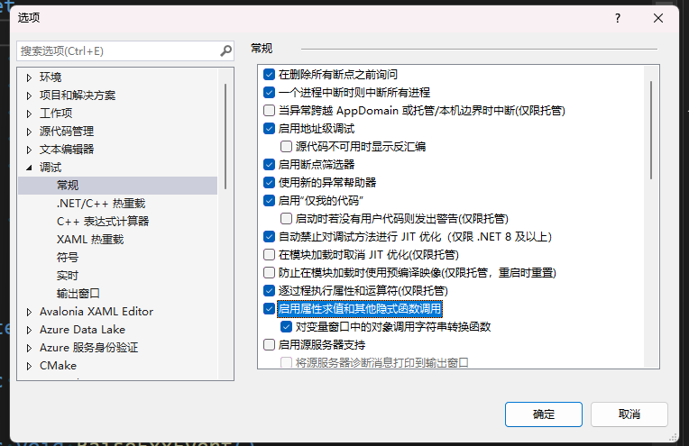
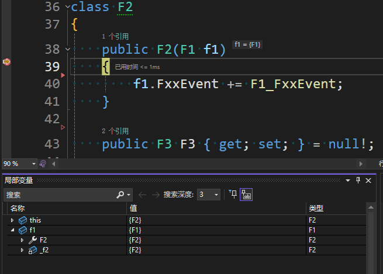
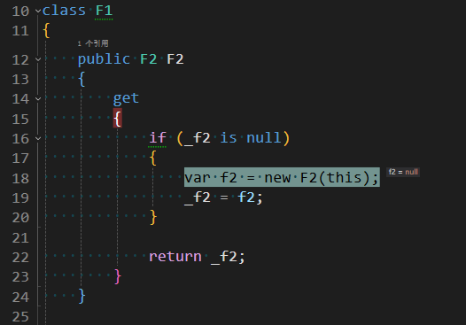
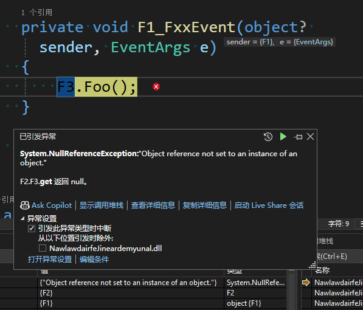
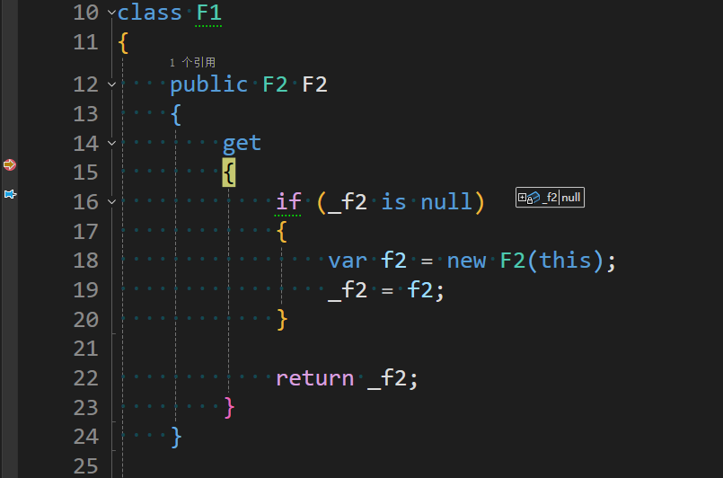
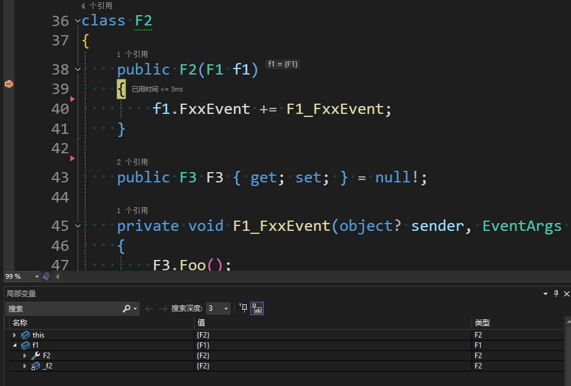
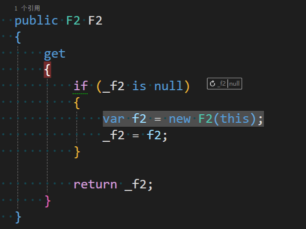
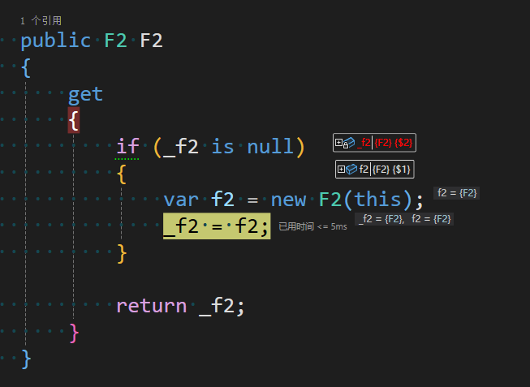

# 警惕 Visual Studio 属性求值副作用导致逻辑不符合预期

在 Visual Studio 进行调试的过程，也许大家会碰到一些进入断点和不进入断点时，行为逻辑不相同的情况。在进入断点时，默认启用属性求值或其他隐式函数调用，将会导致属性被求值，进而可能导致执行逻辑不符合预期

<!--more-->
<!-- CreateTime:2024/09/28 07:30:20 -->

<!-- 发布 -->
<!-- 博客 -->

本文将举一个例子，给出属性求值副作用导致逻辑不符合预期的简单复现步骤，用此例子告诉大家在 Visual Studio 里面进入断点和不进入断点导致的逻辑行为差异

默认启用属性求值或其他隐式函数调用选项在 VisualStudio 的选项->调试里面，如下图所示

<!--  -->


如以下代码，在一个名为 F1 类型里面有一个 F2 属性。这个属性采用非常常见的延迟创建方法，核心代码如下

```csharp
class F1
{
    public F2 F2
    {
        get
        {
            if (_f2 is null)
            {
                var f2 = new F2(this);
                _f2 = f2;
            }

            return _f2;
        }
    }

    private F2? _f2;
}

class F2
{
    ...
}
```

以上代码看起来也是非常正常。接着再给 F1 添加一个事件，这个事件让 F2 构造函数监听，其更改之后的代码如下

```csharp
class F1
{
    public event EventHandler? FxxEvent;

    public void RaiseFxxEvent()
    {
        FxxEvent?.Invoke(this, EventArgs.Empty);
    }
}

class F2
{
    public F2(F1 f1)
    {
        f1.FxxEvent += F1_FxxEvent;
    }

    private void F1_FxxEvent(object? sender, EventArgs e)
    {
        ...
    }
}
```

此时的逻辑还看不出来问题，再添加一些核心关键点。在 F2 里面添加一个 F3 属性，这个 F3 属性是在外面进行赋值的，且业务逻辑完全能够确保被赋值，代码如下

```csharp
class F2
{
    public F3 F3 { get; set; } = null!;
}

class F3
{
    public void Foo()
    {
    }
}
```

让 F2 的 F3 属性被 F1 的 FxxEvent 事件触发时使用，代码如下

```csharp
class F2
{
    public F3 F3 { get; set; } = null!;

    private void F1_FxxEvent(object? sender, EventArgs e)
    {
        F3.Foo();
    }
}
```

现在的类型定义和实现逻辑搭建就完成了，代码如下

```csharp
class F1
{
    public F2 F2
    {
        get
        {
            if (_f2 is null)
            {
                var f2 = new F2(this);
                _f2 = f2;
            }

            return _f2;
        }
    }

    private F2? _f2;

    public event EventHandler? FxxEvent;

    public void RaiseFxxEvent()
    {
        FxxEvent?.Invoke(this, EventArgs.Empty);
    }
}

class F2
{
    public F2(F1 f1)
    {
        f1.FxxEvent += F1_FxxEvent;
    }

    public F3 F3 { get; set; } = null!;

    private void F1_FxxEvent(object? sender, EventArgs e)
    {
        F3.Foo();
    }
}

class F3
{
    public void Foo()
    {
    }
}
```

完成搭建类型之后，编写以下代码进行调用

```csharp
var f1 = new F1();
var f2 = f1.F2;
f2.F3 = new F3();
f1.RaiseFxxEvent();
```

上述代码在不进入断点时，预期和实际都能很好工作。原因是 F2 属性能够必然返回一个 F2 类型的对象，且立刻调用 `f2.F3 = new F3();` 赋值。接着再触发 F1 的 FxxEvent 事件。在 FxxEvent 事件里面，由 F2 调用 F3 的 Foo 方法，逻辑非常简单

然而大家试试在 F2 构造函数里面打上断点，然后查看传入的 F1 参数的属性，将会发现接下来会抛出空异常

```csharp
class F2
{
    public F2(F1 f1)
    {
        // 在这里下断点，然后查看 f1 的属性
        f1.FxxEvent += F1_FxxEvent;
    }
    ...
}
```


<!--  -->


有趣的是现在的 f1 里面的 F2 属性已经有值了，但是别忘了，下断点的 F2 构造函数正是 F1 的属性调用进来的，调用堆栈如下

```csharp
>	F2.F2(F1 f1)
 	F1.F2.get()
```

也如下图所示，当前是在 F1 里面的 F2 的 get 方法里面尝试创建 F2 对象的，进入构造函数的断点

<!--  -->


继续按下 F5 向下跑，将会发现在 `F1_FxxEvent` 方法里面抛出异常，因为 F2 的 F3 属性为空

<!--  -->


是不是感觉很奇怪，明明从静态代码逻辑里面分析，完全不可能存在 F2 的 F3 属性为空的情况，因为事件的触发是在对 F3 属性赋值之后，如下面代码所示

```csharp
var f1 = new F1();
var f2 = f1.F2;
f2.F3 = new F3();
f1.RaiseFxxEvent();
``` 

其实核心的原因在上文已经有给大家提示了，在进入 F2 构造函数时，已经可以在局部变量窗口里面看到 F1 参数的 F2 属性有值了

<!--  -->


这就意味着 F2 属性已经被 get 过一次了，被求值了

为了更好的说明问题，这次咱先在 F2 属性的 get 方法下断点，重启进程调试，如下图所示

<!--  -->


可见此时 `_f2` 字段还是 null 值，非常符合预期

继续进入 F2 构造函数，展开局部变量，尝试去看一下 f1 参数此时的 F2 属性，可以看到此时的属性已经有值了，且 `_f2` 字段也有值了

<!--  -->


但是回到代码里面，逻辑上应该是当前的 `_f2` 字段是没有值的，因为现在正在 F2 的构造函数里，只有 F2 构造函数执行结束之后，才会给 `_f2` 字段赋值

<!--  -->


如下图，尝试在 F2 构造函数完成之后出来的地方，即将给 `_f2` 字段赋值处，进入断点。此时可见已经有值的 `_f2` 字段将被 `f2` 局部变量赋值。此时给 `_f2` 字段和 `f2` 局部变量添加对象 Id 号，可以看到这两个对象的 Id 号是不相同的。在 Visual Studio 里面，对象 Id 号不相同，意味着这是两个完全不同的对象

<!--  -->


于是当前的 `_f2` 字段的 F2 对象，将会被 `f2` 局部变量的 F2 对象覆盖

接着原本 `f2` 局部变量的 F2 对象的 F3 属性将被赋值，然后 F1 的 FxxEvent 事件将触发。但是原本的被覆盖的 `_f2` 字段的 F2 对象的 F3 属性却没有地方赋值，但这个被覆盖的 F2 对象却添加了事件监听，在事件处理函数里面访问了没有赋值的 F3 属性，最终导致空异常

为什么会出现给 `_f2` 字段赋值之前，就存在 `_f2` 字段的值？这是由于 Visual Studio 在调试的时候尝试进行了属性求值。在本例子里面的 F2 属性的 get 方法是有副作用的，其作用就是创建了一个 F2 对象且给 `_f2` 字段赋值。这个过程导致了代码执行逻辑的变更，执行代码逻辑的变更导致了进入了不符合预期的分支，即创建出来的 F2 对象的 F3 属性没有被赋值，因为调试过程中属性求值创建的 F2 对象很快就被正常代码逻辑的 F2 对象所覆盖，最终导致了空异常

这就是值得大家警惕的进入断点时的属性求值导致的副作用

如果一个属性的 get 方法是会变更代码执行逻辑，那进入断点时的属性求值，将会影响逻辑行为。从而导致下断点和不下断点有所差异

其解决方法有两个，第一个方法就是逻辑上保证能够接受此差异度，如本文例子里面加上判空和加上注释说明调试器可能进入此异常分支。第二个方法就是关闭 Visual Studio 的启用属性求值或其他隐式函数调用功能，虽然关闭之后会影响部分调试效率，但是在某些逻辑上只好如此

本文使用调试代码如下，为了方便大家使用，我还给 F2 添加了 Id 属性，通过 Id 属性可以判断对象是否相等，就不需要在 Visual Studio 里面创建对象 Id 了

```csharp
var f1 = new F1();
var f2 = f1.F2;
f2.F3 = new F3();
f1.RaiseFxxEvent();

Console.WriteLine("Hello, World!");

class F1
{
    public F2 F2
    {
        get
        {
            if (_f2 is null)
            {
                var f2 = new F2(this);
                _f2 = f2;
            }

            return _f2;
        }
    }

    private F2? _f2;

    public event EventHandler? FxxEvent;

    public void RaiseFxxEvent()
    {
        FxxEvent?.Invoke(this, EventArgs.Empty);
    }
}

class F2
{
    public F2(F1 f1)
    {
        Id = Interlocked.Increment(ref _count);
        f1.FxxEvent += F1_FxxEvent;
    }

    public int Id { get; }

    public F3 F3 { get; set; } = null!;

    private void F1_FxxEvent(object? sender, EventArgs e)
    {
        F3.Foo();
    }

    private static int _count;
}

class F3
{
    public void Foo()
    {
    }
}
```

本文代码放在 [github](https://github.com/lindexi/lindexi_gd/tree/0a4c3b24161a79e0acbf99cf591bc29eb858d36a/Workbench/NawlawdairfeJineardemyunal) 和 [gitee](https://gitee.com/lindexi/lindexi_gd/tree/0a4c3b24161a79e0acbf99cf591bc29eb858d36a/Workbench/NawlawdairfeJineardemyunal) 上，可以使用如下命令行拉取代码。我整个代码仓库比较庞大，使用以下命令行可以进行部分拉取，拉取速度比较快

先创建一个空文件夹，接着使用命令行 cd 命令进入此空文件夹，在命令行里面输入以下代码，即可获取到本文的代码

```
git init
git remote add origin https://gitee.com/lindexi/lindexi_gd.git
git pull origin 0a4c3b24161a79e0acbf99cf591bc29eb858d36a
```

以上使用的是国内的 gitee 的源，如果 gitee 不能访问，请替换为 github 的源。请在命令行继续输入以下代码，将 gitee 源换成 github 源进行拉取代码。如果依然拉取不到代码，可以发邮件向我要代码

```
git remote remove origin
git remote add origin https://github.com/lindexi/lindexi_gd.git
git pull origin 0a4c3b24161a79e0acbf99cf591bc29eb858d36a
```

获取代码之后，进入 Workbench/NawlawdairfeJineardemyunal 文件夹，即可获取到源代码

更多关于 VisualStudio 进入断点和不进入断点的差异，请参阅 [VisualStudio 打断点调试和不打断点调试有什么区别](https://blog.lindexi.com/post/VisualStudio-%E6%89%93%E6%96%AD%E7%82%B9%E8%B0%83%E8%AF%95%E5%92%8C%E4%B8%8D%E6%89%93%E6%96%AD%E7%82%B9%E8%B0%83%E8%AF%95%E6%9C%89%E4%BB%80%E4%B9%88%E5%8C%BA%E5%88%AB.html )

此问题除了直接断点之外，还可能受到 DebuggerDisplay 影响，详细请参阅 [VisualStudio 在 DebuggerDisplay 的属性更改业务逻辑将会让调试和非调试下逻辑不同](https://blog.lindexi.com/post/VisualStudio-%E5%9C%A8-DebuggerDisplay-%E7%9A%84%E5%B1%9E%E6%80%A7%E6%9B%B4%E6%94%B9%E4%B8%9A%E5%8A%A1%E9%80%BB%E8%BE%91%E5%B0%86%E4%BC%9A%E8%AE%A9%E8%B0%83%E8%AF%95%E5%92%8C%E9%9D%9E%E8%B0%83%E8%AF%95%E4%B8%8B%E9%80%BB%E8%BE%91%E4%B8%8D%E5%90%8C.html )

更多技术博客，请参阅 [博客导航](https://blog.lindexi.com/post/%E5%8D%9A%E5%AE%A2%E5%AF%BC%E8%88%AA.html )