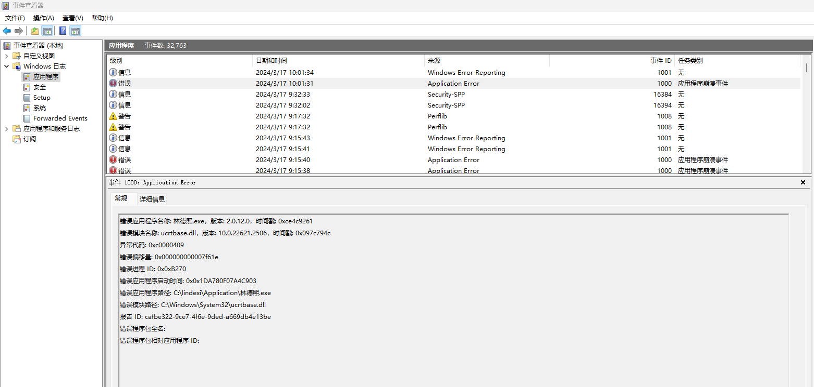

# 记 Intel 的 31.0.101.5186 版本驱动带崩 WPF 程序

本文记录一个 Intel 显卡驱动问题，暂时只在 Intel UHD Graphics 770 显卡带 31.0.101.5186 版本的显卡驱动时，才概率复现问题

<!--more-->
<!-- CreateTime:2024/3/17 9:47:08 -->

<!-- 发布 -->
<!-- 博客 -->

显卡驱动 31.0.101.5186 版本是在 2024.01.24 之前发布的，在出现问题的设备上的表现是，运行任何的 WPF 应用程序，都会闪崩，最多窗口创建出来，但是没有任何窗口内容，是一片黑，甚至很多时候都看不见窗口

通过事件查看器能够看到大概如下的错误日志信息内容大概如下

```
错误应用程序名称: 林德熙.exe，版本: 2.0.12.0，时间戳: 0xce4c9261
错误模块名称: ucrtbase.dll，版本: 10.0.22621.2506，时间戳: 0x097c794c
异常代码: 0xc0000409
错误偏移量: 0x000000000007f61e
错误进程 ID: 0x0x4E80
错误应用程序启动时间: 0x0x1DA78089FE8C794
错误应用程序路径: C:\lindexi\Application\林德熙.exe
错误模块路径: C:\Windows\System32\ucrtbase.dll
报告 ID: 10171c9f-c182-410f-bfa9-d162e93a9bae
错误程序包全名: 
错误程序包相对应用程序 ID: 
```

截图如下

<!--  -->


以上信息具备一点点迷惑性，因为报告的错误模块是 ucrtbase.dll 模块。不熟悉 ucrtbase.dll 的伙伴可以在网上搜 ucrtbase.dll 崩溃问题，就会搜出来许许多多和 ucrtbase.dll 相关的信息。但其实这些方向接近全部都是错误的，为什么这么说呢？因为 ucrtbase.dll 是 ucrt 库，全称是 [Universal C Runtime](https://learn.microsoft.com/zh-cn/cpp/windows/universal-crt-deployment?view=msvc-170 ) 是 Win 下的 C 标准库，基本上可以认为这是一个十分稳定的模块，真要有出错也是上层传了很离谱的参数或调用形式十分诡异才可能出错，以下是[微软官方文档](https://learn.microsoft.com/en-us/cpp/porting/upgrade-your-code-to-the-universal-crt?view=msvc-170)对 UCRT 的描述：

> The Microsoft C Runtime Library (CRT) was refactored in Visual Studio 2015. The Standard C Library, POSIX extensions and Microsoft-specific functions, macros, and global variables were moved into a new library, the Universal C Runtime Library (Universal CRT or UCRT). The compiler-specific components of the CRT were moved into a new vcruntime library.

那为什么会看到这个错误日志里面的 错误模块 是 ucrtbase.dll 呢？通过我从伙伴们拿到的 DUMP 进行分析可以知道，其实是因为 UCRT 提供了 abort 方法，这个方法用于让进程崩溃退出，导致了最后的崩溃点记录在 ucrtbase.dll 模块。这个 abort 方法是用在当应用程序的代码逻辑发现出现了严重的异常问题，需要让进程崩溃时调用的，一旦调用了这个 abort 方法，那进程将会崩溃掉

比方当前遇到的 Intel 驱动相关模块内部出现了奇怪的问题，驱动模块决定让进程崩溃掉，所采用的方法就是间接调用了 ucrtbase.dll 的 abort 方法

通过将 Dump 文件拖入到 VisualStudio 进行混合调试分析，可以看到以下的调用堆栈

```
>	ucrtbase.dll!abort()
 	ucrtbase.dll!terminate()
 	ucrtbase.dll!FindHandler<__FrameHandler4>()
 	ucrtbase.dll!__InternalCxxFrameHandler<class __FrameHandler4>(struct EHExceptionRecord *,unsigned __int64 *,struct _CONTEXT *,struct _xDISPATCHER_CONTEXT *,struct FH4::FuncInfo4 *,int,unsigned __int64 *,unsigned char)
 	ucrtbase.dll!__CxxFrameHandler4()
 	ntdll.dll!RtlpExecuteHandlerForException()
 	ntdll.dll!RtlDispatchException()
 	ntdll.dll!KiUserExceptionDispatch()
 	KernelBase.dll!RaiseException()
 	igd12um64xel.dll!00007ffcc094a65f()
 	igd12um64xel.dll!00007ffcc0b51646()
 	igd12um64xel.dll!00007ffcc0a54e21()
 	igd12um64xel.dll!00007ffcc088b3cc()
 	igd12um64xel.dll!00007ffcc0851271()
 	igd12um64xel.dll!00007ffcc0850bea()
 	igd12um64xel.dll!00007ffcc086fd57()
 	igd12um64xel.dll!00007ffcc086f4e6()
 	D3D12Core.dll!NDXGI::CDevice::CreateDriverInstance(void *,void *,void *,enum D3D12DDI_CREATE_DEVICE_FLAGS)
 	D3D12Core.dll!CDevice::LLOCompleteLayerConstruction(void)
 	D3D12Core.dll!NDXGI::CDevice::LLOCompleteLayerConstruction(void)
 	D3D12.dll!00007ffce2a15bae()
 	D3D12Core.dll!D3D12CoreCreateLayeredDevice()
 	D3D12Core.dll!D3D12CoreCreateDevice()
 	D3D12Core.dll!D3D12ValidateAndCreateDevice()
 	D3D12.dll!00007ffce2a16c5b()
 	D3D12.dll!00007ffce2a1662e()
 	d3d9on12.dll!00007ffce28f4ae0()
 	d3d9on12.dll!00007ffce296df7b()
 	d3d9.dll!CreateDeviceLHDDI()
 	d3d9.dll!D3D9CreateDirectDrawObject()
 	d3d9.dll!FetchDirectDrawData()
 	d3d9.dll!InternalDirectDrawCreate()
 	d3d9.dll!CEnum::CEnum()
 	d3d9.dll!Direct3DCreate9Impl()
 	d3d9.dll!Direct3DCreate9Ex()
 	wpfgfx_v0400.dll!CD3DModuleLoaderInternal::CreateD3DObjects(struct IDirect3D9 * *,struct IDirect3D9Ex * *)
 	wpfgfx_v0400.dll!CDisplaySet::Init(void)
 	wpfgfx_v0400.dll!CDisplayManager::CreateNewDisplaySet(unsigned long,unsigned long,class CDisplaySet const * *)
 	wpfgfx_v0400.dll!CDisplayManager::DangerousGetLatestDisplaySet(class CDisplaySet const * * const)
 	wpfgfx_v0400.dll!CMILFactory::GetCurrentDisplaySet(class CDisplaySet const * *)
 	wpfgfx_v0400.dll!CMILFactory::UpdateDisplayState(bool *,int *)
 	wpfgfx_v0400.dll!CComposition::ProcessComposition(bool *)
 	wpfgfx_v0400.dll!CComposition::Compose(bool *)
 	wpfgfx_v0400.dll!CPartitionThread::RenderPartition(class Partition *)
 	wpfgfx_v0400.dll!CPartitionThread::Run(void)
 	wpfgfx_v0400.dll!CPartitionThread::ThreadMain(void *)
 	kernel32.dll!00007ffd129a257d()
 	ntdll.dll!RtlUserThreadStart()
```

可以看到实际的错误模块是 igd12um64xel.dll 模块，这是一个 Intel 驱动相关的模块，这个模块触发了 KernelBase.dll 的 RaiseException 方法，证明出现了异常。接着这个异常没有人处理，最后进入了 ucrtbase.dll 的 terminate 方法，再进入 abort 方法让进程崩溃

在 WPF 的 gfx 层的 `CD3DModuleLoaderInternal::CreateD3DObjects` 方法里面，将会调用 `d3d9.dll!Direct3DCreate9Ex` 方法，这是一个非常正常的创建 D3D9 的方法，在 d3d9.dll 的底层将会使用 d3d9on12.dll 模块进入到 D3D12.dll 里面，紧接着碰触了 Intel 的驱动模块，最后在 Intel 驱动模块抛出异常崩掉

换句话说就是以上的错误内容和 ucrtbase.dll 没有任何关系，真正的错误点是 igd12um64xel.dll 模块

我将此问题报告给到 WPF 官方，详细请看 <https://github.com/dotnet/wpf/issues/8920>

但预计此问题和 WPF 毫无关系，完全属于 Intel 的问题

另外，现在 2024.03.17 最新 Intel 驱动是 31.0.101.5379 版本，如遇到问题还请大家尝试更新一下显卡驱动

额外，还有伙伴来和我报告说，他的应用程序只要包含中文名就能遇到相同的错误堆栈，只要改成英文名就没有问题，这也很有趣。如果大家遇到类似的问题，不妨看看是不是名称带上中文名了，试试给他换成英文再试试。那位伙伴说只要 exe 的名称是英文的，不带中文的就可以正常运行，所在文件夹随意，所在文件夹路径带上中文是可以的。详细关于中文名无法启动问题，请参阅 [WPF软件因中文名无法启动，原因竟是英特尔驱动 – 晨旭的博客](https://www.chenxublog.com/2024/03/12/intel-gpu-driver-make-wpf-broken.html#comment-2585 )

以上提到的包含中文名就崩溃的问题，根据[晨旭](https://github.com/chenxuuu)大佬在[GitHub](https://github.com/dotnet/wpf/issues/8913#issuecomment-2011329241)上的记录，已在 Intel 的 31.0.101.5379 版本驱动修复