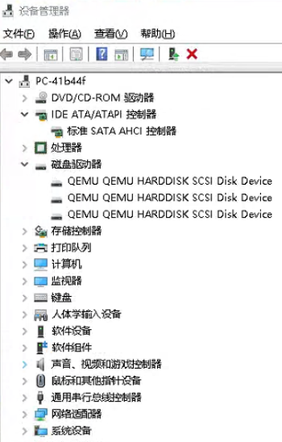

# 记 QEMU 虚拟磁盘设备移动文件抛异常但实际移动成功

本文记录我所在的团队的一个简单的 WPF 应用程序在某个用户设备上跑出来的诡异行为。这个程序会从网上下载资源，下载的时候先下载到临时文件，再通过移动重命名的方式放到正确的路径。偶尔会出现下载成功，但是移动过程失败，但远程过去看却发现实际移动成功了

<!--more-->
<!-- CreateTime:2024/11/15 07:25:55 -->
<!-- 发布 -->
<!-- 博客 -->

我使用 `Get-WmiObject Win32_DiskDrive` 命令在 PowerShell 里面调用 WMI 读取硬盘信息，可以看到如下输出内容

```
Get-WmiObject Win32_DiskDrive
Partitions : 1
DeviceID   : \\.\PHYSICALDRIVE1
Model      : QEMU QEMU HARDDISK SCSI Disk Device
Size       : 105226007040
Caption    : QEMU QEMU HARDDISK SCSI Disk DevicePartitions : 2
DeviceID   : \\.\PHYSICALDRIVE0
Model      : QEMU QEMU HARDDISK SCSI Disk Device
Size       : 118106795520
Caption    : QEMU QEMU HARDDISK SCSI Disk DevicePartitions : 1
DeviceID   : \\.\PHYSICALDRIVE2
Model      : QEMU QEMU HARDDISK SCSI Disk Device
Size       : 118106795520
Caption    : QEMU QEMU HARDDISK SCSI Disk Device
```

通过设备管理器能看到如下界面

<!--  -->


经过 [lsj](https://blog.sdlsj.net/ ) 的分析，预计是虚拟磁盘的问题，导致移动成功了，但是 Win32 给出错误信息

为了更好复现问题，我编写了以下测试程序。经过我的测试，这个问题和 WPF 无关，且和 dotnet 无关，和网络下载无关。仅仅只是以下简单的多个文件同时写入，写入之后进行移动，就能复现问题

```csharp
var workFolder = Path.Join(Path.GetTempPath(), "Test-RecedajeeKewhinuhoyay");
Directory.CreateDirectory(workFolder);

Console.WriteLine($"测试文件夹 {workFolder}");

var locker = new object();

var taskList = new List<Task>();

for (int i = 0; i < 50; i++)
{
    var task = Task.Run(async () =>
    {
        var fileName = Path.GetRandomFileName();
        var filePath = Path.Join(workFolder, fileName + ".tmp");

        await MockDownloadAsync(filePath);

        var newFilePath = Path.Join(workFolder, fileName);
        try
        {
            File.Move(filePath, newFilePath);
        }
        catch (Exception e)
        {
            /*
            Move file fail. FilePath=C:\Users\admin\AppData\Local\Temp\Test-RecedajeeKewhinuhoyay\zvxau5gx.lmz.tmp. HResult=80070003;System.IO.DirectoryNotFoundException: Could not find a part of the path.
               at System.IO.FileSystem.MoveFile(String, String, Boolean)
               at System.IO.File.Move(String, String, Boolean)
               at System.IO.File.Move(String, String)
               at Program.<>c__DisplayClass0_0.<<<Main>$>b__2>d.MoveNext()
             */

            // 新文件存在: True;原文件存在： False

            if (e is IOException ioException)
            {
                Output($"Move file fail. FilePath={filePath}. HResult={ioException.HResult:X};\r\n新文件存在: {File.Exists(newFilePath)};原文件存在： {File.Exists(filePath)}\r\n{ioException}");
            }
            else
            {
                Output($"Move file fail. FilePath={filePath}.\r\n新文件存在: {File.Exists(newFilePath)};原文件存在： {File.Exists(filePath)}\r\n{e}");
            }
        }
    });

    taskList.Add(task);
}

void Output(string message)
{
    Console.WriteLine(message);
}

async Task MockDownloadAsync(string filePath)
{
    using var fileStream = File.OpenWrite(filePath);
    var buffer = new byte[10240];
    for (int i = 0; i < 100; i++)
    {
        Random.Shared.NextBytes(buffer);
        fileStream.Write(buffer, 0, buffer.Length);

        await Task.Delay(15);
    }
}

Task.WaitAll(taskList);

Console.WriteLine("运行完成");
```

以上代码使用 MockDownloadAsync 方法代替真实的网络下载。同时执行多个文件的写入，似乎能够让虚拟磁盘更加忙碌，于是就能够复现问题

抛出的异常如下

```
System.IO.DirectoryNotFoundException: Could not find a part of the path.

               at System.IO.FileSystem.MoveFile(String, String, Boolean)
               at System.IO.File.Move(String, String, Boolean)
               at System.IO.File.Move(String, String)
               at Program.<>c__DisplayClass0_0.<<<Main>$>b__2>d.MoveNext()
```

对应的 Win32 错误码是 0x80070003

解决方法：

只能规避，规避方法是捕获 System.IO.DirectoryNotFoundException 异常，在异常里面判断移动之后的新文件是否存在，如果存在则证明是移动成功，只是虚拟磁盘在逗而已

```csharp
        try
        {
            File.Move(filePath, newFilePath);
        }
        catch(Exception e)
        {
            if (e is System.IO.DirectoryNotFoundException && (uint)e.HResult == 0x80070003/*这个 0x80070003 是多余的判断，只是为了说明就是这种情况而已*/)
            {
                // 有可能是在 QEMU 虚拟磁盘上，在虚拟硬盘移动文件成功，但 Win32 返回失败
                // 尝试判断移动之后的文件是否存在，如果存在就认为移动成功
                if (File.Exists(downloadEntry.FilePath))
                {
                    // 移动成功了，返回就可以了，不用再处理了
                    return; // 业务代码里面不一定可以用 return 哦，调用了 return 将会结束方法了哦
                }
                else
                {
                    // 没有移动成功，即文件不存在，则继续的其他处理
                }
            }

            // ...
            // 忽略其他处理。其他处理如记录日志呀或尝试换成拷贝等

            throw;
        }
```

本文代码放在 [github](https://github.com/lindexi/lindexi_gd/tree/a3b5ce1d8dcc08cdc2d23e436e6fb477f1fac503/Workbench/RecedajeeKewhinuhoyay) 和 [gitee](https://gitee.com/lindexi/lindexi_gd/tree/a3b5ce1d8dcc08cdc2d23e436e6fb477f1fac503/Workbench/RecedajeeKewhinuhoyay) 上，可以使用如下命令行拉取代码。我整个代码仓库比较庞大，使用以下命令行可以进行部分拉取，拉取速度比较快

先创建一个空文件夹，接着使用命令行 cd 命令进入此空文件夹，在命令行里面输入以下代码，即可获取到本文的代码

```
git init
git remote add origin https://gitee.com/lindexi/lindexi_gd.git
git pull origin a3b5ce1d8dcc08cdc2d23e436e6fb477f1fac503
```

以上使用的是国内的 gitee 的源，如果 gitee 不能访问，请替换为 github 的源。请在命令行继续输入以下代码，将 gitee 源换成 github 源进行拉取代码。如果依然拉取不到代码，可以发邮件向我要代码

```
git remote remove origin
git remote add origin https://github.com/lindexi/lindexi_gd.git
git pull origin a3b5ce1d8dcc08cdc2d23e436e6fb477f1fac503
```

获取代码之后，进入 Workbench/RecedajeeKewhinuhoyay 文件夹，即可获取到源代码

更多技术博客，请参阅 [博客导航](https://blog.lindexi.com/post/%E5%8D%9A%E5%AE%A2%E5%AF%BC%E8%88%AA.html )