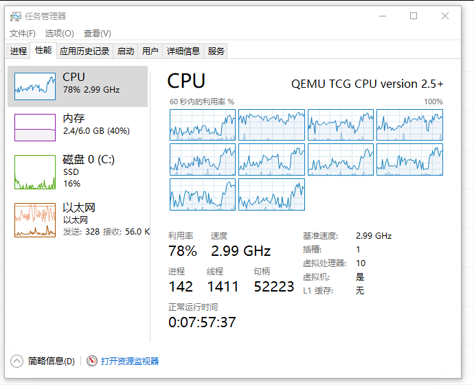

# 记 QEMU 让 dotnet 6 程序抛出空异常问题

本文记录在 QEMU 里面跑 Windows 10 系统时，遇到的 dotnet 抛出不明原因的空异常问题

<!--more-->


<!-- 发布 -->
<!-- 博客 -->

使用 `qemu-system-x86_64 -version` 命令获取 QEMU 版本如下

```
$ qemu-system-x86_64 -version
QEMU emulator version 9.2.92 (Debian 1:10.0.0~rc2+ds-2)
Copyright (c) 2003-2025 Fabrice Bellard and the QEMU Project developers
```

使用 `dpkg -l | grep qemu` 获取安装的版本信息如下

```
$ dpkg -l | grep qemu
ii  ipxe-qemu                      1.21.1+git20250317.42a29d56+dfsg-2 all          PXE boot firmware - ROM images for qemu
ii  qemu-system-common             1:10.0.0~rc2+ds-2                  amd64        QEMU full system emulation binaries (common files)
ii  qemu-system-data               1:10.0.0~rc2+ds-2                  all          QEMU full system emulation (data files)
ii  qemu-system-x86                1:10.0.0~rc2+ds-2                  amd64        QEMU full system emulation binaries (x86)
ii  qemu-utils                     1:10.0.0~rc2+ds-2                  amd64        QEMU utilities
```

运行的 Windows 10 版本是

```
Windows 10 2004 (19041.508)
```

<!--  -->


遇到的两个空异常信息分别如下

```
UnhandledException. IsTerminating:True 

Exception: System.NullReferenceException: Object reference not set to an instance of an object.
   at System.Dynamic.Utils.TypeUtils.IsNullableType(Type type)
   at System.Dynamic.Utils.TypeUtils.GetNonNullableType(Type type)
   at System.Linq.Expressions.Compiler.ILGen.CanEmitILConstant(Type type)
```

```
UnhandledException. IsTerminating:True 

Exception: System.NullReferenceException: Object reference not set to an instance of an object.
   at System.Reflection.Emit.ILGenerator.GetTokenFixups()
```

堆栈分别是在 `System.Linq.Expressions.Compiler.ILGen.CanEmitILConstant` 这里和 `System.Reflection.Emit.ILGenerator.GetTokenFixups` 这里

以及参数为空异常，信息如下

```
Exception Info: System.ArgumentNullException: Value cannot be null. (Parameter 'binaryForm')
   at System.Security.AccessControl.GenericAce.VerifyHeader(Byte[] binaryForm, Int32 offset)
   at System.Security.AccessControl.CommonAce.ParseBinaryForm(Byte[] binaryForm, Int32 offset, AceQualifier& qualifier, Int32& accessMask, SecurityIdentifier& sid, Boolean& isCallback, Byte[]& opaque)
```

系统日志所见内容如下

```
出错模块名称： System.Private.CoreLib.dll， 版本： 6.0.1322.58009，时间戳： 0xd7727752
异常代码： 0xc0000005
错误偏移： 0x002e1375
出错进程 ID： 904
出错应用程序开始时间： 01dbbe7a5b0c47ec
```

以及如下

```
出错模块名称： System.Linq.Expressions.dll， 版本： 6.0.1322.58009，时间戳： 0xbb0217d3
异常代码： 0xc0000005
错误偏移： 0x000e74d8
出错进程 ID： 1efc
出错应用程序开始时间： 01dbbe7a23a4f9cb
```

以及如下

```
出错模块名称： KERNELBASE.dll， 版本： 10.0.19041.488，时间戳： 0x42f14898
异常代码： 0xe0434352
错误偏移： 0x00129962
出错进程 ID： fa0
出错应用程序开始时间： 01dbbe79edc2197b
```

没有找到特别的原因，也没有找到解决方法


<a rel="license" href="http://creativecommons.org/licenses/by-nc-sa/4.0/"></a><br />本作品采用<a rel="license" href="http://creativecommons.org/licenses/by-nc-sa/4.0/">知识共享署名-非商业性使用-相同方式共享 4.0 国际许可协议</a>进行许可。欢迎转载、使用、重新发布，但务必保留文章署名[林德熙](http://blog.csdn.net/lindexi_gd)(包含链接:http://blog.csdn.net/lindexi_gd )，不得用于商业目的，基于本文修改后的作品务必以相同的许可发布。如有任何疑问，请与我[联系](mailto:lindexi_gd@163.com)。