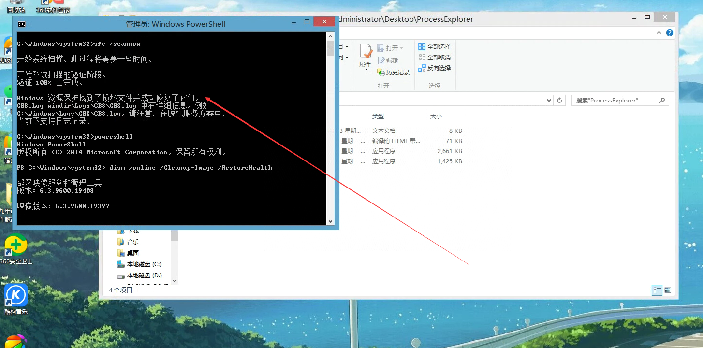

# 记 Win8.1 某应用渲染抛出 OutOfMemoryException 异常及修复方法

本文记录某个应用在某台 Windows 8.1 x86 系统上，运行时抛出 OutOfMemoryException 异常，启动失败。应用程序能启动，但是在第一次碰到渲染时，就发现渲染初始化失败，从而让应用程序闪退

<!--more-->


<!-- 发布 -->
<!-- 博客 -->

此应用是一个 dotnet 6 应用，闪退时好在被系统的事件管理记录了日志，从系统的事件查看器可以看到如下的异常堆栈信息

```
Application: Doubi.exe
CoreCLR Version: 6.0.121.56705
.NET Version: 6.0.1
Description: The process was terminated due to an unhandled exception.
Exception Info: System.Reflection.TargetInvocationException: Exception has been thrown by the target of an invocation.
 ---> System.OutOfMemoryException: Insufficient memory to continue the execution of the program.
   at MS.Internal.HRESULT.Check(Int32 hr)
   at System.Windows.Media.Composition.DUCE.Channel.SyncFlush()
   at System.Windows.Media.MediaContext.CompleteRender()
   at System.Windows.Media.MediaContext.CreateChannels()
   at System.Windows.Media.MediaSystem.ConnectChannels(MediaContext mc)
   at System.Windows.Media.MediaContext..ctor(Dispatcher dispatcher)
   at System.Windows.Media.MediaContext.From(Dispatcher dispatcher)
```

以上的 OutOfMemoryException 异常，不代表一定是内存不足的异常状态。通过堆栈可以看到，这个异常是在 `MS.Internal.HRESULT.Check` 方法里面根据 hr 参数从而抛出的。通过阅读 WPF 源代码，可以看到这是对应的是在 wgx_render.cs 代码里的如下定义

```csharp
    internal enum NtStatusErrors
    {
        NT_STATUS_NO_MEMORY = unchecked((int)0xC0000017)
    }

    /// <summary>
    /// HRESULT
    /// </summary>
    /// <ExternalAPI/>
    // [StructLayout(LayoutKind.Sequential)]
    internal struct HRESULT
    {
        /// <summary>
        /// If the result is not a success, then throw the appropriate exception.
        /// </summary>
        /// <param name="hr"></param>
        /// <ExternalAPI/>
        public static void Check(int hr)
        {
            if (hr >= 0)
            {
                // The call succeeded, don't bother calling Marshal.ThrowExceptionForHr
                return;
            }
            else
            {
                throw ConvertHRToException(hr);
            }
        }

        [SecuritySafeCritical]
        internal static Exception ConvertHRToException(int hr)
        {
          // 忽略其他代码
                switch (hr)
                {
                    case (int) NtStatusErrors.NT_STATUS_NO_MEMORY:
                        return new System.OutOfMemoryException();
                }
          // 忽略其他代码
      }
```

这里的抛出的异常是由 WPF GFX 层的返回值转换的 dotnet 异常，而 GFX 层具体是哪个模块出现问题，也是无法确定的。在 GFX 层采用的是遇到异常即返回错误码的方式，没有直接的堆栈可以看到是哪个模块

这里的 `0xC0000017` 是一个常见的 nt 异常，于是又不好调查了，先尝试简单的 demo 能否复现，用来了解是否 WPF 底层的问题

尝试使用空的 dotnet 6 的 WPF 应用程序，可以正常运行和渲染。 证明应该是此应用触发了某些条件才会让渲染挂了，但是此应用过于复杂，先尝试修一下系统，如果修系统不行，再进行二分。因为二分的成本比较高

尝试更新显卡驱动，发现官方没有提供 Win8.1 x86 的驱动

尝试 DX 修复工具，没有找到可以修复的问题

尝试使用系统自带的修复命令，在管理员权限的 cmd 命令行就输入以下代码进行修复

```
sfc /scannow
```

命令输出 Windows 资源保护找到了损坏文件并成功修复了它们

接着使用管理员的 PowerShell 进行 Dism 修复，命令如下

```
dism /online /Cleanup-Image /RestoreHealth
```

执行输出如下图

<!--  -->


修复完成之后，发现应用程序可以正常使用

猜测是系统的某些文件出了问题，具体是什么问题，还不知道

虽然上面的使用 DX 修复工具等步骤没有实际作用，但也不代表着这些步骤毫无作用，说不定这些步骤只是修了一半的问题


<a rel="license" href="http://creativecommons.org/licenses/by-nc-sa/4.0/"></a><br />本作品采用<a rel="license" href="http://creativecommons.org/licenses/by-nc-sa/4.0/">知识共享署名-非商业性使用-相同方式共享 4.0 国际许可协议</a>进行许可。欢迎转载、使用、重新发布，但务必保留文章署名[林德熙](http://blog.csdn.net/lindexi_gd)(包含链接:http://blog.csdn.net/lindexi_gd )，不得用于商业目的，基于本文修改后的作品务必以相同的许可发布。如有任何疑问，请与我[联系](mailto:lindexi_gd@163.com)。