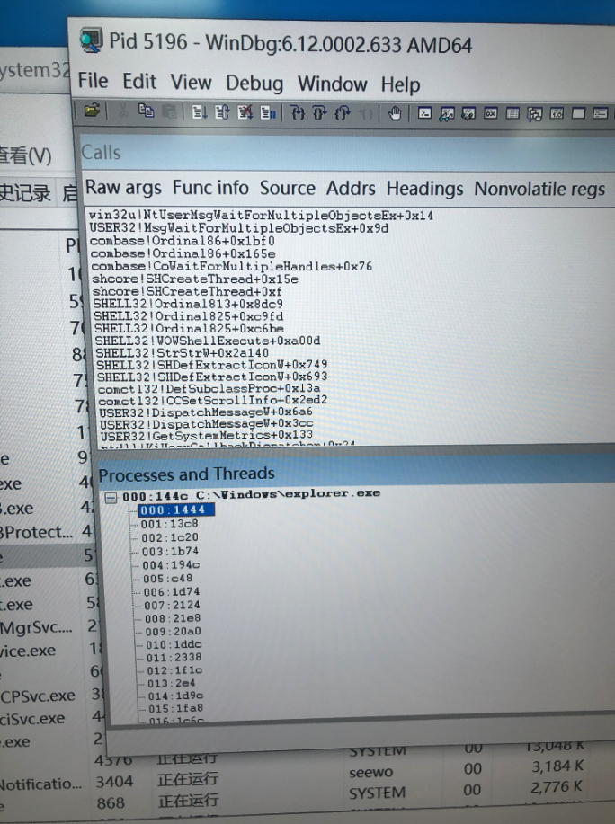
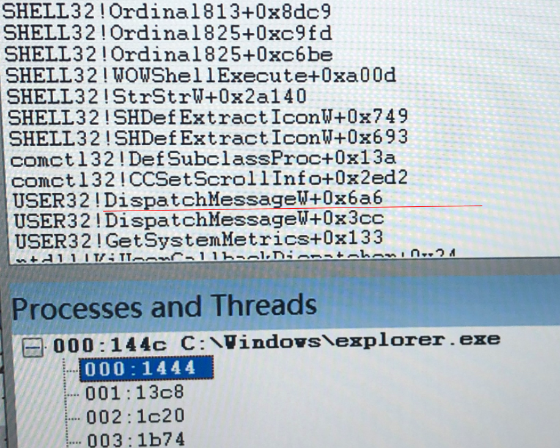
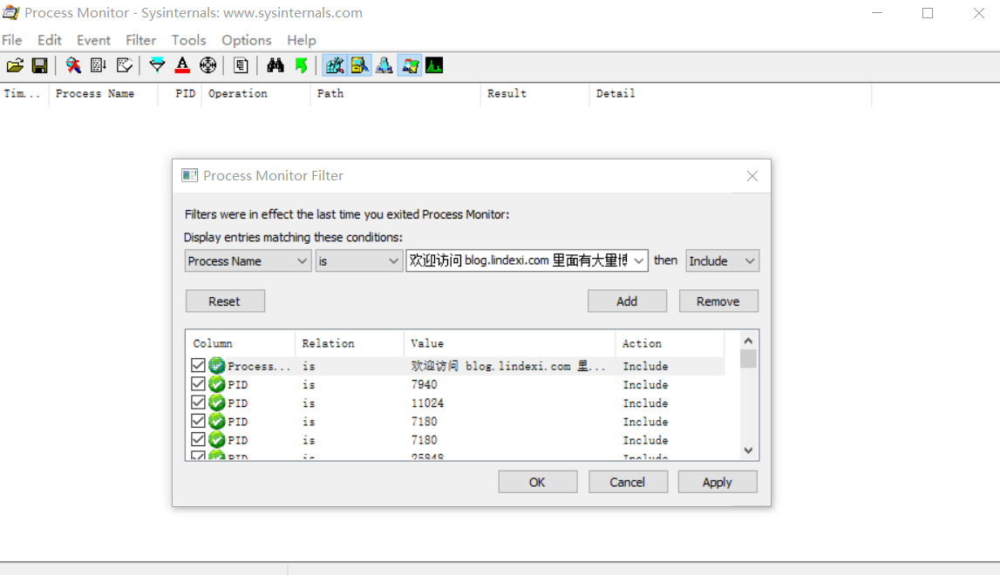
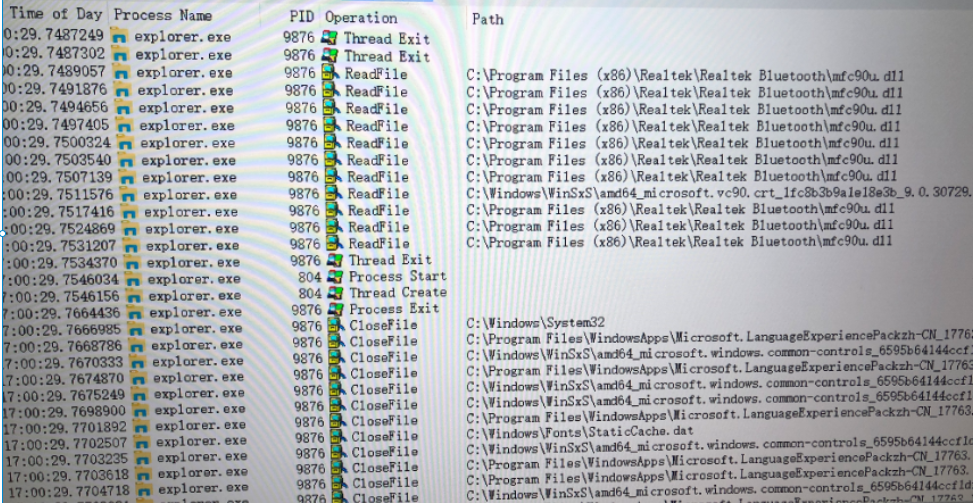
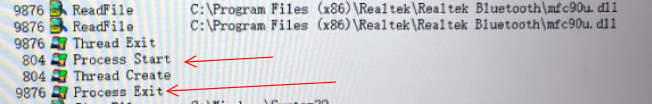
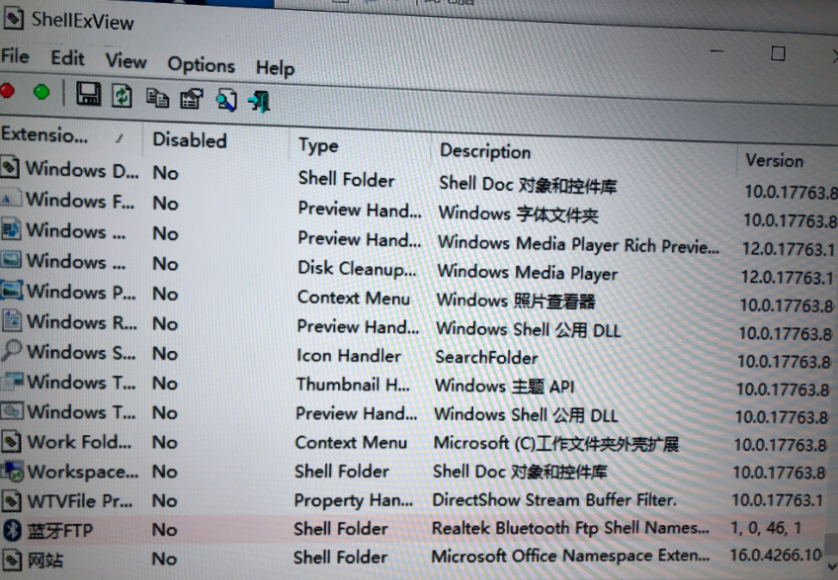
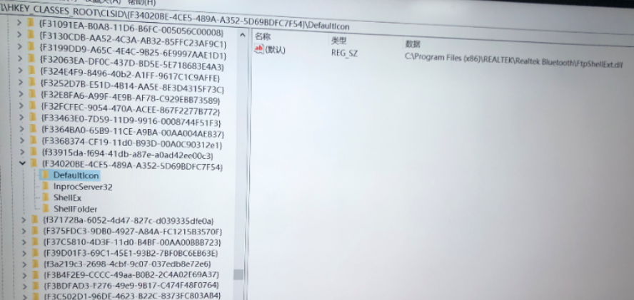
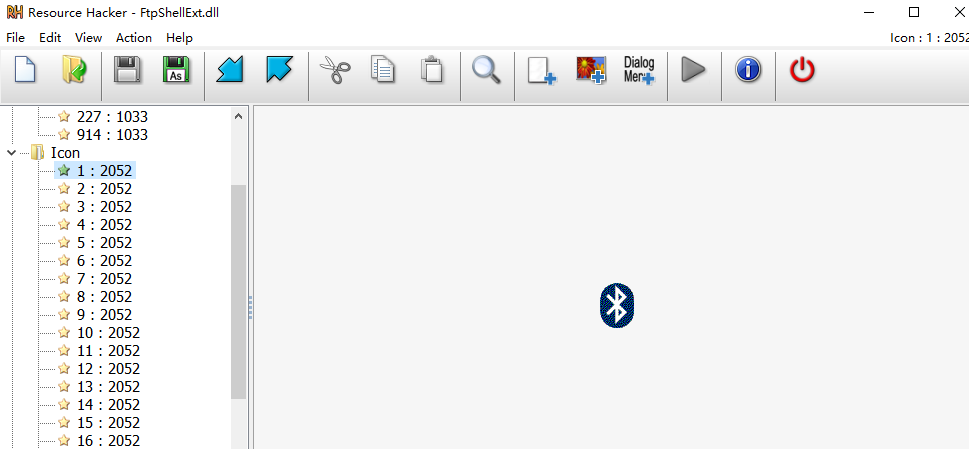
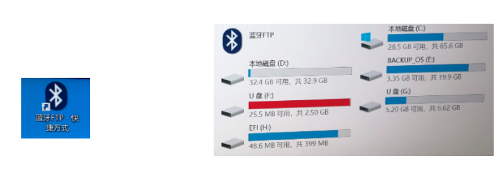

# 记一次调试资源管理器未响应经验

有小伙伴告诉我一台设备全触摸失效了，但实际上是资源管理器未响应。我相信微软的实力，因为这台设备是自主研发的设备，所以我和几个小伙伴一起调试而不是去喷微软

通过本文可以了解到调试的思路和用到的工具

<!--more-->
<!-- CreateTime:2019/11/2 12:31:21 -->

<!-- csdn -->

## 不要相信测试

测试小伙伴发现，在进行100次开机关机之后，可能会有触摸失效。触摸失效是桌面触摸没反应，但是有时在桌面触摸没反应时，触摸任务栏又能恢复，但是过一会又不能触摸

也就是看起来是触摸屏没有告诉系统有触摸，可能是只有任务栏所在的范围可以触摸

于是我就猜关机会关闭触摸屏，触摸屏在开机的时候，进入了休眠。需要有触摸才能唤醒，但是触摸屏的上面部分没有开启，只有下面任务栏部分开启。当触摸到下面部分，将会接收触摸，触摸屏唤醒。这是硬件的问题

触摸屏有两个模式，和显示器一样，一个是节能模式，一个是工作模式，进入节能模式需要收到触摸或其他硬件唤醒才进入工作模式

硬件小伙伴准备拿着 BusHound 去抓触摸屏发送的消息，发现插入鼠标时点击桌面也没有打开，于是这个问题就不是触摸问题

## 测试套路

在发现这个问题不是触摸屏问题时，我就需要去调试。但是在调试之前，可以请测试工程师多做一些协助，这就是测试套路

对于不是一定能触发的坑，测试的思路是找到更短步骤

现在是 100 次才触发，能不能找到某个方法可以做到 10 次以内就触发。现在需要关机，关电源，等待一会，然后开机，等待开机完成，触摸一下。能不能找到其他方式，如只需要重启

## 猜可能的问题

遇到这个没有思路的问题，那么按照我是逗比开发的思路，我可以如何作出让资源管理器没有响应输入

假设我做了一个透明窗口，这个透明窗口是开机自动启动，作为最大化窗口。此时这个窗口将会吃掉所有的除任务栏的输入

这个假设有这样的问题，为什么点击任务栏就能恢复？回应原因是点击任务栏应用失去焦点，失去焦点窗口自动关闭

或者我做了一个全局钩子，这个钩子将会吃掉所有点击桌面的输入

## 根据可能调试

我的小伙伴伟霖大佬发现了用键盘打开任务管理器，此时任务管理器可以响应输入，但是桌面依然不可以。此时说明上面的猜测都是不对的，因为点击任务管理器也就是透明窗口失去焦点，如果他会隐藏，那么就隐藏了。如果是全局钩子，那么也点不到任务管理器

所以上面的思路是不对的

## 实际问题

在任务管理器发现了资源管理器没有响应

也就是实际问题就是资源管理器没有响应，需要了解为什么资源管理器没有响应和可以如何解决

如果这个问题在网上问，基本上小伙伴都会说升级系统，和打补丁。这也是我的思路，假设这个问题微软已经解决了，我也就不需要再进行调试。但是打上了补丁发现依然存在这个问题，于是接下来就是本文的核心，进行调试

## 搜寻信息

我信仰微软，我不相信全球有这么多用户量的系统，会出现这样的问题。我按照描述在网上搜了很久，虽然也有相近的博客，但是说的都不是我遇到的问题

在发现系统的软件出现问题，第一反应应该是去系统日志查看，通过右击此电脑点击管理可以找到系统日志，很多都能在系统日志看到信息。但是这次没有发现有用的信息

因为这个设备是自主研发的，同时装上了很多自主研发的软件，特别是我写的逗比软件，这个问题可能是自己写出来的问题

## 软件未响应可能的原因

按照调试方法，首先需要想存在哪些原因，然后测试原因

软件无响应的方法，假设是存在某个逗比软件，如何让另一个程序未响应？我和伟霖说简单的方法是不断发送 windows 消息给另一个程序，因为微软判断程序是否响应是依靠消息的处理

此时小伙伴使用 Spyxx 工具附加到桌面，查看收到的消息

实际上是没有特别的消息，所以这个思路不对

## 调试资源管理器

现在也没有想到好的思路，那么直接调试资源管理器

调试资源管理器的方法主要用到 WinDbg 工具，打开 WinDbg 工具，通过 File 附加进程，附加到资源管理器，此时进入断点

对我来说，我需要关注一个第三方的应用未响应的只有堆栈和线程

因为老司机告诉我，如果一个程序未响应，在资源管理器看到 CPU 不动，那么原因就是程序在等待。等待的原因可能是有两个线程相互等待，也有可能是等待另一个进程。这部分请看 [dotnet 代码调试方法](https://blog.lindexi.com/post/dotnet-%E4%BB%A3%E7%A0%81%E8%B0%83%E8%AF%95%E6%96%B9%E6%B3%95.html)

通过 WinDbg 打开线程界面和堆栈界面，可以看到线程在等待

<!--  -->


这里是如何判断主线程是哪个线程？通过堆栈存在 DispatchMessage 找到主线程

<!--  -->


可以看到主线程在等待，但不是在等待消息。那么是不是在等待其他线程？看到其他线程也有在等待锁，但是不确定哪个线程等待的锁和主线程相同。 于是不断在 windbg 按下 g 继续执行，然后暂停，可以找到一些线程的变化。通过这个方法发现了资源管理器不是在等待自己进程内的线程，这和我上面说的一样，有这么多用户的系统的稳当性是很重要

另一个小伙伴通过资源管理器拿到转储文件，通过转储文件可以使用 WinDbg 调试到对应的内存对应的变量和调用方法的局部变量

他找到的是在这个方法里面调用了 SendMessage 方法卡住，发送的消息是 WM_Notify 消息，那么在进程里面发送消息有什么用。可能是做进程的通信也可能做线程的通信。等等上面是不是乱说，为什么线程的通信会用到消息。假设这个软件都是一个开发，那么线程之间可以访问到内存，此时使用内存通信就可以。但是资源管理器会使用很多 COM 这部分不是一个开发，通过传内存也不是很好，就通过传 Windows 消息的方式通信

在自定义控件发生了特殊的事件需要通知父窗口时，可以通过发送 WM_Notify 消息，这部分请看 WinFroms 编程相关

我在网上搜 spy notify idctrl NMHDR 找到最相近的博客是 [Problem with WM_NOTIFY from a ClistViewCtrl](https://wtl.yahoogroups.narkive.com/Vrq16dzu/problem-with-wm-notify-from-a-clistviewctrl ) 这是一篇在 18 years ago 写的博客，如果你是搜这几个关键词进入本文，那么我告诉你这条路是走不通的，现在有三个小伙伴在这里用了 1 个小时了。如果你继续往这条路走，如果失败了，请告诉我你使用的时间

## 安全模式

在不知道如何调试时，可以使用二分法，因为这是自主研发的设备，那么问题要么在微软的系统，要么在自主开发的软件，要么在自主研发的硬件。首先我认为微软的系统没有问题，那么剩下的就是自主研发的软件或硬件。难道此时需要一个个软件卸载，这样的效率太低，同时软件卸载可能会修改系统，简单的方法是进入系统的安全模式，进入安全模式就不会执行自主研发的软件，除了 HAL 层以下的驱动都不会执行

进入安全模式发现依然存在资源管理器未响应，那么现在能知道的是自主研发的软件是没有问题的。或者在运行的自主研发软件是没有问题的。但是可能自主研发的软件在安装过程修改了系统，也可能更底层的驱动存在问题，也可能是硬件存在问题

继续进行二分法，干掉不清真的硬件。通过设备管理器禁用了很多设备之后，发现依然存在问题，所以接下来就需要了解还有哪些会影响到资源管理器

## 监控进程

调试一个未响应的资源管理器是没有什么用的，但是刚才说的测试步骤还有一步是点击任务栏恢复。那么是如何恢复的，我怂恿伟霖大佬用 WinDbg 附加调试到点击任务栏看这个进程在做什么，不过他拒绝了我这个逗比方法，因为在使用 WinDbg 调试这么长的步骤，是需要用很长的时间

刚才的测试步骤还有一步是点击任务栏恢复之后，等待一段时间，资源管理器又不能使用

那么资源管理器从可以使用到不可以使用之间发生了什么，资源管理器是在做了什么事情，然后就未响应

用微软极品[工具箱](https://docs.microsoft.com/en-us/sysinternals/) 的 [Process Monitor](https://docs.microsoft.com/en-us/sysinternals/downloads/procmon ) 可以知道某个进程访问的文件，读写的注册表，访问的网络

这里只需要知道资源管理器访问的文件和读取的注册表等，所以在 [Process Monitor](https://docs.microsoft.com/en-us/sysinternals/downloads/procmon ) 开启过滤，设置 ProcessName 为 Explorer.exe 注意需要加上 .exe 这样就输出资源管理器的

<!--  -->


使用 [DebugView](https://docs.microsoft.com/en-us/sysinternals/downloads/debugview ) 可以收到内核的消息和 Win32 的消息，因为资源管理器未响应可能和内核有关系

实际上我不喜欢用到这个工具，因为用这个工具调试的效率将会很低，这个工具会输出大量的信息，需要一个个看

我发现在点击任务栏恢复实际是结束当前进程，打开一个新的资源管理器，那么在这个进程结束之前是做了什么，通过 [Process Monitor](https://docs.microsoft.com/en-us/sysinternals/downloads/procmon ) 可以找到是在读一个 dll 文件

在 Process Monitor 看到读 dll 文件不一定是做文件读写，可能是在做加载。也就是程序需要调用 dll 之前，需要将 dll 读入，此时就存在读 dll 文件

<!--  -->


需要关注的是PID的值，在 9876 进程退出之前做的就是读取某个 dll 而进程退出将会释放内核句柄，也就是后面看到的 CloseFile 信息

<!--  -->


那么这个 dll 是什么，通过路径可以知道这是蓝牙驱动相关的

为什么资源管理器会执行蓝牙相关的逻辑，原因是资源管理器会加载很多 COM 组件

可能是有逗比程序的右键菜单或插件，在安全模式下，资源管理器也会读取注册表加载插件，也就是插件依然可以执行

使用微软极品工具箱的 [AutoRun](https://docs.microsoft.com/en-us/sysinternals/downloads/autoruns) 可以禁用所有插件

禁用之后发现依然存在问题

通过 [ShellExView](https://www.nirsoft.net/utils/shexview.html ) 可以禁用组件，在组件找到了蓝牙相关的，全部禁用

<!--  -->


注意需要使用管理员权限运行 ShellExView 工具

禁用之后发现开关机没有问题

那么这个 蓝牙FTP 是什么，在伟霖大佬的帮助，在注册表找到了图标

<!--  -->


这个图标是什么意思，在 [DefaultIcon](https://docs.microsoft.com/en-us/windows/win32/com/defaulticon ) 可以找到相关的信息，只是从资源dll加载图标的方法

用 resource hacker 工具查看这个 dll 可以找到对应的图标

<!--  -->


这个图标和桌面的相同

<!--  -->


但是，小伙伴是不是记得在资源管理器退出之前读取的文件的路径，是相同路径的 mfc90u.dll 文件

<!--  -->


那么这个文件和 mfc90u.dll 有什么联系，我将这个文件夹复制到我的电脑，通过 VisualStudio 的开发者命令行进入我的电脑复制到的文件夹，使用 dumpbin 工具找引用

```csharp
dumpbin /imports FtpShellExt.dll
```

此时在输出可以发现有引用 mfc90u.dll 文件，也就是最后资源管理器的退出是在执行 FtpShellExt.dll 的逻辑，而在 FtpShellExt.dll 里面需要调用 mfc90u.dll 的方法，于是资源管理器就读取了文件

```csharp
    mfc90u.dll
             18002BA90 Import Address Table
             1800401D0 Import Name Table
                     0 time date stamp
                     0 Index of first forwarder reference

                             Ordinal   760
                             Ordinal   568
                             Ordinal  1071
                             Ordinal  1232
```

调试到这里可以发现这是蓝牙驱动相关的问题，这部分在我能力之外，我需要找驱动的小伙伴调试

这次的调试算完成，资源管理器未响应的原因是蓝牙驱动问题，是在资源管理器加载组件执行逻辑。但更多细节包括资源管理器是如何执行 FtpShellExt.dll 的逻辑，执行的是什么逻辑就没有调试，需要请驱动的小伙伴

## 解决方法

1. 删除桌面 蓝牙FTP 快捷方式图标
2. 删除资源管理器蓝牙FTP组件，通过 Shell View 工具删除

## 经验

首先不要相信测试，要自己去测试，可以请测试帮忙找到短路径。先进行猜测，然后测试猜测。如果没有思路就在网上搜关键词。如果找不到有用信息，尝试进行二分法。使用二分法注意控制变量，也需要了解业务。如果做 Windows 开发，需要的知识会虐前端几倍，从系统到驱动，从整个程序是如何运行的到系统机制

<!-- 另一个经验是千万不要认为自主研发的就是好的稳定的，第三方特别是微软就是不可靠的。刚好相反，微软的或第三方才是可靠的，自主研发的才是不可靠的。即使所有技术包括源代码都有，但是这不等于出现问题能解决。原因是整个系统，从软件到硬件是很复杂的，几乎没有人能完全了解，特别是完全了解自主研发的部分，有问题也很难调试。另外自主研发的经过的测试都很少，这里的很少是和微软百亿用户和长时间运行比较，同时因为用的人少，也就没有文档，很多问题只有在自主研发设备才能找到 -->

<a rel="license" href="http://creativecommons.org/licenses/by-nc-sa/4.0/"></a><br />本作品采用<a rel="license" href="http://creativecommons.org/licenses/by-nc-sa/4.0/">知识共享署名-非商业性使用-相同方式共享 4.0 国际许可协议</a>进行许可。欢迎转载、使用、重新发布，但务必保留文章署名[林德熙](http://blog.csdn.net/lindexi_gd)(包含链接:http://blog.csdn.net/lindexi_gd )，不得用于商业目的，基于本文修改后的作品务必以相同的许可发布。如有任何疑问，请与我[联系](mailto:lindexi_gd@163.com)。
