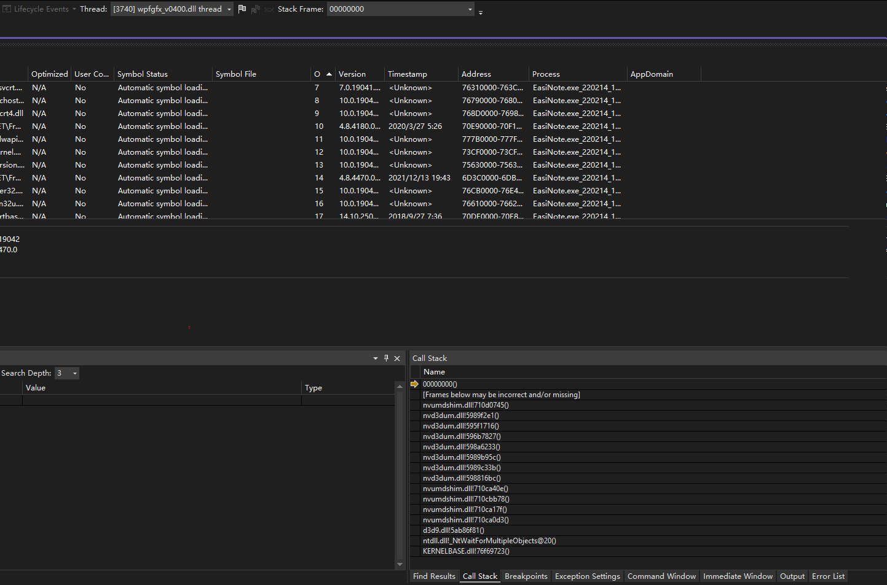

# 记因为 NVIDIA 显驱错误而让 WPF 应用启动闪退问题

本文记录一个因为 NVIDIA 显卡驱动错误而让 WPF 应用启动闪退问题

<!--more-->


<!-- 发布 -->
<!-- 博客 -->

表现是 WPF 应用程序，在启动时，立刻闪退。在事件管理器看到的异常代码是 0xC0000005(Access Violation) 错误，通过捕获 DUMP 可以看到如下堆栈

```
>	00000000()	Unknown
 	[Frames below may be incorrect and/or missing]	Unknown
 	nvumdshim.dll!710d0745()	Unknown
 	nvd3dum.dll!5989f2e1()	Unknown
 	nvd3dum.dll!595f1716()	Unknown
 	nvd3dum.dll!596b7827()	Unknown
 	nvd3dum.dll!598a6233()	Unknown
 	nvd3dum.dll!5989b95c()	Unknown
 	nvd3dum.dll!5989c33b()	Unknown
 	nvd3dum.dll!598816bc()	Unknown
 	nvumdshim.dll!710ca40e()	Unknown
 	nvumdshim.dll!710cbb78()	Unknown
 	nvumdshim.dll!710ca17f()	Unknown
 	nvumdshim.dll!710ca0d3()	Unknown
 	d3d9.dll!5ab86f81()	Unknown
 	ntdll.dll!_NtWaitForMultipleObjects@20()	Unknown
 	KERNELBASE.dll!76f69723()	Unknown
```

<!--  -->


此异常是在 `wpfgfx_v0400.dll thread` 线程上炸掉的，是在 `d3d9.dll` 调用 NVIDIA 显卡驱动时挂掉的，这在托管层是接不住的。以上是将拿到的 190055 的 DUMP 文件放在 VisualStudio 里，选择混合调试

解决方法是根据安装的显卡，去 [NVIDIA 显卡驱动官方下载站](https://www.nvidia.com/download/index.aspx) 下载和安装对应型号的显卡驱动。这个问题属于通用的 DX 问题，也许很多使用到 DirectX 的应用都会在此设备上炸掉。但也许只是因为 WPF 刚好调用了某个 API 炸掉而已。特别感谢 [lsj](https://blog.sdlsj.net) 工具人的协助


<a rel="license" href="http://creativecommons.org/licenses/by-nc-sa/4.0/"></a><br />本作品采用<a rel="license" href="http://creativecommons.org/licenses/by-nc-sa/4.0/">知识共享署名-非商业性使用-相同方式共享 4.0 国际许可协议</a>进行许可。欢迎转载、使用、重新发布，但务必保留文章署名[林德熙](http://blog.csdn.net/lindexi_gd)(包含链接:http://blog.csdn.net/lindexi_gd )，不得用于商业目的，基于本文修改后的作品务必以相同的许可发布。如有任何疑问，请与我[联系](mailto:lindexi_gd@163.com)。