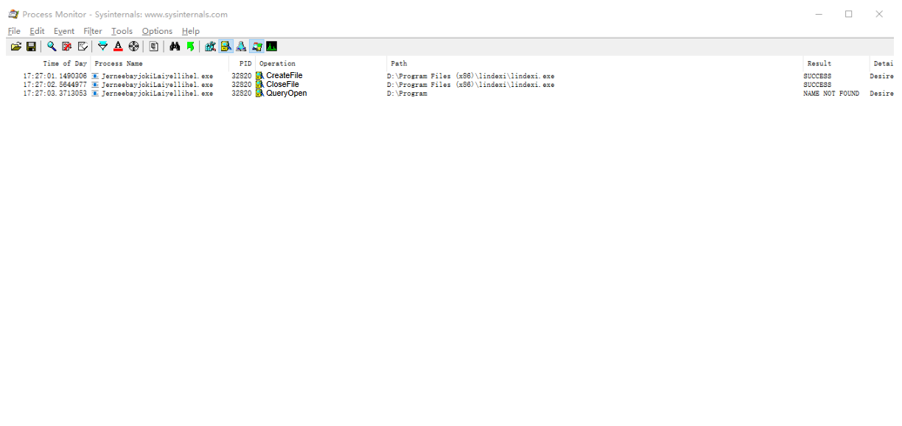
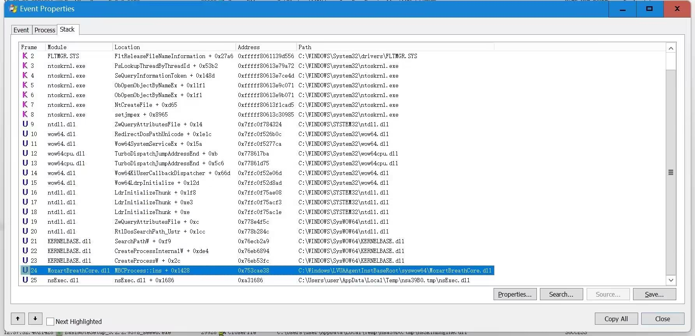

# 记联软 UniAccess 导致 NSIS 安装包启动进程失效

本文记录联软 UniAccess 注入的 C:\Window\LVUAAgentInstBaseRoot\syswow64\MozartBreathCore.dll 导致 NSIS 安装包启动进程失效，启动进程直接结束问题。且给出 NSIS 安装包脚本的规避方法

<!--more-->


<!-- CreateTime:2023/2/16 17:04:24 -->


<!-- 发布 -->
<!-- 博客 -->

特别感谢 [lsj](https://blog.sdlsj.net) 定位到此问题，我只是帮助他记录问题的工具人

联软 UniAccess 是一款监控电脑设备的应用，在很多公司都会使用。遇到此问题时最佳做法是卸载，如何卸载请参阅以下博客

- [卸载联软UniAccess，删除UniAccess Agent记录 - Never_Await_Victory - 博客园](https://www.cnblogs.com/SuChen1994/p/13905448.html )
- [最新彻底删除联软uniaccessAgent_zhangxl2000的博客-CSDN博客_uniaccessagenttray.exe](https://blog.csdn.net/zhangxl2000/article/details/117084871 )
- [卸载 UniAccessAgent 软件_ITPUB博客](http://blog.itpub.net/26736162/viewspace-2649514/ )

如果无法卸载或好奇联软 UniAccess 是如何投毒的，请继续阅读本文

我的 NSIS 脚本是使用以下代码进行启动进程的

```
nsExec::Exec "${PATH_MAIN}\lindexi.exe install"
```

这里的 `${PATH_MAIN}` 在运行的时候大概是 `D:\Program Files (x86)\lindexi` 文件夹路径

预期以上安装包代码将会启动 lindexi.exe 应用，然而通过 [ProcessMonitor](https://learn.microsoft.com/en-us/sysinternals/downloads/procmon) 却发现启动的路径似乎不对

<!--  -->


如上图，可以看到先在安装包里创建出了 `D:\Program Files (x86)\lindexi\lindexi.exe` 文件，接下来预期的就是安装包将启动此进程。然而通过 ProcessMonitor 看到是 QueryOpen 了 `D:\Program` 文件

右击看是调用 `D:\Program` 文件的堆栈，如下图

<!--  -->


从图片可以看到，从 nsExec.dll 里面居然进入了 MozartBreathCore.dll 里面，证明就是被联软 UniAccess 的 C:\Window\LVUAAgentInstBaseRoot\syswow64\MozartBreathCore.dll 注入。然而联软 UniAccess 比较垃圾，没有好好处理好路径空格文件，于是就访问成了 `D:\Program` 文件

而且联软 UniAccess 更垃圾的是发现文件不存在就啥都不干，让安装包继续使用，安装包以为完成了进程启动，记录的日志也都是完成启动进程

其实以上的 NSIS 脚本还是有一刀的，那就是传入的参数是没有给带空格的路径加上引号。不过在 Win32 的 [CreateProcess](https://learn.microsoft.com/zh-cn/windows/win32/api/processthreadsapi/nf-processthreadsapi-createprocessw) 方法可以很好处理此问题，会自动识别路径空格。因此安装包在没有联软 UniAccess 情况下可以很好进行安装

既然知道了联软 UniAccess 投毒了，而且是路径空格问题，就可以额外照顾一下联软 UniAccess 这个垃圾。修改 NSIS 脚本，给路径带上引号，解决路径空格导致联软 UniAccess 启动进程失效

```
nsExec::Exec '"${PATH_MAIN}\lindexi.exe" install'
```

如上面代码，将 `${PATH_MAIN}\lindexi.exe` 使用引号来解决 `${PATH_MAIN}` 是存在空格的 `D:\Program Files (x86)\lindexi` 路径导致联软 UniAccess 这个垃圾无法启动进程


<a rel="license" href="http://creativecommons.org/licenses/by-nc-sa/4.0/"></a><br />本作品采用<a rel="license" href="http://creativecommons.org/licenses/by-nc-sa/4.0/">知识共享署名-非商业性使用-相同方式共享 4.0 国际许可协议</a>进行许可。欢迎转载、使用、重新发布，但务必保留文章署名[林德熙](http://blog.csdn.net/lindexi_gd)(包含链接:http://blog.csdn.net/lindexi_gd )，不得用于商业目的，基于本文修改后的作品务必以相同的许可发布。如有任何疑问，请与我[联系](mailto:lindexi_gd@163.com)。