# 记调试 RX-Explorer-WAS 文件管理器 UI 未响应问题

我的老伙伴开发了一款优雅的文件管理器，我在积极地使用它。然而某天我发现打开 RX-Explorer-WAS 文件管理器之后，界面是黑屏且没有响应。作为一个成熟的开发者，遇到软件卡住的问题，自然就要自己尝试调查问题啦。本文记录了我的调试过程

<!--more-->
<!-- CreateTime:2026/02/12 07:10:34 -->

<!-- 发布 -->
<!-- 博客 -->

开始之前，先提供 RX-Explorer-WAS 的安装地址，通过应用商店即可安装： <https://apps.microsoft.com/detail/9pdn2q3dcqs3>

在我设备上复现打开黑屏问题的界面如下图

<!-- 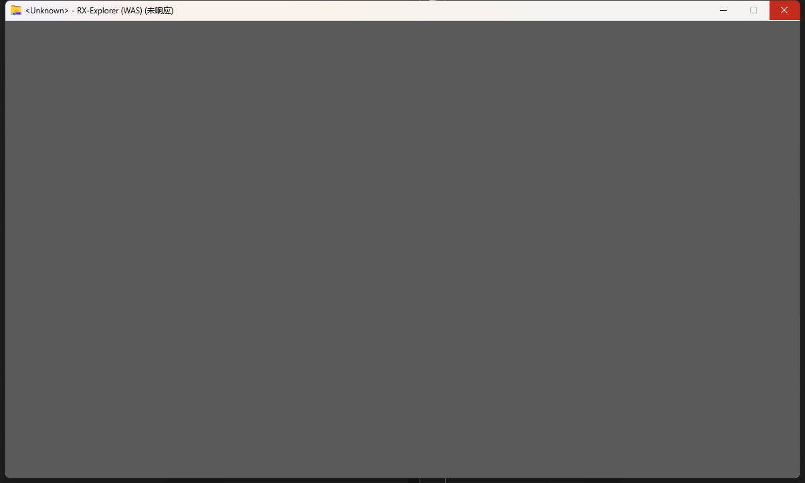 -->


此时非常快速的第一反映就是打开 Visual Studio 进行附加调试。有开发环境的机器上，就不要去打 DUMP 分析了，通过 DUMP 分析是不如直接用开发机的 Visual Studio 附加调试来得爽的

点击 Visual Studio 的 调试->附加到进程 选项，选择未响应窗口对应的进程，然后勾选代码类型为托管类型

<!-- 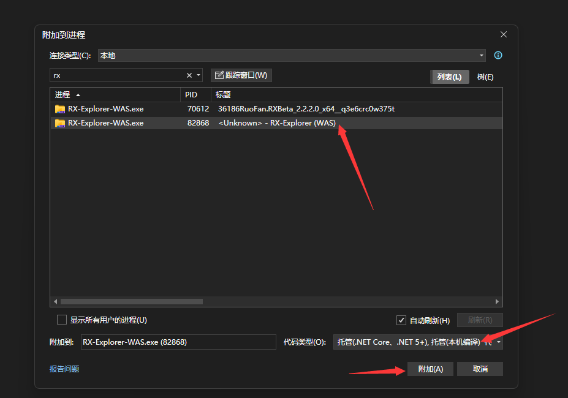 -->


遇到这类未响应问题，优先勾选托管代码调试，附带加上托管（本机编译）选项，不先勾选本机调试。这样做的原因是大部分情况下，可以通过托管代码快速定位到卡住的问题，无需挂载本机调试来干扰调试

<!-- 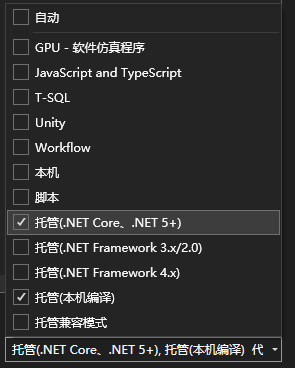 -->


挂进去之后，现在的进程还在正常跑着，点一下暂停，看看 UI 主线程卡在哪里了

<!-- 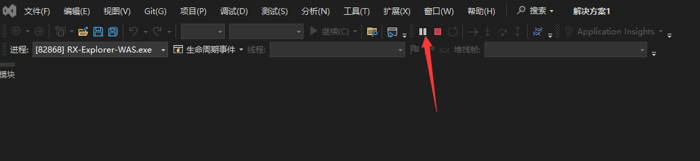 -->


这个时候我习惯让 Visual Studio 的调试界面布局为一边为调用堆栈，一边为线程。如此可以快速切线程来查看各个线程当前所在的堆栈情况。通过 Visual Studio 的 调试->窗口 选项里面，可以打开调用堆栈、线程等窗口

<!-- 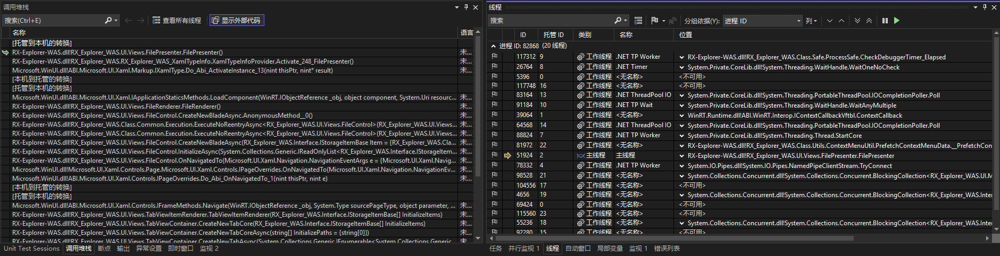 -->


我看到这里，我开始就以为一定就是 `RX_Explorer_WAS.UI.Views.FilePresenter.FilePresenter` 写了什么代码导致的卡住。但是具体是什么呢，这里看不到。于是我就去找了 [Ruofan](https://github.com/zhuxb711) 要来了 pdb 符号文件，此时有符号文件是很有帮助的

那会的我，认为一定是在 `RX_Explorer_WAS.UI.Views.FilePresenter.FilePresenter` 写了什么代码导致的卡住。再或者就是遇到静态构造函数进锁的问题，为什么这么说呢？这是因为如果某个类型的静态构造函数被另一个线程执行，且执行过程中进入了锁等无法结束的情况，那另一个线程再碰触到这个类型时，将会进入等待状态，此时的调用堆栈看起来也差不多这样

要到了符号文件之后，点击 调试->窗口->模块 找到了对应的 DLL 右击点加载符号，选择符号文件

加载符号之后，可以看到卡在这一行了：

<!-- 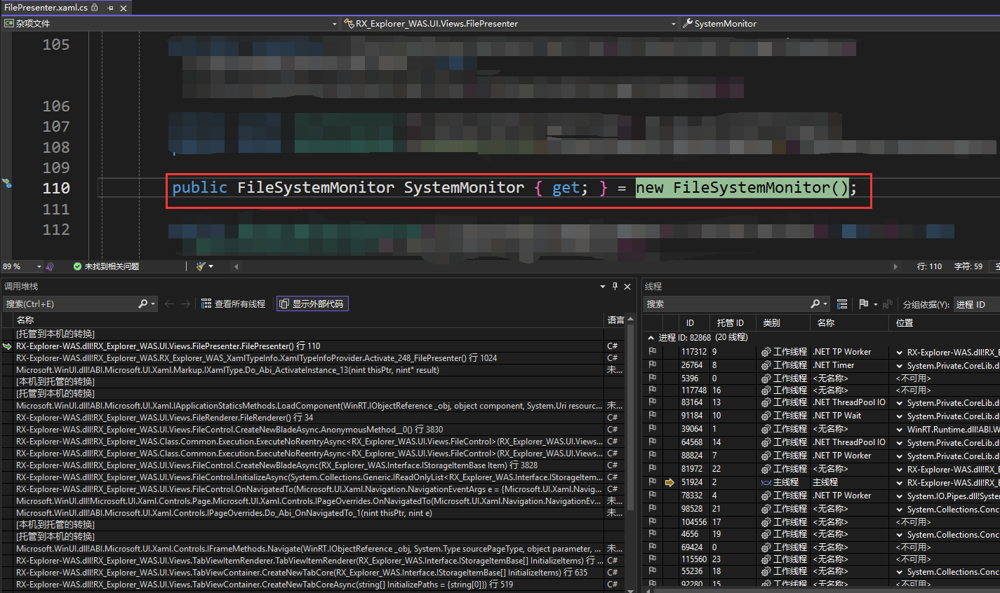 -->


按照我的经验，优先怀疑是静态构造函数相关问题，毕竟正在 new 一个对象而已，这个过程不应该有任何问题才对。因为如果发生在 new 对象里面，那应该堆栈就去到对象的构造函数里了，而不是在这里

此时我就在线程窗口里面，从上到下全看了一遍，然而没有发现任何的调用堆栈可能发生在静态构造函数里面，此时调试过程卡住了，这不是一个常见问题

<!-- 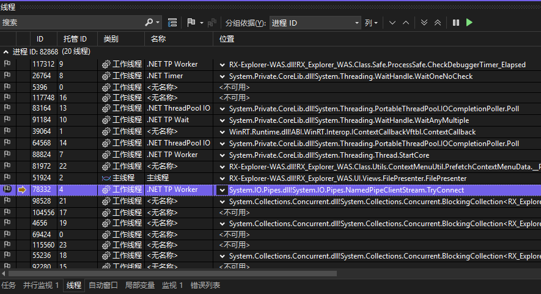 -->


我向 [Ruofan](https://github.com/zhuxb711) 要了这部分的源代码，然而经过我仔细阅读，我都没有找到问题

看起来优先怀疑是静态构造函数这个事情是不成立的，此时我应该怀疑的是调用堆栈的最上方，是否因为碰到了某些非托管代码导致的卡住。毕竟最上方就是 `[托管到本机的转换]` 证明进入卡的是本机代码，即非托管代码

```csharp
 	[托管到本机的转换]	
>	RX-Explorer-WAS.dll!RX_Explorer_WAS.UI.Views.FilePresenter.FilePresenter() 行 110	C#
 	RX-Explorer-WAS.dll!RX_Explorer_WAS.RX_Explorer_WAS_XamlTypeInfo.XamlTypeInfoProvider.Activate_248_FilePresenter() 行 1024	C#
 	Microsoft.WinUI.dll!ABI.Microsoft.UI.Xaml.Markup.IXamlType.Do_Abi_ActivateInstance_13(nint thisPtr, nint* result)	未知
```

停下调试，再次附加进程，这一次勾选了本机调试选项

<!-- 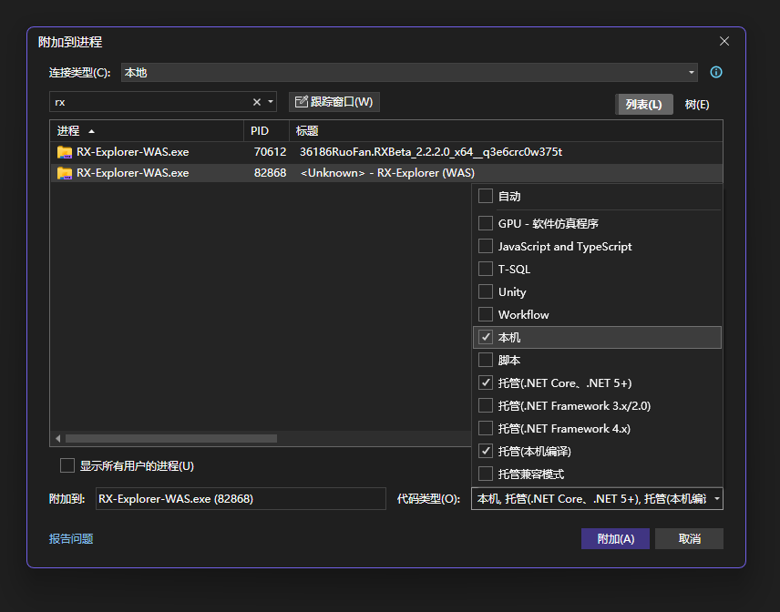 -->


此时附加过程中出现了一个调试异常，如下图所示，忽略即可，忽略方法就是点击继续运行

<!-- 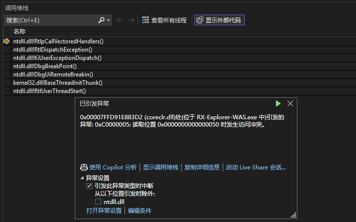 -->


再次点击暂停，看看这一次的主线程堆栈

<!-- 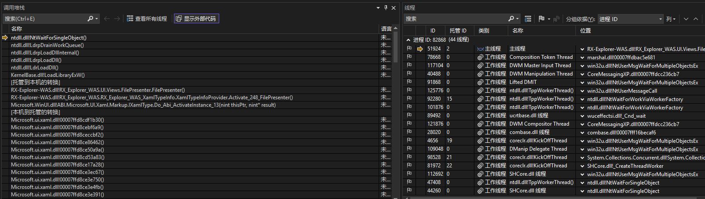 -->


似乎是卡在加载某个程序集的过程了

```
>	ntdll.dll!NtWaitForSingleObject()	未知
 	ntdll.dll!LdrpDrainWorkQueue()	未知
 	ntdll.dll!LdrpLoadDllInternal()	未知
 	ntdll.dll!LdrpLoadDll()	未知
 	ntdll.dll!LdrLoadDll()	未知
 	KernelBase.dll!LoadLibraryExW()	未知
 	[托管到本机的转换]	
 	RX-Explorer-WAS.dll!RX_Explorer_WAS.UI.Views.FilePresenter.FilePresenter()	未知
 	RX-Explorer-WAS.dll!RX_Explorer_WAS.RX_Explorer_WAS_XamlTypeInfo.XamlTypeInfoProvider.Activate_248_FilePresenter()	未知
 	Microsoft.WinUI.dll!ABI.Microsoft.UI.Xaml.Markup.IXamlType.Do_Abi_ActivateInstance_13(nint thisPtr, nint* result)	未知
```

那这里会是加载哪个程序集呢？是否加载了某个犯天条的程序集导致的卡顿。这样的事情我是遇到过的，我在某些用户设备上调试过，加载某些 DLL 需要花超级长的时间

但是在这里开启了托管调试导致无法看出来加载的是哪个 DLL 导致的卡顿。还请记住这句话，后面要考。我就是在这里思路错误的，我一直尝试追踪是加载哪个 DLL 时出现卡顿的。既然是经验贴，我就不掩盖我的错误调试过程了，按照我的一路调试顺序告诉大家啦

我点击停止调试，准备这一次只开启本机调试方式进行附加调试。只开启本机调试的方式，可以展示出整个 CoreCLR 的执行过程，如此可以看到在加载的发起方 CoreCLR 的调用堆栈，进而了解到正在加载的程序集是哪个

<!-- 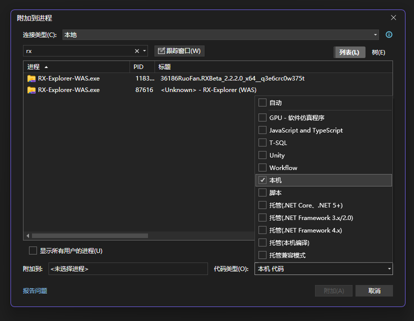 -->


再次附加调试就看到了 CoreCLR 发起加载程序集的堆栈了

<!-- 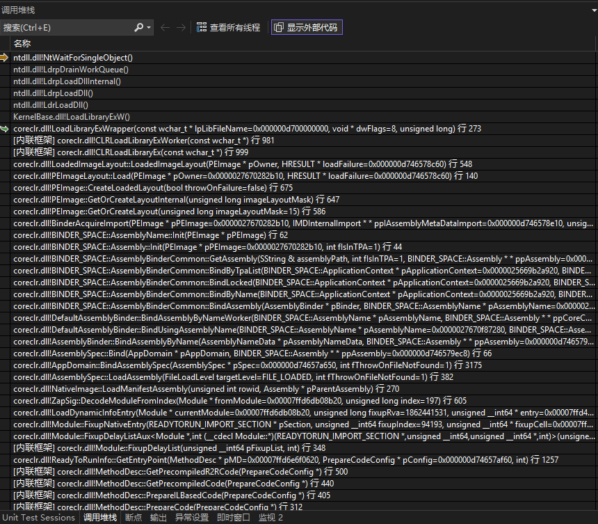 -->


```
 	ntdll.dll!NtWaitForSingleObject()	未知
 	ntdll.dll!LdrpDrainWorkQueue()	未知
 	ntdll.dll!LdrpLoadDllInternal()	未知
 	ntdll.dll!LdrpLoadDll()	未知
 	ntdll.dll!LdrLoadDll()	未知
 	KernelBase.dll!LoadLibraryExW()	未知
>	coreclr.dll!LoadLibraryExWrapper(const wchar_t * lpLibFileName=0x000000d700000000, void * dwFlags=8, unsigned long) 行 273	C++
 	[内联框架] coreclr.dll!CLRLoadLibraryExWorker(const wchar_t *) 行 981	C++
 	[内联框架] coreclr.dll!CLRLoadLibraryEx(const wchar_t *) 行 999	C++
 	coreclr.dll!LoadedImageLayout::LoadedImageLayout(PEImage * pOwner, HRESULT * loadFailure=0x000000d746578c60) 行 548	C++
 	coreclr.dll!PEImageLayout::Load(PEImage * pOwner=0x0000027670282b10, HRESULT * loadFailure=0x000000d746578c60) 行 140	C++
 	coreclr.dll!PEImage::CreateLoadedLayout(bool throwOnFailure=false) 行 675	C++
 	coreclr.dll!PEImage::GetOrCreateLayoutInternal(unsigned long imageLayoutMask) 行 647	C++
 	coreclr.dll!PEImage::GetOrCreateLayout(unsigned long imageLayoutMask=15) 行 586	C++
 	coreclr.dll!BinderAcquireImport(PEImage * pPEImage=0x0000027670282b10, IMDInternalImport * * ppIAssemblyMetaDataImport=0x000000d746578e10, unsigned long * pdwPAFlags=0x000000d746578e20) 行 125	C++
 	coreclr.dll!BINDER_SPACE::AssemblyName::Init(PEImage * pPEImage) 行 62	C++
 	coreclr.dll!BINDER_SPACE::Assembly::Init(PEImage * pPEImage=0x0000027670282b10, int fIsInTPA=1) 行 44	C++
    ...
```

点击进入 `LoadLibraryExWrapper` 这一行，此时我习惯让 Visual Studio 的调试界面一边是调用堆栈，一边是局部变量窗口。如此可以在切调用堆栈时，看到各个方法的局部变量情况。此时我看到了有 path 变量，再点击 Visual Studio 的 调试->窗口->内存->内存1 选项卡，打开内存查看窗口。在内存查看窗口，输入 path 变量的地址，此时就看到了准备加载的路径

<!-- 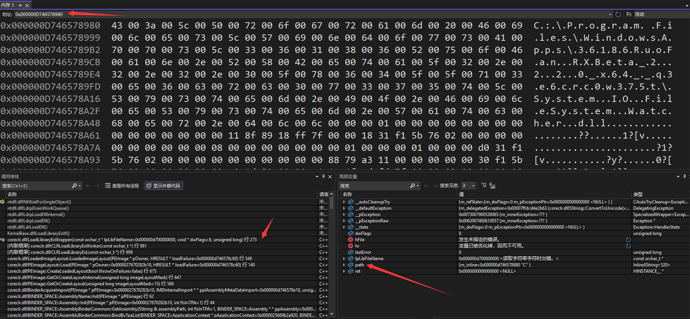 -->


我看到准备加载的是非常正常的 System.IO.FileSystem.Watcher.dll 文件，再在网上搜也找不到相关的问题。此时调试再次卡住

而且卡住的地方还是在 KernelBase 里面

我再次阅读调用堆栈，似乎明白了，当前主线程的卡住不是主原因。如以下堆栈：

```
 	ntdll.dll!NtWaitForSingleObject()	未知
 	ntdll.dll!LdrpDrainWorkQueue()	未知
 	ntdll.dll!LdrpLoadDllInternal()	未知
 	ntdll.dll!LdrpLoadDll()	未知
 	ntdll.dll!LdrLoadDll()	未知
 	KernelBase.dll!LoadLibraryExW()	未知
 	coreclr.dll!LoadLibraryExWrapper(const wchar_t * lpLibFileName=0x000000d700000000, void * dwFlags=8, unsigned long) 行 273	C++
```

可以看到当前的状态是卡在 LdrpDrainWorkQueue 方法，即当前进程还有另一个 DLL 正在排队加载。我回忆了刚才遍历所有进程，似乎看到有可能的问题。我重新退出调试，使用带托管调试附加进程

打开 调试->窗口->并行堆栈 窗口，作为熟练工，我很快就定位到一个线程正在一个加载 DLL 的堆栈

<!-- 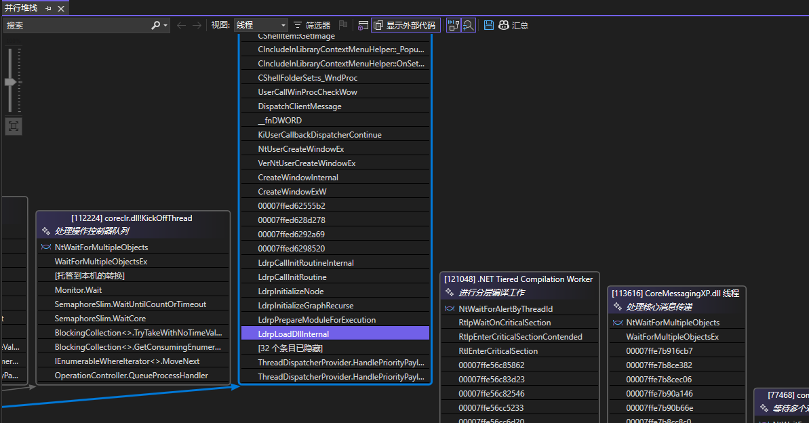 -->


此时就能看到主线程卡住的核心原因就是因为存在一个线程在加载 DLL 的过程中卡住，如下图所示。注：下图是后面截的，导致线程号和后文的不匹配，还请大家略过

<!-- 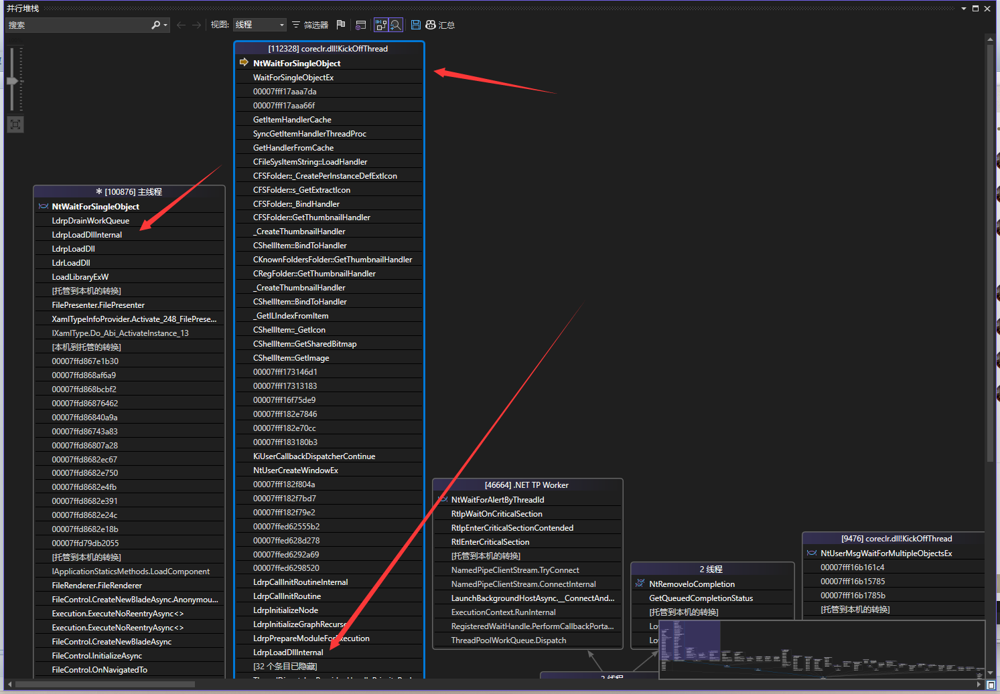 -->


切换到对应的线程，查看堆栈，可以看到确实是正在加载 DLL 的过程中

<!-- 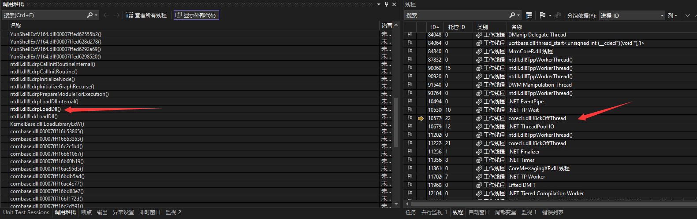 -->


也就是主线程的加载 DLL 卡住是因为正在等待这个线程完成 DLL 加载。那这个线程正在加载啥呢？为什么需要加载呢？

通过调用堆栈可以看到一个陌生的非托管 DLL 正在加载过程中干活

```
    ...
 	user32.dll!UserCallWinProcCheckWow(struct _ACTIVATION_CONTEXT *,__int64 (*)(struct tagWND *,unsigned int,unsigned __int64,__int64),struct HWND__ *,enum _WM_VALUE,unsigned __int64,__int64,void *,int)	未知
 	user32.dll!DispatchClientMessage()	未知
 	user32.dll!__fnDWORD()	未知
 	ntdll.dll!KiUserCallbackDispatcherContinue()	未知
 	win32u.dll!NtUserCreateWindowEx()	未知
 	user32.dll!VerNtUserCreateWindowEx(unsigned long,struct _LARGE_STRING *,struct _LARGE_STRING *,unsigned long,int,int,int,int,struct HWND__ *,struct HMENU__ *,void *,void *,enum ZBID,unsigned long,unsigned long)	未知
 	user32.dll!CreateWindowInternal()	未知
 	user32.dll!CreateWindowExW()	未知
 	YunShellExtV164.dll!00007ffed62555b2()	未知
 	YunShellExtV164.dll!00007ffed628d278()	未知
 	YunShellExtV164.dll!00007ffed6292a69()	未知
 	YunShellExtV164.dll!00007ffed6298520()	未知
 	ntdll.dll!LdrpCallInitRoutineInternal()	未知
 	ntdll.dll!LdrpCallInitRoutine()	未知
 	ntdll.dll!LdrpInitializeNode()	未知
 	ntdll.dll!LdrpInitializeGraphRecurse()	未知
 	ntdll.dll!LdrpPrepareModuleForExecution()	未知
 	ntdll.dll!LdrpLoadDllInternal()	未知
 	ntdll.dll!LdrpLoadDll()	未知
 	ntdll.dll!LdrLoadDll()	未知
 	KernelBase.dll!LoadLibraryExW()	未知
 	combase.dll!00007fff16b53865()	未知
    ...
 	windows.storage.dll!_SHCoCreateInstance(struct _GUID const &,struct IUnknown *,unsigned long,int,enum EXTCOCREATEFLAGS,struct _GUID const &,void * *)	未知
 	windows.storage.dll!SHExtCoCreateInstance()	未知
 	shell32.dll!DCA_SHExtCoCreateInstance()	未知
 	shell32.dll!HDXA_QueryContextMenu(struct _DSA *,struct IDataObject *,unsigned int,struct HKEY__ * * const,class ATL::CComPtr<struct IAssociationElement> * const,struct _ITEMIDLIST_ABSOLUTE const *,struct _QCMINFO *,unsigned int,struct _DCA *,unsigned int * const,struct IUnknown *,struct _DCA *)	未知
 	shell32.dll!CDefFolderMenu::QueryContextMenu(struct HMENU__ *,unsigned int,unsigned int,unsigned int,unsigned int)	未知
 	ContextMenuSafeEnumerator.dll!00007ffe70955c97()	未知
 	[托管到本机的转换]	
 	RX-Explorer-WAS.dll!RX_Explorer_WAS.Class.Utils.ContextMenuUtil.PrefetchContextMenuData.__PrefetchContextMenuDataCore|5_0(string Path)	未知
 	RX-Explorer-WAS.dll!RX_Explorer_WAS.Class.Utils.ContextMenuUtil.PrefetchContextMenuData()	未知
 	RX-Explorer-WAS.dll!RX_Explorer_WAS.Class.Providers.ThreadDispatcherProvider.ExecuteOnStandAloneThreadAsync.AnonymousMethod__0(System.__Canon Argument, System.Threading.CancellationToken CancelToken)	未知
```

首要的调查就是卡在哪里，从 `YunShellExtV164.dll` 作为入手点，这个 DLL 我在应用程序所在的路径 `C:\Program Files\WindowsApps\36186RuoFan.RXBeta_2.2.2.0_x64__q3e6crc0w375t` 找不到，意味着这是被注入进来的或被从其他地方加载的

打开 Visual Studio 的调试->窗口->模块界面，尝试搜 `YunShellExtV164.dll` 找到路径

<!-- 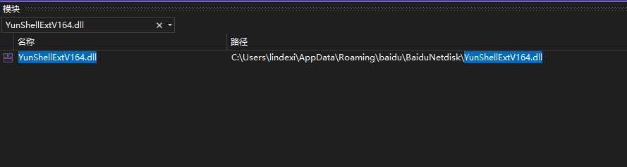 -->


通过 `C:\Users\lindexi\AppData\Roaming\baidu\BaiduNetdisk\YunShellExtV164.dll` 路径可以看到这是百度云的 DLL 文件。为什么会加载它？它又卡在哪？

顺着调用堆栈顶部，可以看到是在等锁。由于这是发生在百度云的 DLL main 里面，我就不想继续调查具体在卡什么了，只需要知道在卡一个锁就好

<!-- 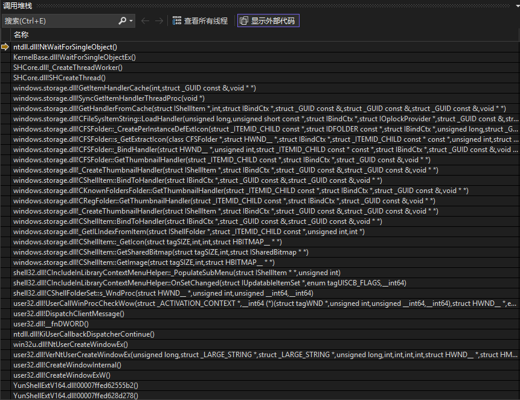 -->


按照最佳实践，不应该在 DLL main 里面执行任何长时间的逻辑，或者可能导致卡住的逻辑。如果真要执行，最好是自己开一个线程去执行。这是因为 DLL main 是在 DLL 被加载的时候将被执行的方法，如果在这个方法卡住，那这个进程将无法加载其他的 DLL 了

当前的情况属于如此，加载到百度云的 DLL 就卡住了，导致后续主线程加载其他 DLL 就卡住

通过堆栈底部，可以明白是从 `RX_Explorer_WAS.Class.Utils.ContextMenuUtil.PrefetchContextMenuData.__PrefetchContextMenuDataCore|5_0(string Path)` 调用到 ContextMenuSafeEnumerator.dll 从而加载的百度云的文件的

询问开发者才知道，这是尝试加载所有右键菜单的模块

加载右键菜单时，加载到百度云的右键菜单，导致百度云的模块被加载。百度云的模块在被加载的时候执行的逻辑卡住，导致了主线程无法再加载任何 DLL 文件，导致主线程卡住，从而让界面显示黑屏

此时的调试工作就完成了，彻底明白了问题

解决方法是什么呢？

从用户侧来说，我可以禁用百度云的右键菜单，如此也可以提升我的右键菜单的性能。我完全不用右键菜单的百度云的功能，其百度云右键菜单的功能如下图所示

<!-- 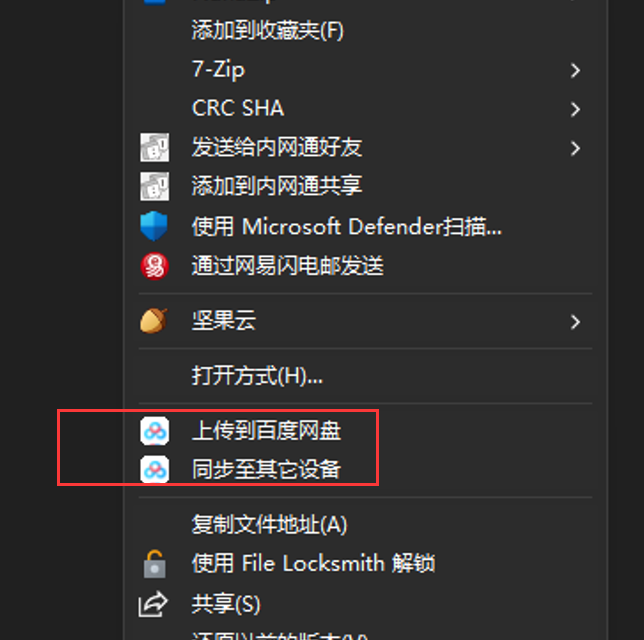 -->


通过 <https://www.nirsoft.net/utils/shexview.html> 提供的 ShellView 工具干掉百度云右键菜单

<!-- 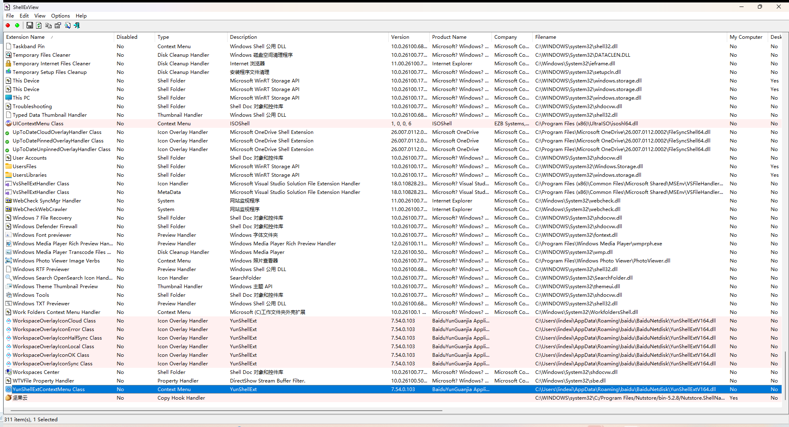 -->


右击百度云相关的项，点击禁用即可

从开发者的角度来说，可以尝试在进程外加载右键菜单，也就是跨进程的方案。这部分我还没学会，还请大家摸索

回到开始的问题，我一开始通过调用堆栈，认为是静态构造函数相关的问题导致的。继续深入调试，发现是加载 DLL 卡住的。通过这个调试经验，也让我更明确了按照最佳实践，不能在加载过程中干耗时的事情或可能会卡住的事情是多么重要

感谢 [Ruofan](https://github.com/zhuxb711) 提供了优雅的文件管理器

更多调试经验请看 [dotnet 代码调试方法](https://blog.lindexi.com/post/dotnet-%E4%BB%A3%E7%A0%81%E8%B0%83%E8%AF%95%E6%96%B9%E6%B3%95.html )