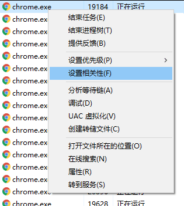

# 调试时限制程序使用 CPU 核心数模拟低端设备

我现在的开发设备性能太强了，有一些问题只能在低性能的设备上才能进行调试，本文告诉大家在开发机上不通过虚拟机等方法直接调试模式程序在低性能设备上运行

<!--more-->
<!-- CreateTime:2019/8/16 16:11:32 -->

<!-- csdn -->

通过 VisualStudio 调试启动一个程序之后，可以在任务管理器找到这个进程

在任务管理器的详细信息右击这个进程，点击设置相关性

<!--  -->

此时可以设置有几个 CPU 可以处理这个进程，这样这个程序就相当于在 CPU 核心数比较少的设备上运行

菜鸟提供了 [SetProcessAffinityMask](https://docs.microsoft.com/en-us/windows/win32/api/winbase/nf-winbase-setprocessaffinitymask ) 可以使用程序的方式设置一个进程使用的 CPU 有多少

这个函数请看 [《Windows via C/C++》学习笔记](https://www.cnblogs.com/wz19860913/archive/2008/08/05/1260833.html )

 本作品采用<a rel="license" href="http://creativecommons.org/licenses/by-nc-sa/4.0/">知识共享署名-非商业性使用-相同方式共享 4.0 国际许可协议</a>进行许可。欢迎转载、使用、重新发布，但务必保留文章署名[林德熙](http://blog.csdn.net/lindexi_gd)(包含链接:http://blog.csdn.net/lindexi_gd )，不得用于商业目的，基于本文修改后的作品务必以相同的许可发布。如有任何疑问，请与我[联系](mailto:lindexi_gd@163.com)。
