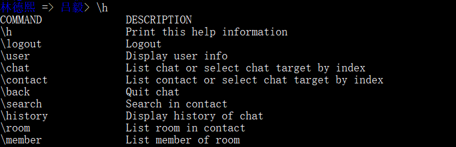

# 通过命令行使用微信

本文告诉大家如何使用命令行使用微信

<!--more-->
<!-- CreateTime:2019/9/2 12:57:38 -->

<!-- csdn -->

<!-- 标签：微信，命令行 -->

虽然本渣是使用 windows 微信也有 UWP 的，但是微信还是不太清真，所以我就找到一个控制台的微信，可以在控制台使用微信。

在读本文之前，相信已经安装完成了 npm 库了，如果还没有安装完成，请自己搜索如何安装。在打开 Powershell 使用命令行输入 npm 如何可以看到输出就是安装成功。

建议使用淘宝的源，只需要在 Powershell 复制下面代码

```csharp
 npm install -g cnpm --registry=https://registry.npm.taobao.org
```

现在可以修改所有 npm 开始的命令为 cnpm 了

现在需要安装 wechat-terminal 用来在命令行使用微信

```csharp
cnpm install -g node-wechat-terminal
```

或者不使用淘宝镜像

```csharp
npm install -g node-wechat-terminal
```

在安装完成输入下面代码就可以打开微信

```csharp
wechat-terminal
```

输入这个命令会输出一个二维码，需要使用手机扫描登陆，登陆完成之后就可以通过命令的方式使用微信，可以使用下面的命令

```csharp
\h			输出帮助
\logout		登出
\user		输出用户信息
\chat 		列出当前正在聊天的列表，后面可以添加序号进入聊天
\contact	列出所有联系人
\contact {n}	在列出的联系人对应的编号进行聊天
\back		结束聊天
\search		搜索联系人
\history 	显示当前聊天历史
\room 		列出聊天室
\member 	列出聊天室的成员
```

<!--  -->


下面就是一个例子

```csharp
林德熙> \search 毅
#83 吕毅
林德熙> \contact 83
林德熙 => 吕毅> hi
林德熙 => 吕毅> \history
Chat history with 吕毅:
TIME     FROM   TO   MESSAGE
09:02:13 林德熙 吕毅 hi
09:02:26 林德熙 吕毅 好像看不到你的消息
09:02:29 林德熙 吕毅 发一个我来看看
09:02:58 林德熙 吕毅 收不到
09:16:37 林德熙 吕毅 hi
```

<!--  -->


现在还无法看到其他人发的信息，所以还不是很好用

参见：[关于npm无法安装依赖包以及安装包缓慢的解决方法 - CSDN博客](https://blog.csdn.net/u011225099/article/details/72900241 )

[node-wechat-terminal - npm](https://www.npmjs.com/package/node-wechat-terminal )

<a rel="license" href="http://creativecommons.org/licenses/by-nc-sa/4.0/"></a><br />本作品采用<a rel="license" href="http://creativecommons.org/licenses/by-nc-sa/4.0/">知识共享署名-非商业性使用-相同方式共享 4.0 国际许可协议</a>进行许可。欢迎转载、使用、重新发布，但务必保留文章署名[林德熙](http://blog.csdn.net/lindexi_gd)(包含链接:http://blog.csdn.net/lindexi_gd )，不得用于商业目的，基于本文修改后的作品务必以相同的许可发布。如有任何疑问，请与我[联系](mailto:lindexi_gd@163.com)。  
