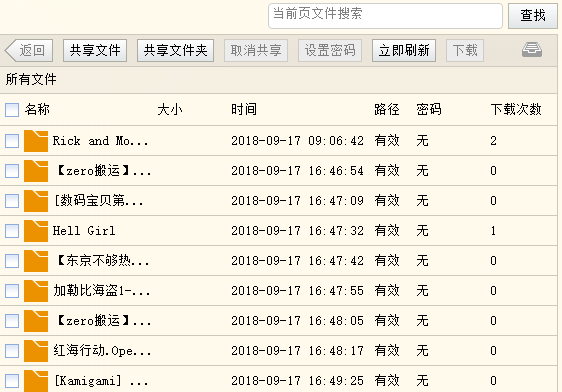

# 高效率工具

本文分享一些提高效率工具

<!--more-->
<!-- CreateTime:2019/9/2 12:57:38 -->


<div id="toc"></div>
<!-- csdn -->

<!-- 标签：工具 -->

## Btsync

关于 btsync 参见：[编程大人的介绍](https://program-think.blogspot.com/2015/01/BitTorrent-Sync.html?utm_source=tuicool&utm_medium=referral)

btsync 是分布式网盘，里面可以存放任意内容，我就使用他来分享工具，本文的工具都提供btsync分享。如何安装参见[这篇博客](https://lindexi.gitee.io/post/%E5%A6%82%E4%BD%95%E5%AE%89%E8%A3%85-btsync.html ) 因为百度分享经常失败，所以使用btsync可以做比较好的分享。

下载地址：

链接：http://pan.baidu.com/s/1dFMhwmH 密码：twqy

如果上面的链接失败了，请使用这个链接[https://pan.baidu.com/s/1cBg69S](https://pan.baidu.com/s/1cBg69S)

<!-- https://drive.cvte.com/c/sd/bdf/3fc70dde1ad39e63 -->

Btysnc: BTOOM47DVNF2UQEXJ3W3CV2EWG7RJXMXA

[CSDN 需要积分](http://download.csdn.net/detail/lindexi_gd/9792343)

## visual Studio

最好用的IDE没有之一，.NET开发者的必备IDE。Visual Studio提供非常强大的启动工具箱，并且还有一些让人惊喜的插件支持。每一次版本更新都会给开发者带来无限惊（keng）喜

虽然vs很强大，但是vs还可以有很多强大扩展，如何
使用扩展 ？

1. 打开 [https://marketplace.visualstudio.com/](https://marketplace.visualstudio.com/) 

   这里有很多拓展，当然拓展也可以从小伙伴那里拿到。扩展可以自己做成离线包给小伙伴，但是放在这个网站下载的人比较多。里面有很多汉化的扩展。

1. 下载之后安装

 

 

推荐插件给大家：

 - [Productivity Power Tools](https://visualstudiogallery.msdn.microsoft.com/dbcb8670-889e-4a54-a226-a48a15e4cace)

   收集了一堆非常简洁又非常有用的功能来帮助你日常使用Visual Studio。这些功能集中在编辑、浏览以及其他常见的构造代码时会使用到的任务，功能非常强大，大大提高了开发效率。

 - [Resharper](https://www.jetbrains.com/resharper/)

   JetBrains公司出品的著名的代码生成工具，使用ReSharper，你可以进行深度代码分析，智能代码协助，实时错误代码高亮显示，解决方案范围内代码分析，快速代码更正，一步完成代码格式化和清理，业界领先的自动代码重构，高级的集成单元测试方案，和强大的解决方案内导航和搜索。

   

   下载地址：[官网](https://www.jetbrains.com/resharper/)

 - [VsVim](https://marketplace.visualstudio.com/items?itemName=JaredParMSFT.VsVim)

   在vs使用 Vim 的快捷键，于是不要说 VisualStudio 不好用，直接给你最厉害的工具。

 - [Output enhancer - Visual Studio Marketplace](https://marketplace.visualstudio.com/items?itemName=NikolayBalakin.Outputenhancer )

   更直观地在输出窗口看到各种不同种类的信息

   

  - [调试神器OzCode](https://walterlv.github.io/post/using-ozcode-to-improve-debug.html)
  
   

然后广告两个我写的插件：

 - [编码规范工具](https://marketplace.visualstudio.com/items?itemName=lindexigd.vs-extension-18109)

   可以帮忙检测工程中是否存在编码错误的文件，可以把他们转为 GBK 或 utf8

 - [图片注释](http://download.csdn.net/detail/lindexi_gd/9833388)  

   可以在注释中使用图片

还有我小伙伴插件[VisualStudio多解决方案联合调试](http://jasongrass.gitee.io/2017-10-VS%E5%A4%9A%E8%A7%A3%E5%86%B3%E6%96%B9%E6%A1%88%E8%81%94%E8%B0%83/)   在项目开发中，多个解决方案之间存在引用关系，但通常是独立开发，并不直接引用，而是通过Nuget等方式引用。这为它们之间的联合调试带来了不便，尤其在调试某些异常和BUG时。

如果你觉得没有一个好用的插件，那么可以自己写一个，参见：
[http://lindexi.oschina.io/lindexi/post/VisualStudio-%E6%89%A9%E5%B1%95%E5%BC%80%E5%8F%91.html](http://lindexi.oschina.io/lindexi/post/VisualStudio-%E6%89%A9%E5%B1%95%E5%BC%80%E5%8F%91.html )

vsiual Studio 扩展，最好是 Resharper ，如果需要对他进行修改，参见：[resharper 自定义代码片](http://lindexi.oschina.io/lindexi/post/resharper-%E8%87%AA%E5%AE%9A%E4%B9%89%E4%BB%A3%E7%A0%81%E7%89%87.html)

Btysnc:
BM4X74AK7CSEKEZSXY73ZH3TVHIJCNWT7

每次看到 vsiual Studio 打开模板里面的内容都不是自己想要的，是不是可以自己做模板？

可以，请看 [Visual Studio 自定义项目模板](http://lindexi.oschina.io/lindexi/post/Visual-Studio-%E8%87%AA%E5%AE%9A%E4%B9%89%E9%A1%B9%E7%9B%AE%E6%A8%A1%E6%9D%BF.html)

Vsiual Studio 还有一个强大的功能，[自定义外部命令](https://lindexi.gitee.io/lindexi/post/VisualStudio-%E8%87%AA%E5%AE%9A%E4%B9%89%E5%A4%96%E9%83%A8%E5%91%BD%E4%BB%A4.html )

## Sublime

对于编辑器，我就推荐 Sublime Text ，vs code


我现在就是用  Sublime 在写博客

SublimeText2 支持但不限于 C, C++, C#, CSS, D, Erlang, HTML, Groovy, Haskell, HTML, Java, JavaScript, LaTeX, Lisp, Lua, Markdown, Matlab, OCaml, Perl, PHP, Python, R, Ruby, SQL, TCL, Textile and XML 等主流编程语言的语法高亮。

Sublime 可以自己写插件，所以几乎所有功能都可以做，我的插件有200M

Sublime 可以随心跳转，关于Sublime 我还写有博客：[sublime Text 正则替换](http://lindexi.oschina.io/lindexi/post/sublime-Text-%E6%AD%A3%E5%88%99%E6%9B%BF%E6%8D%A2.html)


Sublime 也有很多插件：[https://packagecontrol.io/](https://packagecontrol.io/)

下载：[http://www.sublimetext.com/](http://www.sublimetext.com/)，如果官网无法访问，请到[[免费]Sublime Text 3.0 3143 x64 下载-CSDN下载](http://download.csdn.net/download/lindexi_gd/9981371)

Btysnc:
BOBL4WN7YVGH55BASAX3RTUKXVLLIIRXB

关于使用 Sublime 过程的问题，我收集写在博客，参见 [安装IMESupport解决Sublime Text中文输入法焦点问题](https://my.oschina.net/oywk/blog/703923)

如果需要使用 Sublime 写 Markdown 请看这篇[在 Sublime 中配置 Markdown 环境](http://frank19900731.github.io/blog/2015/04/13/zai-sublime-zhong-pei-zhi-markdown-huan-jing/?utm_source=tuicool&utm_medium=referral )

## Visual Studio Code

vsc 是强大的工具。

不需要多说 下载地址：[https://code.visualstudio.com/docs?dv=win&wt.mc_id=DX_841432&utm_source=vscom&utm_medium=ms%20web&utm_campaign=VSCOM%20Home&sku=codewin](https://code.visualstudio.com/docs?dv=win&wt.mc_id=DX_841432&utm_source=vscom&utm_medium=ms%20web&utm_campaign=VSCOM%20Home&sku=codewin )

我推荐他的插件 ：[https://marketplace.visualstudio.com/items?itemName=coderfee.qiniu-fig-bed](https://marketplace.visualstudio.com/items?itemName=coderfee.qiniu-fig-bed)


## 字体

关于字体，我就推荐 Source Code 

看名字，他就是做代码用的。

Source Code Pro 是由大名鼎鼎的 Adobe 公司发布的一款开源且完全免费的等宽编程字体


下载地址：<!-- https://drive.cvte.com/c/sd/bde/2dfb967c237efaa3 -->

BTSYNC：B6EZLWWDHSMHDHNF6DLOMGKYBSXT7OI4R

[https://github.com/adobe-fonts/source-code-pro](https://github.com/adobe-fonts/source-code-pro)

## 杀广告

对于杀弹窗，我推荐 波神的程序


下载地址：

Btysnc:BU56XVAJTB62A6BKJAZM6TJKRUUVYU3YP

对于网页版杀广告，我推荐 Adblock


下载地址：[https://chrome.google.com/webstore/detail/adblock-plus/cfhdojbkjhnklbpkdaibdccddilifddb?utm_source=chrome-app-launcher-info-dialog](https://chrome.google.com/webstore/detail/adblock-plus/cfhdojbkjhnklbpkdaibdccddilifddb?utm_source=chrome-app-launcher-info-dialog)

http://adblockplus.org/

下面是我使用的规则

```csharp
cnblogs.com##.w_r
codeceo.com##.widget.widget_d_hotpost
cnblogs.com##.itnews.c_ad_block
blog.csdn.net###res-relatived
blog.csdn.net##.blog-ass-articl.tracking-ad
cnblogs.com###headline_block
cnblogs.com##.headline
cnblogs.com###HistoryToday
cnblogs.com##.c_ad_block
zhihu.com##.RichText.AuthorInfo-badge
note.youdao.com##.sidebar-ft.ng-scope
blog.csdn.net###ad_commend
tuicool.com###right_site_articles
tuicool.com##.article_detail_bg
easyicon.net###load_feedback
detail.tmall.com##.charityTreasure
item.taobao.com##.charityTreasure
user.qzone.qq.com###QM_Container_100002
user.qzone.qq.com##.icenter-right-mod
pan.baidu.com##.module-hot-rec
baidu.com##.cr-content
blog.csdn.net##.similar_wrap.tracking-ad
yun.baidu.com##.module-hot-rec
||oimagea5.ydstatic.com/image?id=-4410769970301576623&product=adpublish&w=200&h=130
||bbs.seewo.com/data/attachment/portal/201707/18/190934kt3wpaa6tp6mpis3.jpg
```

请点击设置，自定义过滤，纯文本。然后复制我上面的代码进去，点击确定。


可以杀掉博客园和csdn的广告，百度的广告

## 安装软件

在刚拿到电脑，需要安装很多软件，如 Py 或其他软件，但是在安装的时候，经常需要点击很多步骤，如何才可以做到自动安装？

下面介绍一个命令行安装软件[scoop](https://github.com/lukesampson/scoop )是一个在 Windows 的命令行安装软件，可以通过这个软件自动在官网下载软件并且选择系统版本自动安装。可以极大提高安装软件的效率，不需要去寻找官网，寻找对应的软件，点击安装。

使用的方法很简单，先使用管理员打开 PS ，然后输入下面代码

```
iex (new-object net.webclient).downloadstring('https://get.scoop.sh')
```

运行就可以看到下面代码

```
PS C:\WINDOWS\system32> iex (new-object net.webclient).downloadstring('https://get.scoop.sh')
Initializing...
Downloading...
Extracting...
Creating shim...
Adding ~\scoop\shims to your path.
Scoop was installed successfully!
Type 'scoop help' for instructions.
```

在安装完成可以快速使用这个软件安装其他的软件，如安装`7zip` `git` `openssh` 三个软件，可以使用下面代码

```csharp
scoop install sudo
sudo scoop install 7zip git openssh --global
```

## Chrome 插件

关于 浏览器插件，我推荐：

- LastPass
  
  管理密码

  

  https://chrome.google.com/webstore/detail/lastpass-free-password-ma/hdokiejnpimakedhajhdlcegeplioahd?utm_source=chrome-app-launcher-info-dialog

- Markdown Here  

 无论在哪都可以使用 Markdown http://markdown-here.com/

- 有道词典Chrome划词插件 https://chrome.google.com/webstore/detail/%E6%9C%89%E9%81%93%E8%AF%8D%E5%85%B8chrome%E5%88%92%E8%AF%8D%E6%8F%92%E4%BB%B6/eopjamdnofihpioajgfdikhhbobonhbb?utm_source=chrome-app-launcher-info-dialog

- Vim
 
 这是我最推荐的软件

 https://chrome.google.com/webstore/detail/cvim/ihlenndgcmojhcghmfjfneahoeklbjjh?utm_source=chrome-app-launcher-info-dialog 

 - [onetab](https://chrome.google.com/webstore/detail/onetab/chphlpgkkbolifaimnlloiipkdnihall/related)

  可以节省70%内存

## AutoHotkey

自定义快捷方式，按键的软件

面向普通电脑用户的自由开源的自动化软件工具，它让用户能够快捷或自动执行重复性任务。

比代码片好用。

这个工具在于我经常打 `_` 但是这个键需要按一下 Shift 才可以打，有了 AutoHotkey ，可以让`-`在按下时转为`_`，也就是把 `-`和`_`反过来，对于一些按键是比较好。

例如反`{`和`[`一般代码用 `{` 频率是比较`[`多，所以反过可以提高速度。

下载地址：

[官网](https://autohotkey.com/)

Btysnc:
B7ADS3HEN6SZKUSUXLYR4GQ3TTBZLR6F6

## 录制屏幕


下载地址  [官网](https://github.com/NickeManarin/ScreenToGif)

Btysnc:BRJSQ2XGNBPRVLTTRBCTKPPQQD4LPRRXY

可以到我上传的下载：[http://download.csdn.net/detail/lindexi_gd/9844708](http://download.csdn.net/detail/lindexi_gd/9844708)


## 文件同步

FreeFileSync 可以同步文件，可以定义不同步的文件夹，我用它来同步代码，我可以设置不同步 bin 文件夹，这个软件用起来感觉好。


下载地址：[官网](http://www.freefilesync.org/)

Btysnc:BICAKLNB4GDINLEYD5ADPMMMVKFLHP6YT

## 加密软件

刚刚介绍了文件同步，如果需要同步文件到网盘，因为现在很多企业都扔了xx，所以放在网盘和公开是一样的。但是存在一些文件是不想公开的，这时就可以使用本文下面告诉大家的加密软件

### Cryptomator

这个软件可以加密一个文件夹，将这个文件夹同步解密到一个驱动器。于是就可以同步这个文件夹到网盘，文件夹内的文件都是加密过后的文件，连文件名都无法知道。

[Cryptomator 1.4.0 beta2 x64-CSDN下载](https://download.csdn.net/download/lindexi_gd/10611367 )

建议的做法：创建加密文件夹，在里面使用 git 做历史，并且使用微云同步上传文件夹。

## 快速进入特殊文件

有时候把程序的日志放在用户的Appdata那么如何快速进入？遇到有用户电脑错误了，需要快速进入，怎么办？

我提供两个方法，第一个方法是打开资源管理器，输入`%appdata%`就可以打开


第二个方法是使用shell，打开运行，输入`shell:appdata`。来自：[Windows 10 中的 Shell 指令 - 东邪独孤 - 博客园](http://www.cnblogs.com/tcjiaan/p/7140778.html)


## Clover

Clover 是 Windows Explorer 资源管理器的一个扩展，为其增加类似谷歌 Chrome 浏览器的多标签页功能。


下载地址 [Clover](http://cn.ejie.me/)

## 播放器

 - [Global Potplayer](http://potplayer.daum.net/) 

## 下载软件

### BT 下载

如果感觉 BT 的速度有些慢，因为 BT 的下载依赖于其他用户上传，所以寻找用户是最难的地方。不过可以通过添加 trackers 让大家容易找到。下面是我找到的一个项目，里面有很多 trackers ，只需要把他加到种子里就可以通过下面的连接找到其他用户。

[ngosang/trackerslist: An updated list of public BitTorrent trackers](https://github.com/ngosang/trackerslist )

### 内网通

经常需要复制文件到另一个电脑,需要在内网快速传输?需要在内网聊天?

推荐使用内网通软件,内网通可以快速找到内网用户,可以进行内网聊天,传输文件,还可以添加自己分享的文件,之后其他小伙伴就可以下载分享的文件

<!--  -->


我从 2015 就开始使用这个软件,在内网传输文件和分享资源的时候,十分好用

因为所有的消息都在内网传输,没有服务器,适合沟通一些机密的信息

下载 [内网通官网，新一代局域网办公沟通方式，企业内部高效安全的工作沟通软件](http://www.51nwt.com/index.htm )

## Gogs

Gogs 是一个简单、最快速和最轻松的方式搭建自助 Git 服务。

Gogs 可以在5分钟搭建一个和github差不多的网站。

我对他做了一点优化，多了一启动程序，程序在：http://download.csdn.net/detail/lindexi_gd/9766835

解压后打开 启动.exe 就可以，打开之后可以关闭程序，gogs 还在运行。

只需要进入设置。

在这之前，已经设置好了git


环境变量有git，如果没有，[下载](https://git-scm.com/)安装

打开 [http://127.0.0.1:3000](http://127.0.0.1:3000)


在数据库用 Sqlite ，仓库目录用 `/`


日志路径 `/log`


然后注册账号，一开始的账号就是管理员账号。

现在可以把 gogs 文件夹放在 U 盘，走到哪都可以使用。

使用只需要打开 启动.exe 

我做的只是简单程序，已经提交gogs不过没有通过。

下载地址：[点击下载](http://download.csdn.net/detail/lindexi_gd/9766835) [官网](https://github.com/gogits/gogs)

推荐安装在自己的 U 盘,这样就可以做到同步

## Fiddler

一个http协议调试代理工具，它能够记录并检查所有你的电脑和互联网之间的http通讯，设置断点，查看所有的“进出”Fiddler的数据。 Fiddler 要比其他的网络调试器要更加简单，因为它不仅仅暴露http通讯还提供了一个用户友好的格式。

下载地址 ： [http://www.telerik.com/fiddler](http://www.telerik.com/fiddler)

## Listary

资源管理器增强软件，可以按下两次 ctrl 快速打开需要的文件或软件

下载：[Listary](http://www.listary.com/)


## Paint.NET

基于.NET实现的快速免费的图像处理软件

[Paint.NET - Free Software for Digital Photo Editing](https://www.getpaint.net/)

## Treesize Free

硬盘管理工具，能够显示文件夹大小。

[TreeSize Free - Quickly Scan Directory Sizes and Find Space Hogs](http://www.jam-software.com/treesize_free/)


## Linux

对于一些软件只有在 Linux 可以使用？实际安装 win10 可以打开 Linux

打开参见：[某段子](http://www.ithome.com/html/win10/216665.htm)

现在老周写了如何在 Linux 搭建 asp.net core，这个方法很简单，请到老周的[博客](http://www.cnblogs.com/tcjiaan)看

## ps

经常需要ps，那么在一个电脑安装ps是很慢的，我有一个软件，可以立刻安装，几乎只有2分钟


Btysnc:BLDFNMNECURWGPK5V23NTGAHEPO5ZCRAP

## 在线工具

### 图标

啊里图标网，包括很多图标，可以搜索中文


[http://www.iconfont.cn/](http://www.iconfont.cn/)

### 颜色

[http://www.peise.net/tools/web/](http://www.peise.net/tools/web/)


### 在线正则


[http://tool.oschina.net/regex/](http://tool.oschina.net/regex/)

### 在线压缩图片

[https://www.jpeg.io/](https://www.jpeg.io/)

[压缩PNG JPG文件高达80％](https://www.websiteplanet.com/zh-hans/webtools/imagecompressor )

### 在线 html 转 markdown

[https://domchristie.github.io/to-markdown/](https://domchristie.github.io/to-markdown/)

### 变量命名工具

[CODELF](https://unbug.github.io/codelf/ ) 

如果发现自己难以给变量一个好的名字，请试试打开这网页

### IFTTT

分享一个奇特的网络服务。它本身没有提供什么功能，但因为它的工作方式类似编程，所以你可以拿它做各种各样难以想象的事情

[使用 IFTTT 做 RSS 的邮件订阅服务 - walterlv](https://walterlv.github.io/post/rss-email-using-ifttt.html )

## C# 编译为 js

[JSIL](http://jsil.org/)


可以愉快写算法用 C#

## C# 转 VB

[Code Converter](http://converter.telerik.com/)

## 调试工具

我收藏一些好用的工具，可以提高调试的效率和开发效率，下面就是我收藏的工具

调试系统和其他进程的工具请看[Windows Sysinternals](https://docs.microsoft.com/en-us/sysinternals/)

调试 dotnet framework 的工具请看[.NET Framework Tools](https://docs.microsoft.com/en-us/dotnet/framework/tools/)

测试界面工具请看[Testing Tools](https://docs.microsoft.com/en-us/windows/desktop/winauto/testing-tools )

## 桌面

最后作为一个二次元的大佬，怎么能没有自己专属的桌面，推荐[动态壁纸桌面](
http://www.upupoo.com/?source=46e3f8072940b4be94eb39e384ef2a97 )

参见：https://program-think.blogspot.com/2015/01/BitTorrent-Sync.html?utm_source=tuicool&utm_medium=referral

[http://www.iplaysoft.com/sublimetext.html](http://www.iplaysoft.com/sublimetext.html)

[http://www.jianshu.com/p/ae60a1415e52](http://www.jianshu.com/p/ae60a1415e52)

[.Net 高效开发之不可错过的实用工具 - 葡萄城控件技术团队 - 博客园](http://www.cnblogs.com/powertoolsteam/p/5240908.html#!comments)

[.NET开发人员必备工具推荐](http://chenrensong.com/post/df4988b7-58d6-40f3-9c36-a74a0092ce59)

[值得记录的工具和网站](https://fresky.github.io/2014/04/09/good-tools-and-websites/)

<a rel="license" href="http://creativecommons.org/licenses/by-nc-sa/4.0/"></a><br />本作品采用<a rel="license" href="http://creativecommons.org/licenses/by-nc-sa/4.0/">知识共享署名-非商业性使用-相同方式共享 4.0 国际许可协议</a>进行许可。欢迎转载、使用、重新发布，但务必保留文章署名[林德熙](http://blog.csdn.net/lindexi_gd)(包含链接:http://blog.csdn.net/lindexi_gd )，不得用于商业目的，基于本文修改后的作品务必以相同的许可发布。如有任何疑问，请与我[联系](mailto:lindexi_gd@163.com)。  